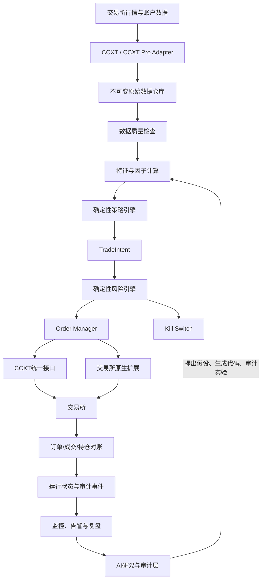
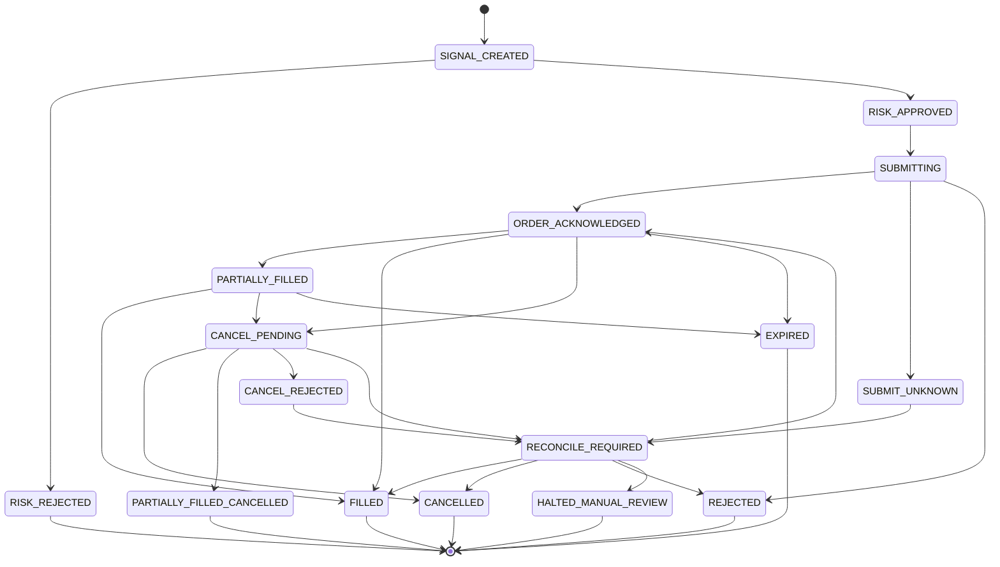

# alphaMind 系统架构

## 1. 架构目标

alphaMind 必须同时解决四个不同问题：

1. 策略是否存在可解释、可重复的统计优势；
2. 系统能否在真实成本和交易限制下执行策略；
3. 当策略、交易所、网络或人工判断出错时，损失是否可控；
4. 每一笔信号、决策、订单和人工干预能否被复盘。

任何单独的 AI 模型、回测框架或交易所 SDK 都不能覆盖全部问题，因此系统采用分层架构。

本文件描述逻辑边界和长期目标架构，不代表 MVP 必须把每一层拆成独立服务。第一阶段由 Freqtrade 承载策略运行、订单和持仓能力，实际组件映射、风险会计和数据库所有权以 [Freqtrade MVP Runtime Contract](freqtrade-mvp-runtime-contract.md) 为准。

## 2. 总体数据流



## 3. 模块边界

### 3.1 数据层

职责：

- 获取 OHLCV、Trades、Order Book、Mark Price、Index Price、Funding Rate 和 Open Interest；
- 保存交易所原始响应，不能只保留统一后的字段；
- 所有时间统一为 UTC；
- 检查重复、缺口、乱序、异常值和时间漂移；
- 原始数据只追加，不允许研究代码原地修改；
- 特征数据必须记录生成版本、输入范围和代码版本。

第一阶段现货趋势基线只要求稳定支持 OHLCV。Mark Price、Index Price、Funding Rate、Order Book、逐笔成交和清算数据必须在对应的合约、均值回归或微观结构研究立项后再引入，不能成为 MVP 的无关依赖。

### 3.2 策略层

策略层只能接收经过质量检查的数据，并输出 `TradeIntent`：

```text
strategy_id
strategy_version
signal_id
symbol
intent_type              # OPEN_LONG / CLOSE_LONG
signal_strength
reference_price
entry_price_limit
signal_expiry
stop_price
max_holding_time
reason_code
observed_market_regime
created_at
```

`TradeIntent` 不包含最终订单数量。策略负责表达方向、失效条件和信号证据；风险引擎根据 NAV、可用余额、止损距离、波动率、标的暴露和全局风险预算计算批准数量。这样策略无法通过填写较大数量绕过风险预算。

在 Freqtrade MVP 中，`TradeIntent` 映射为 entry/exit signal、tag 和审计事件，不实现为独立消息队列或跨进程接口。

策略层不能：

- 直接调用交易所 API；
- 修改账户杠杆；
- 自行扩大仓位；
- 在亏损后取消止损；
- 访问生产 API Key。

### 3.3 风险层

风险层是确定性规则引擎，必须在每次下单前检查：

- 数据是否新鲜；
- 交易所和账户是否健康；
- 本地持仓是否与交易所一致；
- 独立的 regime/market health 计算是否允许该策略运行；策略上报的 `observed_market_regime` 只用于审计，不能作为唯一依据；
- 单笔、单标的、单策略和同方向风险是否超限；
- 是否触发日亏、周亏或回撤限制；
- 是否存在重复信号或未完成旧单；
- 是否处于冷却期、只减仓模式或全局暂停状态。

建议的初始保护项：

```text
max_open_positions
max_symbol_exposure
max_strategy_exposure
max_directional_exposure
daily_loss_limit
weekly_loss_limit
drawdown_kill_switch
stale_data_guard
order_rate_limit
cooldown_after_stop
cancel_stale_orders
close_only_mode
manual_global_kill
```

风险审批通过后输出独立的 `RiskApprovedOrder`，至少包含：

```text
risk_decision_id
signal_id
symbol
side
order_type
approved_quantity
limit_price
stop_price
reduce_only
time_in_force
expires_at
risk_budget_used
decision_reason
created_at
```

执行层只能消费 `RiskApprovedOrder`，不能直接根据 `signal_strength` 推导订单数量。退出订单必须标记 `reduce_only` 或使用现货等价保护，任何退出路径都不能扩大原始持仓。

上述 `RiskApprovedOrder` 只适用于获批后的自研执行系统。Freqtrade MVP 由 `custom_stake_amount`、配置上限和入场确认完成定仓与批准，并将等价字段写入 Audit DB；它不创建第二个可执行订单实体。

### 3.4 执行层

本节状态机适用于获批后的自研执行系统。执行层将 `RiskApprovedOrder` 转换成订单，并维护完整生命周期。内部必须先持久化唯一幂等键；如果目标交易所支持 `client_order_id`，同一个 `risk_decision_id` 重试时必须复用它。交易所不支持时必须按 capability matrix 定义保守替代方案，无法唯一判断写请求结果时禁止盲目重试。



`SUBMIT_UNKNOWN` 表示请求超时或连接中断后无法判断交易所是否已经接单。该状态禁止盲目重试，必须按交易所 order id、可用的 `client_order_id`、open orders、fills、余额变化和本地持久记录对账。超过预注册时限仍无法得到唯一结论时进入 `HALTED_MANUAL_REVIEW`。`CANCELLED`、`EXPIRED` 和 `PARTIALLY_FILLED_CANCELLED` 都必须保留累计成交数量，不能把订单终态误当成零成交。

订单状态机不能替代持仓状态机。第一阶段至少维护：

```text
FLAT -> ENTRY_PENDING -> OPEN -> EXIT_PENDING -> FLAT
ENTRY_PENDING -> POSITION_RECONCILE_REQUIRED
OPEN -> POSITION_RECONCILE_REQUIRED
EXIT_PENDING -> POSITION_RECONCILE_REQUIRED
```

风险限制、止损、最大持仓时间和盈亏必须基于已对账的持仓状态，而不是仅根据最后一个订单状态推导。

进程重启后必须先执行对账：

1. 从交易所读取余额、持仓、未成交订单和近期成交；
2. 与内部运行状态逐项比较；MVP 使用 Freqtrade Runtime DB，自研系统使用其获批的运行数据库；
3. 不一致时进入 `RECONCILE_REQUIRED`；
4. 对账完成前禁止开新仓，只允许减仓或人工确认；
5. 所有修正动作写入审计日志。

对账还必须识别外部人工交易、充值提币、奖励、返佣、手续费币种变化和交易所自动行为。无法分类的差异不能自动计入策略 PnL，必须进入人工复核。

### 3.5 验证环境边界

执行证据分为五层，必须分别保存：

| 环境 | 主要证明内容 | 不能证明的内容 |
|---|---|---|
| Historical Backtest | 信号规则、历史成本敏感度、样本外表现 | 真实成交、API 和重启恢复 |
| Freqtrade Dry-run | 实时信号、配置、模拟订单和运行稳定性 | 交易所真实接单、partial fill、离线成交 |
| Deterministic Replay/Fault Injection | 超时、重复事件、partial fill、撤单竞争、状态机和恢复逻辑 | 交易所真实参数、权限和写请求行为 |
| 独立 Testnet Contract Harness | 目标交易所支持时验证 API Key、下单参数、精度、订单和查询契约 | 生产流动性和策略收益；Freqtrade 本身不运行 sandbox account |
| Live Canary | 小额真实成交、费用、滑点和生产运维 | 策略长期有效性和扩容安全性 |

目标交易所没有可信 Testnet 或测试下单端点时，Replay/Shadow 仍用于验证内部故障逻辑，但 Live Canary 将是第一次完整验证生产写路径。该残余风险必须显式审批，不能因为已经完成 Shadow 就声称 API 写路径通过。

## 4. CCXT 与原生 API 的职责

本节适用于 Freqtrade 内部适配能力无法满足需求、且自研执行组件已经按 4.3 节获批的场景。`ExchangePort` 是条件式目标设计，不是默认 MVP 交付物。

### 4.1 默认使用 CCXT/CCXT Pro

CCXT 负责统一处理：

- Markets、Ticker、OHLCV、Order Book 和 Trades；
- Balance、Order、Trade 和 Position；
- 普通创建、查询和取消订单；
- 统一交易对、时间戳和常见异常；
- CCXT Pro WebSocket 行情、订单和成交推送。

策略和风控层只依赖项目定义的 `ExchangePort`，不能直接依赖 CCXT 对象：

```python
from collections.abc import AsyncIterator
from typing import Protocol


class ExchangePort(Protocol):
    async def fetch_markets(self) -> list[Market]: ...
    async def fetch_balance(self) -> Balance: ...
    async def fetch_positions(self) -> list[Position]: ...
    async def fetch_open_orders(self) -> list[Order]: ...
    async def create_order(self, request: OrderRequest) -> Order: ...
    async def cancel_order(self, order_id: str) -> Order: ...
    def watch_order_book(self, symbol: str) -> AsyncIterator[OrderBook]: ...
    def watch_orders(self) -> AsyncIterator[Order]: ...
    async def reconcile(self) -> ReconciliationResult: ...
```

### 4.2 原生适配器只补充差异

以下能力常存在交易所差异，需要原生参数或原生 API：

- Hedge Mode 与 One-way Mode；
- Cross 与 Isolated Margin；
- `reduceOnly`、Post-only、条件单和批量订单；
- 触发价格使用 Last、Mark 或 Index；
- 合约数量单位、杠杆和仓位模式；
- 私有 WebSocket、ADL、强平和组合保证金；
- 期权 Greeks、多腿组合和交易所专有风控字段。

推荐结构：

```text
ExchangePort
└─ CCXTExchangeAdapter
   ├─ BinanceOverrides
   ├─ OKXOverrides
   └─ BybitOverrides
```

普通能力使用 CCXT 统一接口，高级能力通过 `Overrides` 实现。所有响应同时保存标准字段和原始 `info` 字段。

### 4.3 Freqtrade 与自研组件边界

MVP 默认由 Freqtrade 负责数据下载、回测、lookahead 检查、策略运行和 dry-run。项目自定义代码优先放在策略、实验记录、数据质量和外部审计，不复制 Freqtrade 已经稳定提供的订单、持仓和数据库能力。

自研 `ExchangePort`、Order Manager 或完整交易服务不属于默认 MVP。只有同时满足以下条件才允许启动：

1. 已记录 Freqtrade 无法满足的具体能力，而不是基于未来扩展提前设计；
2. 已比较 Freqtrade 扩展、交易所原生适配和自研服务三种方案；
3. 已定义从研究信号到新执行系统的同源性测试，避免 backtest 与 live 使用不同规则；
4. 已准备订单回放、故障注入、重启恢复和并行 shadow 验证；
5. 迁移决策经过版本化评审，并单独重新通过 Paper 门槛。

CCXT/CCXT Pro 是适配库，不提供 alphaMind 的风险政策和完整状态一致性保证。Sandbox 支持、订单类型、限频和 WebSocket 字段必须按 Phase 0 选定的交易所逐项验证。

## 5. AI 边界

### 5.1 Research Agent

负责从论文、历史实验和市场数据中提出结构化假设。每个假设必须包含：

- 市场现象；
- 经济或微观结构解释；
- 适用标的和 regime；
- 信号定义；
- 预期收益来源；
- 主要失败路径；
- 所需数据；
- 验证方案。

### 5.2 Code Agent

负责将已批准假设转换为策略代码、测试和实验配置。不得自行扩大参数空间，也不得以达到指定收益率为停止条件。

### 5.3 Audit Agent

负责检查：

- 未来函数和 Lookahead Bias；
- 全样本归一化和目标泄漏；
- 训练集、验证集和测试集混用；
- 生存者偏差；
- 参数挖掘和只展示最优结果；
- 手续费、资金费率、滑点和未成交遗漏；
- 收益是否集中于少数交易；
- 回测和实盘是否使用不同代码路径。

### 5.4 Review Coach

定期读取运行记录，分析预期与实际成交差异、滑点、拒单、人工干预、风险触发和可能的 regime 变化。复盘只能创建研究任务，不能实时修改生产策略。

### 5.5 强制限制

- AI 不持有提现权限；
- AI 默认只使用只读市场数据和实验数据；
- AI 不能直接访问 `Order Manager`；
- AI 生成的策略必须固定版本并通过晋升流程；
- AI 的每次建议和修改必须进入审计日志。

### 5.6 实施优先级

AI Agent 不是 Research Ready、Backtest Qualified 或 Paper Ready 的前置条件。第一阶段可以用人工评审和确定性脚本完成假设记录、代码检查和实验审计；只有基础研究链路稳定、重复劳动已经被量化后，才逐个引入 Research Agent、Code Agent、Audit Agent 和 Review Coach。

任何 Agent 上线前必须固定模型与提示词版本、输入数据权限、输出 schema、最大资源预算和人工审批点。Agent 失败只能中止研究任务，不能影响实时风险和执行服务。

## 6. 状态与存储

建议使用：

- Parquet：不可变历史行情和特征快照；
- Freqtrade Runtime DB：Freqtrade `Trade`、`Order`、open position 和重启恢复状态；
- alphaMind Research/Audit DB：策略版本、实验、数据清单、风险快照、人工干预、告警和复盘；
- Redis：只有出现真实的跨进程任务、锁或短期协调需求后才引入，不作为 MVP 默认依赖；
- 对象存储：回测报告、模型文件和日志归档。

MVP 中 Freqtrade Runtime DB 是订单与持仓运行状态的唯一内部权威，alphaMind Audit DB 只能保存只读关联和审计事件。二者可以使用不同物理数据库，也可以使用严格隔离的用户/schema，但不能由两个写入者共同维护同一订单状态。dry-run、live 和多个 bot 实例必须使用不同数据库、用户或 schema。

对于实盘余额、订单和成交，交易所是操作事实来源；发现差异时停止新入场，先由 Freqtrade 和交易所完成运行恢复，再向 Audit DB 补写差异和处置记录。Audit DB 不参与反向恢复 Freqtrade。

## 7. 安全设计

- 使用独立交易子账户；
- API Key 只允许读取和交易，禁止提现；
- 使用 IP 白名单；
- 密钥存放在 Secret Manager 或加密存储中；
- 研究和生产环境物理或权限隔离；
- Agent 使用独立、可撤销、最小权限 Token；
- Freqtrade MVP 的策略与 bot 同进程运行，无法宣称已经实现独立的无网络/无写入沙箱；当前通过代码评审、固定 hash、最小挂载、只读根文件系统和受控配置降低风险，并显式接受同进程残余权限；
- 自研执行系统获批后，策略计算进程才要求无交易所网络权限、无生产密钥和受限文件写入，并通过结构化消息与风险/执行进程通信；
- 实盘策略绑定固定 commit/hash；
- 生产监控端必须使用 HTTPS、强密码和访问控制；
- 禁止将监控面板、数据库或 Redis 裸露到公网。

## 8. 可观测性

最低监控指标：

- 行情新鲜度和数据缺口；
- WebSocket 重连次数；
- API 延迟、超时和限频；
- 信号数、批准数和拒绝原因；
- 下单、成交、撤单和拒单率；
- 滑点和限价单成交率；
- 当前仓位、方向暴露和保证金；
- 已实现/未实现盈亏；
- 日亏、周亏和最大回撤；
- 本地状态与交易所状态差异；
- 策略外人工操作。

严重事件必须触发即时告警，并根据规则自动进入 `PAUSED`、`CLOSE_ONLY` 或 `KILLED` 状态。
