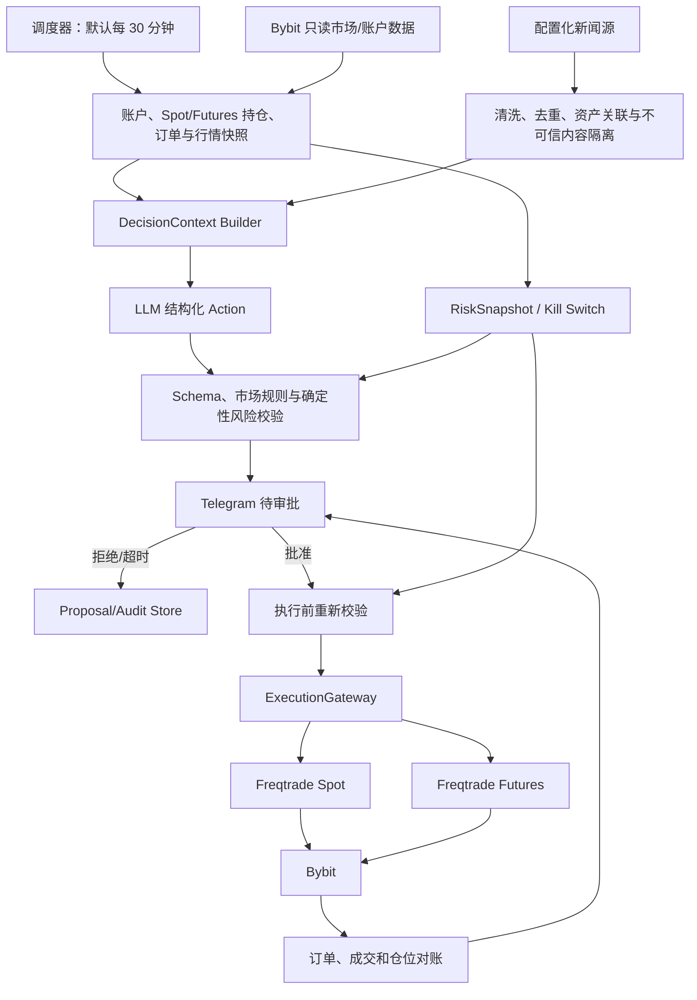
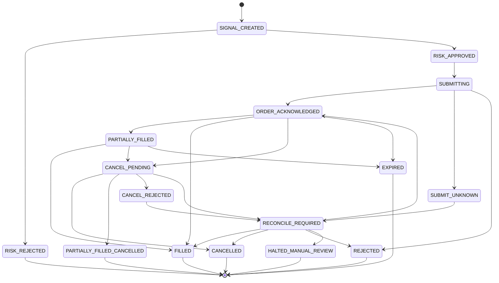

# alphaMind 系统架构

## 1. 架构目标

alphaMind 必须同时解决五个不同问题：

1. AI 能否基于真实账户、行情和新闻生成清晰、结构化的候选动作；
2. 用户能否通过 Telegram 安全、及时且幂等地批准或拒绝动作；
3. 系统能否在真实成本、合约约束和交易限制下自动执行已批准动作；
4. 当模型、交易所、网络或人工判断出错时，损失是否可控；
5. 每个周期、新闻引用、建议、审批、订单和人工干预能否被复盘。

任何单独的 AI 模型、回测框架或交易所 SDK 都不能覆盖全部问题，因此系统采用分层架构。

本文件描述逻辑边界，不要求把每层拆成微服务。Freqtrade 承载 Spot/Futures 订单、持仓和 Runtime DB；alphaMind 负责调度、新闻、AI Context/Action、Telegram 审批、确定性风险与 ExecutionGateway。范围、任务和进度始终以 [完整开发计划](development-plan.md) 为准。

## 2. 总体数据流



## 3. 模块边界

### 3.1 数据层

职责：

- 获取 OHLCV、Trades、Order Book、Mark Price、Index Price、Funding Rate 和 Open Interest；
- 保存交易所原始响应，不能只保留统一后的字段；
- 所有时间统一为 UTC；
- 检查重复、缺口、乱序、异常值和时间漂移；
- 原始数据只追加，不允许研究代码原地修改；
- 特征数据必须记录生成版本、输入范围和代码版本。

MVP 的现货决策至少需要 OHLCV、余额、持仓和挂单；合约决策还必须包含 Mark Price、Funding Rate、杠杆、保证金、强平价和保护单。Order Book、逐笔成交和清算流仍属于后续增强，不是首个闭环前置条件。

### 3.2 策略层

决策层接收经过验证的 `DecisionContext`，由 AI 输出结构化 `Action`。传统 Donchian/ATR/EMA 作为上下文特征和对照基线，不再直接拥有唯一交易权威：

```text
cycle_id
action_id
instrument_id
market                  # spot / linear_perpetual
side                    # long / short
action                  # HOLD / OPEN / ADD / REDUCE / CLOSE / CANCEL_ORDER
entry_range
stop_loss
take_profit
reduce_fraction
requested_leverage
valid_until
reason_codes
news_refs
rationale
risks
```

`Action` 不包含最终可执行数量。AI 负责表达方向、动作、失效条件和证据；确定性风险引擎根据 NAV、止损距离、余额/保证金、单标的与组合暴露、杠杆和交易所规则计算批准数量。

Action 进入 Proposal Store，只有 `APPROVED` 且执行前复核通过的动作才能交给 ExecutionGateway。ExecutionGateway 将 Action 映射为 Freqtrade REST/RPC、tag/custom data 或受控 strategy callback；它不直接向 Bybit 写单。

策略层不能：

- 直接调用交易所 API；
- 越过配置修改最终杠杆或数量；
- 未经 Telegram 批准自行扩大仓位；
- 在亏损后取消止损；
- 访问生产 API Key。

### 3.3 风险层

风险层是确定性规则引擎，必须在每次下单前检查：

- 数据是否新鲜；
- 交易所和账户是否健康；
- 本地持仓是否与交易所一致；
- 独立的 regime/market health 计算是否允许该策略运行；策略上报的 `observed_market_regime` 只用于审计，不能作为唯一依据；
- 单笔、单标的、单策略和同方向风险是否超限；
- 是否触发日亏、周亏或回撤限制；
- 是否存在重复信号或未完成旧单；
- 是否处于冷却期、只减仓模式或全局暂停状态。

建议的初始保护项：

```text
max_open_positions
max_symbol_exposure
max_strategy_exposure
max_directional_exposure
daily_loss_limit
weekly_loss_limit
drawdown_kill_switch
stale_data_guard
order_rate_limit
cooldown_after_stop
cancel_stale_orders
close_only_mode
manual_global_kill
```

风险审批通过后输出独立的 `RiskApprovedOrder`，至少包含：

```text
risk_decision_id
signal_id
symbol
side
order_type
approved_quantity
limit_price
stop_price
reduce_only
time_in_force
expires_at
risk_budget_used
decision_reason
created_at
```

执行层只能消费已批准且重新校验通过的 Action，不能直接根据模型 `confidence` 或自然语言推导订单数量。合约减仓/退出必须使用 reduce-only；任何退出路径都不能扩大原始持仓。

Freqtrade 继续由 `custom_stake_amount`、leverage callback、position adjustment、配置上限和入场确认完成最终风险映射。Proposal/Action Store 是授权与审计来源，不成为第二个交易所订单权威。

### 3.4 执行层

当前执行层由 ExecutionGateway + Spot/Futures Freqtrade 实例组成。Gateway 将已批准 Action 映射为 Freqtrade 操作，Freqtrade 是唯一 Bybit 写入者。Action、Freqtrade trade/order 和 Bybit order ID 必须关联；无法判断写请求结果时先查询和对账，禁止盲目重试。



`SUBMIT_UNKNOWN` 表示请求超时或连接中断后无法判断交易所是否已经接单。该状态禁止盲目重试，必须按交易所 order id、可用的 `client_order_id`、open orders、fills、余额变化和本地持久记录对账。超过预注册时限仍无法得到唯一结论时进入 `HALTED_MANUAL_REVIEW`。`CANCELLED`、`EXPIRED` 和 `PARTIALLY_FILLED_CANCELLED` 都必须保留累计成交数量，不能把订单终态误当成零成交。

订单状态机不能替代持仓状态机。第一阶段至少维护：

```text
FLAT -> ENTRY_PENDING -> OPEN -> EXIT_PENDING -> FLAT
ENTRY_PENDING -> POSITION_RECONCILE_REQUIRED
OPEN -> POSITION_RECONCILE_REQUIRED
EXIT_PENDING -> POSITION_RECONCILE_REQUIRED
```

风险限制、止损、最大持仓时间和盈亏必须基于已对账的持仓状态，而不是仅根据最后一个订单状态推导。

进程重启后必须先执行对账：

1. 从交易所读取余额、持仓、未成交订单和近期成交；
2. 与内部运行状态逐项比较；MVP 使用 Freqtrade Runtime DB，自研系统使用其获批的运行数据库；
3. 不一致时进入 `RECONCILE_REQUIRED`；
4. 对账完成前禁止开新仓，只允许减仓或人工确认；
5. 所有修正动作写入审计日志。

对账还必须识别外部人工交易、充值提币、奖励、返佣、手续费币种变化和交易所自动行为。无法分类的差异不能自动计入策略 PnL，必须进入人工复核。

### 3.5 验证环境边界

执行证据分为五层，必须分别保存：

| 环境 | 主要证明内容 | 不能证明的内容 |
|---|---|---|
| Historical Backtest | 信号规则、历史成本敏感度、样本外表现 | 真实成交、API 和重启恢复 |
| Freqtrade Dry-run | 实时信号、配置、模拟订单和运行稳定性 | 交易所真实接单、partial fill、离线成交 |
| Deterministic Replay/Fault Injection | 超时、重复事件、partial fill、撤单竞争、状态机和恢复逻辑 | 交易所真实参数、权限和写请求行为 |
| 独立 Testnet Contract Harness | 目标交易所支持时验证 API Key、下单参数、精度、订单和查询契约 | 生产流动性和策略收益；Freqtrade 本身不运行 sandbox account |
| Live Canary | 小额真实成交、费用、滑点和生产运维 | 策略长期有效性和扩容安全性 |

目标交易所没有可信 Testnet 或测试下单端点时，Replay/Shadow 仍用于验证内部故障逻辑，但 Live Canary 将是第一次完整验证生产写路径。该残余风险必须显式审批，不能因为已经完成 Shadow 就声称 API 写路径通过。

## 4. CCXT 与原生 API 的职责

本节适用于 Freqtrade 内部适配能力无法满足需求、且自研执行组件已经按 4.3 节获批的场景。`ExchangePort` 是条件式目标设计，不是默认 MVP 交付物。

### 4.1 默认使用 CCXT/CCXT Pro

CCXT 负责统一处理：

- Markets、Ticker、OHLCV、Order Book 和 Trades；
- Balance、Order、Trade 和 Position；
- 普通创建、查询和取消订单；
- 统一交易对、时间戳和常见异常；
- CCXT Pro WebSocket 行情、订单和成交推送。

策略和风控层只依赖项目定义的 `ExchangePort`，不能直接依赖 CCXT 对象：

```python
from collections.abc import AsyncIterator
from typing import Protocol


class ExchangePort(Protocol):
    async def fetch_markets(self) -> list[Market]: ...
    async def fetch_balance(self) -> Balance: ...
    async def fetch_positions(self) -> list[Position]: ...
    async def fetch_open_orders(self) -> list[Order]: ...
    async def create_order(self, request: OrderRequest) -> Order: ...
    async def cancel_order(self, order_id: str) -> Order: ...
    def watch_order_book(self, symbol: str) -> AsyncIterator[OrderBook]: ...
    def watch_orders(self) -> AsyncIterator[Order]: ...
    async def reconcile(self) -> ReconciliationResult: ...
```

### 4.2 原生适配器只补充差异

以下能力常存在交易所差异，需要原生参数或原生 API：

- Hedge Mode 与 One-way Mode；
- Cross 与 Isolated Margin；
- `reduceOnly`、Post-only、条件单和批量订单；
- 触发价格使用 Last、Mark 或 Index；
- 合约数量单位、杠杆和仓位模式；
- 私有 WebSocket、ADL、强平和组合保证金；
- 期权 Greeks、多腿组合和交易所专有风控字段。

推荐结构：

```text
ExchangePort
└─ CCXTExchangeAdapter
   ├─ BinanceOverrides
   ├─ OKXOverrides
   └─ BybitOverrides
```

普通能力使用 CCXT 统一接口，高级能力通过 `Overrides` 实现。所有响应同时保存标准字段和原始 `info` 字段。

### 4.3 Freqtrade 与自研组件边界

MVP 由 Freqtrade 负责数据下载、回测、Spot/Futures 交易运行、订单、持仓和 Runtime DB。alphaMind 自定义调度、新闻、AI、审批、风险与 ExecutionGateway，但不复制 Freqtrade 的订单数据库和交易所写入能力。

自研 `ExchangePort`、Order Manager 或完整交易服务不属于默认 MVP。只有同时满足以下条件才允许启动：

1. 已记录 Freqtrade 无法满足的具体能力，而不是基于未来扩展提前设计；
2. 已比较 Freqtrade 扩展、交易所原生适配和自研服务三种方案；
3. 已定义从研究信号到新执行系统的同源性测试，避免 backtest 与 live 使用不同规则；
4. 已准备订单回放、故障注入、重启恢复和并行 shadow 验证；
5. 迁移决策写入唯一开发计划，并重新完成对应 dry-run、Demo/Testnet 和小额验证。

CCXT/CCXT Pro 是适配库，不提供 alphaMind 的风险政策和完整状态一致性保证。Sandbox 支持、订单类型、限频和 WebSocket 字段必须按 Phase 0 选定的交易所逐项验证。

## 5. AI 决策与审批边界

### 5.1 Decision Cycle

调度器默认每 30 分钟启动一个不可重叠周期，也支持手工触发。每个周期生成唯一 `cycle_id`，读取账户、持仓、挂单、行情、合约风险、新闻、上一周期结果和当前风险预算。

模型不可用、超时、输出损坏或 Schema 不通过时，本周期不增加风险；现有止损、保护单、Kill Switch 和确定性退出继续运行。

### 5.2 新闻边界

新闻通过配置化适配器进入 `NewsItem`，执行时间校验、去重、资产关联、来源分类和长度限制。新闻正文是不可执行的不可信数据：其中任何“忽略系统规则”“调用工具”或“立即下单”指令都不能改变 Prompt、权限、Schema 或风险规则。

AI 以新闻为理由时必须引用本周期实际存在的 `news_id`；Telegram 显示标题和来源链接。

### 5.3 AI Authority

AI 可以提出：

- HOLD、开仓、加仓、减仓、平仓和撤单；
- spot 或 linear perpetual、long/short；
- 入场区间、止损、止盈、有效期和理由；
- requested leverage 和 reduce fraction。

AI 不能决定：

- 最终数量、保证金和有效杠杆；
- 项目级损失、单笔风险、组合敞口和强平缓冲；
- 是否解除止损、Close-Only 或 Kill Switch；
- 是否绕过 Telegram、最小金额、精度或交易所上限；
- 是否自动提高最大杠杆。

### 5.4 Telegram Authority

Telegram 是普通 AI 动作的人工授权面，只保存审批事件，不持有 Bybit key。必须验证 user/chat 白名单、nonce、TTL 和幂等；多个动作分别批准。拒绝、过期或重复点击不能产生执行。

每个通过 R2 业务校验的非 HOLD Action 独立进入 Proposal Store。Store 以不可变 ApprovalEvent 历史维护
当前投影，使用 expected state 和 idempotency key 阻止并发覆盖与第二次用户决定；有效期不能超过 Action
自身有效期或配置审批 TTL。R3-04 已启用 `APPROVED -> REVALIDATING -> QUEUED/EXPIRED/CANCELLED`；
订单提交、部分成交和最终结果状态仍必须等待 R4 ExecutionGateway。
详细存储与状态边界见 [ADR-0012](decisions/0012-proposal-store-state-machine.md)。

R3-02 使用 `python-telegram-bot` 22.x 的 async `Bot` API 与原生 `InlineKeyboardMarkup` 展示概览、详情和
批准/拒绝按钮。按钮 payload 只含操作与 proposal ID，不含 nonce、原始 user/chat ID 或完整交易参数；
消息发送成功后才进入 `PENDING_APPROVAL`，批准、拒绝或过期后编辑原消息并移除按钮。适配层只消费
R3-03 未来产出的 `VerifiedTelegramCallback`，自身不声称已经验证原始 Telegram Update。具体边界见
[ADR-0013](decisions/0013-python-telegram-bot-approval-adapter.md)。

R3-03 将原始 `Update.callback_query` 收口到 `TelegramCallbackProcessor`。每个 Action 生成独立随机 nonce
hash；按钮使用不超过 64 bytes 的紧凑 HMAC payload，签名绑定 action、proposal、有效期和目标 chat hash。
认证要求当前环境 allowlist 与 Proposal 创建时快照同时命中，并在认证前 ACK callback；篡改、跨 chat、
inline/inaccessible message、过期和重复点击均不能产生第二个用户决定。原始 ID、nonce、callback secret
和 query ID 不进入 Proposal Store。详细认证合同见
[ADR-0014](decisions/0014-telegram-callback-authentication.md)。

批准不等于无条件下单。R3-04 使用新绑定的 DecisionContext 与已验证 RiskSnapshot 重新检查价格是否仍在
批准范围、最新仓位/挂单、余额/保证金、entry/safe-exit 风险状态及当前市场精度、最小数量/notional 和
杠杆上限。Context 与 RiskSnapshot 的 id、NAV、余额、风险状态和挂单集合必须一致；任一不确定性进入
`CANCELLED/EXPIRED` 且没有 execution 详情。只有全部通过才能生成一次 `QUEUED` 事实，并绑定
context/risk/capability hash；该状态仍不表示订单已提交。详细合同见
[ADR-0015](decisions/0015-execution-preflight-revalidation.md)。

R3-05 使用受限 `TelegramNotification v1` 消费可信执行或风险事实，覆盖成功、部分成交、未执行、失败和
风险告警。通知先进入独立 SQLite FULL/WAL outbox，再由 worker lease 投递；相同 source event 确定性
派生稳定 notification ID，异文重放 fail-closed。Telegram 与 SQLite 不能原子提交，因此投递语义明确为
至少一次，消息携带稳定 ID 以识别崩溃窗口中的重复。通知链不保存原始 Telegram 身份、异常正文或远端
响应，也不从 `QUEUED` 推断订单或成交；真实执行结果仍须等待 R4 的 Freqtrade/交易所对账事实。详细合同
见 [ADR-0016](decisions/0016-telegram-execution-risk-notifications.md)。

### 5.5 模型与 Prompt 治理

provider、model、Prompt、采样参数、Token/成本、超时和重试配置化。每个周期记录 model/prompt/config 版本与输入 hash。个人项目的小幅 Prompt 变化只分段统计，不机械重启 90 天 Paper；真实资金下的重大行为变化回到短期 dry-run。

AI 周期终态写入独立、append-only 的 Decision Journal：只保存通过本地合同与业务校验后的 HOLD/候选
动作，或安全的模型错误枚举，并绑定 model、Prompt、config、Schema 版本与输入/正文 hash。Journal 写入
失败时本周期强制 `HOLD_ONLY`；它不声明 Telegram 批准、风险定仓、订单或成交事实。详细所有权见
[ADR-0011](decisions/0011-ai-decision-journal.md)。

### 5.6 辅助 Agent

Research、Code、Audit 和 Review Agent 可以继续用于研究与开发，但不是交易运行时的额外投票委员会，也不能直接修改生产配置或资金权限。MVP 不实现多 Agent 辩论和自动 Prompt 优化。

## 6. 状态与存储

建议使用：

- Parquet：不可变历史行情和特征快照；
- Freqtrade Runtime DB：Freqtrade `Trade`、`Order`、open position 和重启恢复状态；
- alphaMind Decision Journal：不可变 AI 周期终态和已验证候选动作，供 Proposal Store 消费；
- alphaMind Proposal Store：逐 Action 授权、重新校验、执行队列绑定、不可变事件与当前投影，不保存订单/成交权威；
- alphaMind Research/Audit DB：策略版本、实验、数据清单、风险快照、人工干预、告警和复盘；
- Redis：只有出现真实的跨进程任务、锁或短期协调需求后才引入，不作为 MVP 默认依赖；
- 对象存储：回测报告、模型文件和日志归档。

MVP 中 Freqtrade Runtime DB 是订单与持仓运行状态的唯一内部权威，alphaMind Audit DB 只能保存只读关联和审计事件。二者可以使用不同物理数据库，也可以使用严格隔离的用户/schema，但不能由两个写入者共同维护同一订单状态。dry-run、live 和多个 bot 实例必须使用不同数据库、用户或 schema。

对于实盘余额、订单和成交，交易所是操作事实来源；发现差异时停止新入场，先由 Freqtrade 和交易所完成运行恢复，再向 Audit DB 补写差异和处置记录。Audit DB 不参与反向恢复 Freqtrade。

## 7. 安全设计

- 使用独立交易子账户；
- API Key 只允许读取和交易，禁止提现；
- 使用 IP 白名单；
- 密钥存放在 Secret Manager 或加密存储中；
- 研究和生产环境物理或权限隔离；
- Agent 使用独立、可撤销、最小权限 Token；
- Freqtrade MVP 的策略与 bot 同进程运行，无法宣称已经实现独立的无网络/无写入沙箱；当前通过代码评审、固定 hash、最小挂载、只读根文件系统和受控配置降低风险，并显式接受同进程残余权限；
- 自研执行系统获批后，策略计算进程才要求无交易所网络权限、无生产密钥和受限文件写入，并通过结构化消息与风险/执行进程通信；
- 实盘策略绑定固定 commit/hash；
- 生产监控端必须使用 HTTPS、强密码和访问控制；
- 禁止将监控面板、数据库或 Redis 裸露到公网。

## 8. 可观测性

最低监控指标：

- 行情新鲜度和数据缺口；
- WebSocket 重连次数；
- API 延迟、超时和限频；
- 信号数、批准数和拒绝原因；
- 下单、成交、撤单和拒单率；
- 滑点和限价单成交率；
- 当前仓位、方向暴露和保证金；
- 已实现/未实现盈亏；
- 日亏、周亏和最大回撤；
- 本地状态与交易所状态差异；
- 策略外人工操作。

严重事件必须触发即时告警，并根据规则自动进入 `PAUSED`、`CLOSE_ONLY` 或 `KILLED` 状态。
