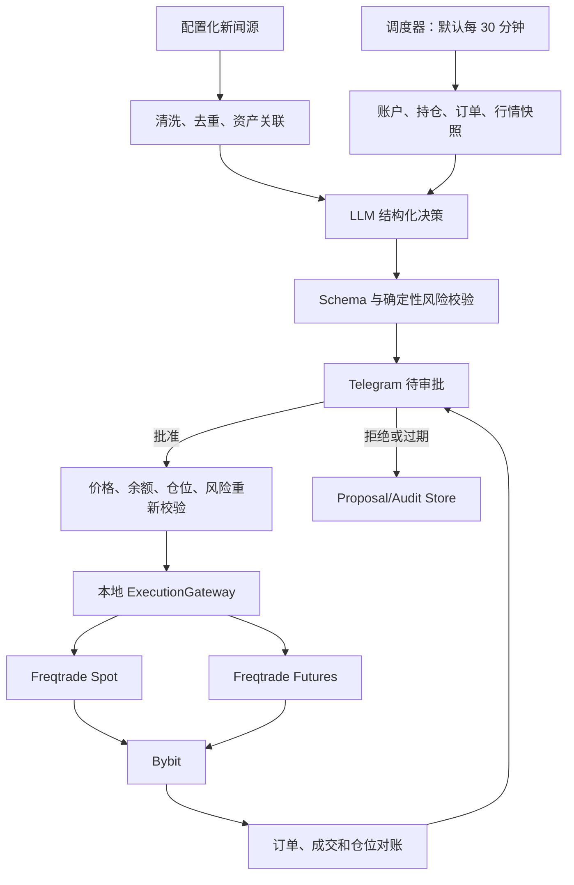

# alphaMind 完整开发计划

| 元数据 | 内容 |
|---|---|
| 状态 | Normative / 唯一开发计划与进度账本 |
| 设计基线 | `main@6238335` 后的 2026-07-18 产品重定基线 |
| 制定日期 | 2026-07-15 |
| 最近进度更新 | 2026-07-18 / 完成全仓依赖优先审计与通用基础设施去手写封装；R2-03 仍为 `READY_TO_VERIFY`，下一执行步骤是一次真实只读 provider 冒烟与 usage 对账 |
| 适用范围 | 个人 AI 交易系统；默认每 30 分钟观察；Telegram 人工授权；Bybit 现货与 USDT 永续；配置化 BTC/ETH/SOL/HYPE；Freqtrade 执行 |
> 当前阶段：已完成的 P0-01 至 P2-06、P3-01 至 P3-04 作为可复用研究、风险、审计和数据库底座保留。项目于 2026-07-18 重新定基线：AI 决策、新闻输入、Telegram 审批和批准后自动执行成为 MVP 主链；币种、市场、周期和杠杆改为配置化；现货与 Bybit USDT 永续均纳入 MVP。R0-01 至 R0-04 已完成配置、Schema、模型、Prompt 和首批新闻源合同；R1-01 至 R1-06 已完成配置化账户观察底座；R2-01/R2-02 已完成决策合同与新闻采集。R2-03 的官方 OpenAI Python SDK Responses provider、严格结构化输出、有限重试和成本账本已经实现并通过离线门禁，当前为 `READY_TO_VERIFY`；因本机没有 `OPENAI_API_KEY`，仍需一次真实只读请求和 usage 对账后才能标记 `DONE`，R2-04 尚未开始。R0-05 的真实资金参数不阻塞 R1-R3 dry-run。`development-plan.md` 是唯一规范与进度收口，其他文档不能维护独立任务状态

## 1. 计划目的与使用规则

本文把现有架构、运行合同、策略规范和路线图转化为可排期、可验收、可追溯的开发工作包。后续开发必须引用本文中的任务 ID，并按依赖顺序推进。

文档职责和冲突处理顺序如下：

1. 项目范围、开发顺序、任务状态、下一任务和验收方式均以本文为最高依据；
2. [Freqtrade MVP Runtime Contract](freqtrade-mvp-runtime-contract.md) 作为已完成现货底座的技术输入；与本文的新 AI、合约或配置化范围冲突时，必须在 R0-02 更新，不能反向覆盖本文；
3. [策略研究与验证规范](strategy-research-and-validation.md) 只约束需要做严格量化有效性声明的研究，不再阻止 AI 产品主链、dry-run 或 Testnet 开发；
4. [系统架构](architecture.md)、[开发路线图](roadmap.md)、ADR 和审核意见是本文的支撑材料，不得拥有独立进度账本；
5. 任何支撑文档与本文冲突时，以本文为准，并在 R0-02 或相关任务中同步消除冲突。

执行规则：

- R0 完成前允许实现无密钥、fake adapter 和只读市场/账户能力；认证交易调用仍须满足对应 R4/R5 任务；
- AI、新闻、Telegram 和 ExecutionGateway 是 MVP 正式范围，不再需要以“引入 AI Agent”为由另行申请架构许可；
- 每个变更必须对应一个任务 ID，例如 `P1-03`；
- 每个任务在产物和与风险相称的测试满足后即可标记完成；项目所有人负责真实资金、风险上限和杠杆批准；
- 个人项目不要求虚构独立评审者；第二人复核是扩资或高杠杆前的推荐项，不是普通开发门禁；
- 任何影响信号、仓位、退出、成本、风险阈值或运行所有权的变更，都必须先更新决策记录和本文；
- dry-run、Demo/Testnet 和小额 Live 仍按 R4-R6 顺序推进，但不再强制固定 90 天 Paper 或一次性 Final Holdout；
- 真实资金动作不能以“无报错运行”替代幂等、风控、执行复核和资金对账证据。

进度账本规则：

- 本文同时是规范性计划和唯一任务进度账本；不得维护一份与本文状态不同的临时进度清单；
- 每次完成、暂停、拆分或迁移任务时，必须在同一批改动中更新顶部“当前阶段”、第一轮执行清单、实际产物、验证结果和延期项；
- 状态只使用 `NOT_STARTED`、`IN_PROGRESS`、`READY_TO_VERIFY`、`BLOCKED`、`PAUSED`、`SUPERSEDED`、`DONE`；`DONE` 必须能从仓库产物和验证证据复核；
- 未完成验证若迁移到后续任务，必须同时写明新的任务 ID 和它所阻止的门禁，禁止仅删除原验收项；
- 提交前必须核对代码、配置、ADR、测试结果与本文状态一致；发现不一致时先修正账本再提交；
- 提交信息应能关联本轮主要任务 ID；开发交接和状态报告以本文当前内容为准。

## 2. 设计分析结论

### 2.1 已经明确且应保持的决策

现有设计形成了以下一致结论，后续不应重复争论或绕开：

| 主题 | 已冻结方向 | 开发含义 |
|---|---|---|
| MVP 框架 | Freqtrade | 不实现第二套 Order Manager |
| 交易所接入 | Freqtrade 内部 CCXT 能力 | 策略和 watchdog 不直接创建订单 |
| 市场范围 | Bybit 现货 + USDT 线性永续 | Spot 与 Futures 使用隔离配置、DB 和风险口径 |
| 标的与方向 | Instrument Registry 配置；初始 BTC/ETH/SOL/HYPE | 代码不得以固定币种分支限制扩展；现货 long，合约按配置 long/short |
| 决策周期 | 默认 30 分钟，可配置 | AI 周期不替代实时止损、Kill Switch 和事件告警 |
| 决策权威 | AI 生成结构化候选，Telegram 人工授权 | 批准后系统自动执行；LLM 与 Bot 均不直接持有 Bybit key |
| 新闻输入 | MVP 正式输入 | 来源配置化、去重、资产关联、引用和 Prompt Injection 隔离 |
| 策略特征 | Donchian、ATR 等保留 | 作为 AI 特征和传统基线，不再是唯一交易权威 |
| 杠杆 | 全局、标的、交易所三层上限 | 最终有效杠杆与数量由确定性风险模块裁剪 |
| 运行状态 | Freqtrade Runtime DB | Audit DB 不恢复或覆盖 Trade/Order |
| 风险审批 | 外部 watchdog + Freqtrade callback | callback 只读缓存快照，禁止阻塞式远程调用 |
| 验证层 | fixture/fake、Dry-run、Demo/Testnet、小额 Live | 先验证功能和资金安全；严格统计研究是扩展证据而非产品阻塞 |

### 2.2 当前仓库事实

- 仓库已有 Python package、Freqtrade 2026.6 适配器、研究/风险/审计/Runtime DB 模块、Compose、184 项测试和历史研究产物；
- P3-01 至 P3-04 的风险定仓、Audit Outbox 和 Runtime DB 隔离继续复用；原 RiskSnapshot v1 已由 R1-04 升级为 spot/futures v2；
- `configs/freqtrade/common.json` 仍固定历史 Donchian 的 `spot`、`4h`，且关闭 position adjustment/force entry；pair whitelist 已由 Instrument Registry 生成，不再固定 BTC/ETH；
- `src/alphamind/risk/freqtrade_adapter.py` 与 `watchdog.py` 已消费 Instrument Registry；Freqtrade 风险适配器进一步从 R1-03 capability 快照派生 BTC/ETH/SOL/HYPE 的价格精度、数量步长和最小名义金额；
- 仓库已有周期调度、冻结决策 Schema 和 R2-01 运行时合同绑定；尚无 DecisionContext Builder、
  新闻适配器、AI provider、Telegram 审批、Proposal Store 或 ExecutionGateway；
- 当前实现仍无法形成“AI 观察 -> 用户批准 -> 自动下单”的产品闭环，R2-02 至 R5 必须继续解决该差距。

### 2.3 必须在编码前解决的设计缺口

| 编号 | 缺口 | 默认建议 | 未解决时的影响 |
|---|---|---|---|
| G-01 | 目标交易所未定 | **已解决**：开发目标固定为 Bybit 国际版现货；常驻地区仅作为 Live Canary 外部准入检查 | P0-03 已锁定运行版本；端点实测由 P1-02/P3-06 负责 |
| G-02 | Donchian 与 Dual EMA 尚未最终二选一 | **已解决**：第一策略和参数已由 ADR-0004 固定为 4h Donchian 20/10、ATR(20) × 2 stop；1d 仅做稳健性复测 | P2-01/P2-02 必须与 Strategy Card 同源 |
| G-03 | Freqtrade、CCXT、Python 和镜像未锁定 | **已解决**：版本和 digest 已写入 `configs/common/runtime-versions.toml`；固定镜像内实测迁移至 P1-02 | 不阻塞 P0-04、P0-05 和离线开发；实测前不得完成 P1-02 或进入 Paper/Live |
| G-04 | 数据原始层定义存在张力 | **已解决**：ADR-0005 固定 Freqtrade Feather 首次落盘文件为不可变 source snapshot，不保留原始 REST payload；actual hash 由 P1-03 下载后登记 | P1-03/P1-04 必须遵守 source/clean/features/holdout 隔离和禁止静默补缺合同 |
| G-05 | Runtime DB 选型与 watchdog 只读路径未定 | **已解决**：ADR-0007 固定本地/dry-run 隔离 SQLite 只读路径，Paper/Live 候选使用 PostgreSQL SELECT-only 角色；Freqtrade 保持唯一写入和 migration 所有者 | P3-04 必须实测只读权限、版本 allowlist、RPO/RTO 和恢复顺序 |
| G-06 | callback 到 Audit DB 的异步通道未定 | **已解决**：ADR-0007 固定独立 SQLite WAL outbox、50 ms callback 上限、10,000/256 MiB 容量、分级背压与幂等 sidecar writer | P3-03 必须验证 crash/retry/dead-letter，达到阈值时新入场 fail-closed |
| G-07 | Replay 的验证对象容易越界 | **已解决**：Replay 只验证 alphaMind 风险、审计、适配与运维处置；partial fill/submit unknown 使用 fixture 与锁定版本 Freqtrade 集成测试，不建立第二订单权威 | P3-05 必须证明 Replay 无生产凭据、无交易写权限且证据不越层 |
| G-08 | 旧 Paper 的最小信号、成交和独立事件数 | **历史已解决，当前已取代**：原 ADR-0004 门槛只用于 Donchian 严格研究；R6 改为 14–30 天稳定性与资金对账 | 不再阻塞 R0-R5；需要统计声明时另行研究 |
| G-09 | 部署平台与密钥方案未定 | **已解决**：P0-08 gate 整合 P0-01/P0-02/P0-03，固定 Windows 无 key 研究、Linux amd64 pinned Docker 生产候选、分离 trade/read-only key、禁 Withdrawal、IP 绑定与仓库外 `0400` 只读 secret 文件 | P3-07/P3-08 必须实测 host 加固、secret mount、撤销与轮换；失败时不得进入 Paper/Live |
| G-10 | Kill Switch 的实际动作未定 | **已解决**：ADR-0006 与 runbook 固定 entry fail-closed、撤销未成交入场、保留安全退出、Kill 人工处置和恢复证据 | P3-05 必须完成故障与恢复演练 |
| G-11 | AI 决策链不存在 | R2 定义 Context、模型接口和 Action Schema | 未完成时系统仍只是传统策略机器人 |
| G-12 | 新闻输入不存在 | R2 建立配置化来源、去重、资产关联和不可信内容边界 | 未完成时不满足产品设想 |
| G-13 | Telegram 只读/审批链不存在 | R3 建立状态机、白名单、nonce、TTL 与结果通知 | 未完成时用户无法授权 AI 动作 |
| G-14 | 币种和市场硬编码 | R1 引入 Instrument Registry 和运行时市场能力查询 | 未完成时 SOL/HYPE 与合约仍需改代码 |
| G-15 | Freqtrade 能否表达全部 AI 动作尚未验证 | R4 先做 OPEN/ADD/REDUCE/CLOSE/CANCEL POC | 未解决时不得假定批准动作可可靠执行 |
| G-16 | 合约风险模型缺失 | R5 增加杠杆、保证金、名义敞口、强平缓冲、funding 和 reduce-only | 未完成时不得使用真实合约资金 |

`G-04` 和 `G-07` 是最容易造成过度设计的两点。前者不能为了“保存一切”提前建设通用行情平台；后者不能为了测试 partial fill 而在 Freqtrade 外维护一套生产订单真相。

### 2.4 关键逻辑链


运行时的数据流必须保持单一写路径：



约束：

- 只有 Freqtrade 拥有交易写权限；
- AI 负责提出动作，Telegram 批准构成授权，批准后 ExecutionGateway 自动驱动 Freqtrade；
- watchdog 不能创建、取消或修改订单；
- Audit DB 不能成为订单或持仓恢复源；
- RiskSnapshot 缺失、陈旧、损坏或版本不支持时，新入场必须 fail-closed；
- 风险停止不能阻断止损、安全退出或撤销未成交入场单。
- 30 分钟 AI 周期不替代持续止损、交易所托管保护、Kill Switch 和即时风险告警。

### 2.5 反方观点与失败路径

#### 观点一：直接自研执行引擎更灵活

自研可以更完整地表达幂等键、partial fill 和状态机，但当前只有单所现货、两个标的和简单趋势策略。此时自研会同时引入交易所适配、订单生命周期、数据库恢复和生产运维风险，无法证明收益超过复用 Freqtrade 的成本。结论：MVP 不采纳；只有 Runtime Contract 的六项替换门槛全部满足后重新立项。

#### 观点二：同时实现 Donchian 和 Dual EMA 可以加快选优

同时实现会把“建立验证链路”变成隐性策略搜索，扩大多重测试偏差。第一策略的目标不是找到收益最高的规则，而是证明研究、风险和运行链可复现。结论：默认 Donchian，只允许在 Phase 0 看策略结果之前改选一次。

#### 观点三：固定 90 天 Paper 才能开始小额实盘

固定 90 天对个人产品迭代过重，也不能单独证明 AI 决策有效。结论：R4 先完成至少 7 天现货 dry-run，R6 再进行 14–30 天 spot/futures 联合运行；是否继续观察由稳定性、审批、执行和资金对账决定，而不是机械天数。

#### 观点四：Testnet 或 dry-run 通过即可证明执行安全

Freqtrade 官方文档明确区分 dry-run 与真实交易；其 FAQ 也不把 sandbox 市场视为真实策略验证环境。Testnet 的订单簿、流动性和参与者与生产不同。结论：无论是否有 Contract Harness，Live Canary 仍是生产写路径和真实成交的独立证据层。

## 3. MVP 范围

### 3.1 In Scope

- Bybit 现货与 USDT 线性永续；
- 配置化 Instrument Registry，初始配置 BTC、ETH、SOL、HYPE；
- 现货 long；合约按配置支持 long/short、isolated margin 和最大杠杆；
- 默认每 30 分钟读取账户、持仓、挂单、行情、合约风险和新闻；
- AI 生成 `HOLD/OPEN/ADD/REDUCE/CLOSE/CANCEL_ORDER` 等结构化动作；
- Telegram 展示、批准、拒绝、过期、暂停和结果通知；
- 用户批准后的自动复核、下单、成交对账和通知；
- Donchian、ATR、EMA 等确定性特征与传统基线；
- 现金、单标的 Buy-and-Hold、可选初始 50/50 不再平衡组合和简单均线基准；
- Freqtrade 数据下载、回测、lookahead analysis、recursive analysis、dry-run 与 Live Canary；
- point-in-time 数据质量、实验登记、成本与成交模型；
- 风险定仓、RiskSnapshot、日/周亏损、回撤、close-only 和 Kill Switch；
- Runtime DB 与 Research/Audit DB 隔离；
- 监控、告警、备份恢复、人工操作和证据归档；
- alphaMind 自有逻辑的单元、合同、集成、回放和故障注入测试。

### 3.2 Out of Scope

- 多账户、多交易所、多腿和跨所套利；
- 自研 Order Manager、ExchangePort 和生产订单状态机；
- 无 Telegram 审批的完全自主实盘；
- AI 自动提高杠杆、解除止损或修改项目级风险边界；
- 期权、跨所、组合保证金和 Funding/Basis Carry 策略；
- 多模型辩论、多 Agent 委员会和自动 Prompt 优化；
- 未经清洗的 Twitter/Telegram 群全文输入；
- Redis、Kafka、Kubernetes 和微服务拆分；
- 复杂前端与公开 Internet 管理面；
- 高频或亚分钟交易；
- 自动 Hyperopt 或以收益目标为停止条件的参数搜索。

## 4. 目标仓库布局

以下目录在对应任务开始时创建，不提前批量生成空目录：

```text
alphaMind/
├─ docs/
│  ├─ decisions/                 # Phase 0 决策记录
│  ├─ runbooks/                  # 运维、恢复、Kill Switch
│  ├─ README.md
│  ├─ architecture.md
│  ├─ development-plan.md
│  ├─ freqtrade-mvp-runtime-contract.md
│  ├─ roadmap.md
│  ├─ strategy-research-and-validation.md
│  └─ strategy.md
├─ configs/
│  ├─ common/
│  ├─ alphamind/                 # 调度、模型、新闻、Telegram、资产与市场配置
│  ├─ spot/                      # Spot Freqtrade 实例配置
│  ├─ futures/                   # Futures Freqtrade 实例配置
│  ├─ backtest/
│  ├─ dry_run/
│  ├─ replay/
│  ├─ testnet_contract/          # 仅在目标交易所支持时创建
│  └─ live/
├─ data/
│  ├─ manifests/                 # 可提交的元数据和 hash
│  ├─ quality/                   # 可提交的质量报告
│  └─ schemas/
├─ research/
│  ├─ hypotheses/
│  ├─ strategy_cards/
│  ├─ experiments/
│  └─ reports/
├─ src/alphamind/
│  ├─ research/
│  ├─ risk/
│  ├─ audit/
│  ├─ config/                    # 业务配置与 Instrument Registry
│  ├─ scheduler/                 # 决策周期和周期锁
│  ├─ news/                      # 新闻适配、清洗、去重与资产关联
│  ├─ ai/                        # Context Builder、模型适配与 Action Schema
│  ├─ approval/                  # Proposal Store 与 Telegram 审批状态机
│  ├─ execution_gateway/         # 只驱动 Freqtrade，不直接持有 Bybit key
│  ├─ replay/
│  └─ monitoring/
├─ user_data/
│  ├─ strategies/                # Freqtrade strategy 的唯一源路径
│  ├─ data/                      # 不提交大体量行情文件
│  ├─ backtest_results/          # 不提交生成物
│  └─ logs/                      # 不提交运行日志
├─ tests/
│  ├─ unit/
│  ├─ contract/
│  ├─ integration/
│  ├─ replay/
│  └─ fixtures/
├─ scripts/
├─ docker/
├─ pyproject.toml
├─ dependency lock file
└─ docker-compose.yml
```

目录约束：

- Freqtrade strategy 只存在于 `user_data/strategies/`，禁止再维护一份顶层副本；
- 可复用的纯计算逻辑放在 `src/alphamind/`，strategy 文件只做 Freqtrade 映射；
- 真实密钥、live 配置、Runtime DB、行情、日志和实验大文件不得提交；
- 示例配置使用 `.example` 或无密钥模板，并通过环境变量或 Secret Manager 注入；
- `execution_gateway/` 只接收已批准 Action 并驱动 Freqtrade，不得成为第二套 Bybit 订单写入者；
- Spot 与 Futures 使用独立 Freqtrade 配置、Runtime DB 和运行身份；真实合约推荐使用专用 Bybit 子账户。

## 5. 阶段和依赖总览

| 阶段 | 入口条件 | 核心产物 | 完成标准 | 建议周期 |
|---|---|---|---|---:|
| 已完成底座 P0-P3-04 | 仓库当前事实 | 研究、风险、审计、Runtime DB | 作为可复用资产保留 | DONE |
| R0 重新定基线 | 用户明确新目标 | 唯一计划、配置/动作/权限合同、旧文档同步 | 无相互冲突的规范 | 1–3 天 |
| R1 配置化与账户观察 | R0 完成 | Instrument Registry、spot/futures 配置、账户与市场快照、30 分钟调度 | 无 LLM 时可按配置生成完整只读周期快照 | 3–7 天 |
| R2 新闻与 AI 决策 | R1 完成 | 新闻管道、DecisionContext、模型接口、Action Schema | 稳定返回合法 HOLD 或候选动作 | 4–10 天 |
| R3 Telegram 人工授权 | R2 完成 | Proposal Store、审批状态机、重新校验和通知 | fake executor 下批准一次只执行一次 | 3–7 天 |
| R4 现货执行纵向闭环 | R3 完成 | Freqtrade ExecutionGateway、配置化现货动作与对账 | Telegram 批准后自动完成 dry-run 现货交易 | 5–10 天 |
| R5 合约与杠杆纵向闭环 | R4 完成 | isolated futures、long/short、杠杆/强平/funding 风控 | Demo/Testnet 合约动作和保护单可对账 | 7–14 天 |
| R6 联合 Paper 与小额 Live | R4/R5 完成 | 14–30 天联合运行、小额上线与版本化指标 | 资金、订单与仓位变化均可解释 | 14–30 天起 |

关键路径：

```text
已完成 P0-P3-04 底座
  -> R0 重新定基线
  -> R1 配置化与快照
  -> R2 新闻与 AI
  -> R3 Telegram 审批
  -> R4 现货闭环
  -> R5 合约闭环
  -> R6 小额上线
```

可以并行但不能跨门禁的工作：

- R0 中，文档同步与配置/Action Schema 设计可以并行；
- R1 中，Instrument Registry、账户快照和调度器可以并行；
- R2 中，新闻适配器与模型 provider 可以并行，但都必须汇合到同一 DecisionContext；
- R3 可先使用 fake executor；R4/R5 不必等待严格收益验证，但必须等待审批、幂等和风控闭环；
- 模型或 Prompt 变化记录版本并分段统计；只有真实资金下发生重大行为变化时才退回短期 dry-run，不机械重启 90 天计时。

## 6. Phase 0：决策冻结

本节至 P3-04 记录 2026-07-18 之前已完成的传统量化底座任务，产物继续有效；其中固定 BTC/ETH 现货、Donchian 唯一权威、独立评审和 Final Holdout 门禁已由 R0-R6 取代。历史验收文字用于说明已完成工作，不再决定下一任务。

### P0-01 项目约束与责任矩阵

产物：

- `docs/decisions/0001-project-scope.md`
- `docs/decisions/ownership-matrix.md`

必须记录：

- 市场、标的、方向、周期和非目标；
- 项目负责人、策略负责人、风险审批人、运维责任人和独立评审者；
- 告警接收、升级时限、人工操作权限和最终停机权；
- 计划资金、最大可接受资金损失和退出条件。

验收：

- 每个责任有具体责任人和替补；
- 不使用“团队负责”作为责任主体；
- 任何人不能同时独占开发、风险批准和 Live Canary 上线批准。

### P0-02 交易所 Capability Matrix

产物：

- `docs/decisions/0002-exchange-selection.md`
- `configs/common/exchange-capabilities.yaml`

已选开发目标：Bybit 国际版现货，CCXT/Freqtrade exchange id 为 `bybit`。

调查项：

- Bybit 国际版 V5 API 与 Freqtrade 适配能力；
- 常驻地区不得进入策略、风险或交易对选择代码；账户资格仅在 Live Canary 前重新核对；
- Freqtrade stable 支持状态；
- BTC/USDT、ETH/USDT 现货符号；
- 最小名义金额、价格/数量精度和手续费币种；
- market/limit/stop 订单能力；
- `client_order_id`、订单查询、成交查询和历史保留；
- API 限频、IP allowlist、无提现交易 key；
- Testnet、test-order 或最小额 contract test 能力；
- 人工交易、奖励、返佣和外部现金流识别方式。

验收：

- 只批准 Bybit 国际版作为当前开发目标；
- 每一项都给出官方来源、核对日期和“不支持/未知”状态；
- 未知项有验证任务和保守处置；
- 无法唯一判断写请求结果的情况有停机而非盲重试规则。
- 明确 Freqtrade Bybit spot 不支持 `stoploss_on_exchange`，不得通过第二交易写路径绕过；
- Bybit Testnet 只用于独立 Contract Harness，不能冒充 Freqtrade dry-run 或生产成交证据。

### P0-03 运行环境和版本锁定

产物：

- `docs/decisions/0003-runtime-version-lock.md`
- `configs/common/runtime-versions.toml`
- `.python-version`、`pyproject.toml` 和 `uv.lock`
- `scripts/verify_runtime_lock.py`

决策：

- Python 版本；
- Freqtrade release/tag、镜像 digest；
- Freqtrade 所带 CCXT 版本；
- 本地研究与生产宿主平台；
- alphaMind 在本地研究 Python 与容器 Python 之间的兼容范围。

范围迁移：Runtime DB/Audit DB 技术边界由 P0-07 冻结；Docker Compose 和固定镜像实测由 P1-02 完成；备份恢复由 P3-04 完成。这些任务不再作为 P0-03 的完成前置，但继续约束对应后续门禁。

验收：

- 禁止在可复现证据中使用浮动 `latest` 或未记录 digest 的 `stable`；
- 开发、CI、dry-run 和 live 的版本关系明确；
- 版本升级要求重新运行兼容性、回测和 dry-run 验证；
- 生产候选不直接依赖 Windows Docker；如确需使用，必须单独接受可靠性风险；
- 本地研究版本检查和 Python 3.12/3.14 兼容测试通过；
- 固定 digest 容器实测已登记为 P1-02 强制验收，不允许被 Paper/Live 跳过。

### P0-04 第一策略与 Strategy Card

产物：

- `docs/decisions/0004-first-strategy.md`
- `research/strategy_cards/donchian_trend_v0.1.0.yaml`

默认规则：

- 策略：4h Donchian Breakout；
- 方向：long/flat；
- 信号：只使用已完成 candle；
- rolling high/low：滞后一根；
- 成交：不得使用信号 candle 的 close 无滑点成交；
- 1d：只做稳健性复测。

Strategy Card 必须固定：

- 假设、参数搜索边界和不得修改项；
- entry、exit、stop、最大持仓时间；
- 预算风险与仓位约束；
- 最小信号、成交和独立事件门槛；
- 失效 regime 和证伪标准；
- trial registry 初始值。

验收：

- 未查看目标数据上的候选收益前完成；
- 若选择 Dual EMA，必须解释为何不是根据表现择优；
- 不允许同时实现两种策略后再决定。

### P0-05 数据与验证合同

产物：

- `docs/decisions/0005-data-and-holdout.md`
- `data/schemas/ohlcv.schema.yaml`
- `data/schemas/data-manifest.schema.yaml`
- `data/manifests/regime-manifest.yaml`

必须冻结：

- 数据来源、交易所、符号、时区、4h/1d 起止日期；
- source snapshot 的定义和是否保留原始 exchange payload；
- train/validation rolling 方式；
- 一次性 final holdout 的连续区间；
- stress slices 的预注册日期与分类规则；
- 缺失、重复、异常价格和异常成交量的处置；
- 数据 hash 和不可变策略。

验收：

- final holdout 在查看结果前冻结；
- 不允许静默补齐缺失行情；
- source、clean 和 feature 数据物理或路径隔离；
- final holdout 一旦用于调参即永久降级并留下记录。

实际进度（2026-07-15）：

- 状态：`DONE`；四项计划产物和本地验证已完成，项目所有人于 2026-07-16 在 P0-08 总门禁批准中接受 `main@7a9d124` 的合同基线；
- 数据合同：Bybit spot、BTC/USDT 与 ETH/USDT、4h/1d、`[2022-01-01, 2026-07-01)` UTC；
- 开发验证：expanding train + 6 个月 validation，共 3 个 fold；
- Final Holdout：P0-05 完成时 `[2025-07-01, 2026-07-01)` 状态为 `SEALED_UNREAD`；该历史结论已被 P1-03 访问事件 supersede，当前状态见 P1-03；
- 结构化验证：两个 Draft 2020-12 schema 合法，有效示例通过，`fill_missing=true` 和负成交量示例被拒绝，fold/holdout/regime 交叉约束通过；
- 项目验证：`uv run pytest` 为 33 passed；`ruff check`、`ruff format --check`、`uv lock --check` 和 `git diff --check` 通过；
- 延期边界：本任务没有下载或读取目标数据；actual file/snapshot SHA-256、数据质量报告和 holdout 访问证据由 P1-03、P1-04、P2-07 分别落地，缺失时阻止对应任务和门禁。

### P0-06 风险会计与 Kill Switch

产物：

- `docs/decisions/0006-risk-accounting.md`
- `data/schemas/risk-snapshot.schema.yaml`
- `docs/runbooks/kill-switch.md`

必须冻结：

- NAV、mark price、手续费、负债和外部现金流口径；
- UTC 日/周边界和现金流调整高水位；
- 单笔计划风险、单日亏、单周亏和回撤阈值；
- `entry_allowed`、`close_only`、`kill_switch` 的动作；
- snapshot TTL、发布频率、版本兼容和 fail-closed 条件；
- 入场挂单暴露、最小名义金额、精度和余额约束；
- 未知资金差异的人工复核流程。

默认阈值仅作为待批准起点：

- 单笔计划风险：NAV 的 0.25%；
- 单日亏损：1%，禁止新入场；
- 单周亏损：3%，禁止新入场并人工复核；
- 回撤：5%，触发 Kill Switch；
- 项目绝对损失：从 `configs/common/risk-limits.toml` 读取比例和固定金额，当前为现金流调整资本基线的 10% 与 45 USDT，达到任一边界即触发 Kill Switch；上调任一边界都必须重新审批并更新 P0-01 决策。

验收：

- 明确这些是计划风险而非最大实际亏损保证；
- Kill Switch 不阻塞安全退出；
- 每个风险状态都有可测试的输入、输出和操作动作。

实际进度（2026-07-16）：

- 状态：`DONE`；三项计划产物和本地验证已完成，项目所有人于 2026-07-16 在 P0-08 总门禁批准中接受 `main@52f1ae8` 的风险合同基线；
- 会计合同：USDT 会计币种、保守退出 mark、手续费/负债、外部现金流、UTC 日/周、现金流调整高水位与项目绝对损失公式已冻结；
- 状态合同：`ENTRY_ALLOWED`、`CLOSE_ONLY`、`KILLED_MANUAL_REVIEW` 的确定输入、输出、优先级、撤销入场和安全退出动作已冻结；
- 快照合同：15 秒目标发布、60 秒 TTL、30 秒源新鲜度、5 秒未来时钟容差、原子替换和 missing/stale/corrupt/unsupported fail-closed 已冻结；原 schema v1 已由 R1-04 的 spot/futures schema v2 取代；
- 结构化验证：RiskSnapshot Draft 2020-12 schema 可解析，有效三状态示例通过，非法状态布尔组合、未知字段、浮点金额和 `safe_exit_allowed=false` 示例被拒绝；
- 项目验证：`uv run pytest` 为 41 passed；`ruff check .`、新增测试文件的 `ruff format --check`、`uv lock --check` 与 `git diff --check` 通过；全仓 format check 仍报告 13 个未触碰历史文件，未在本任务中批量改写；
- 延期边界：本任务不实现 watchdog、Freqtrade callback 或交易写路径；运行会计/原子发布由 P3-01 验证，消费者 fail-closed 与安全退出由 P3-02 验证，故障和恢复演练由 P3-05 验证。

### P0-07 Audit、Replay 与数据库边界

产物：

- `docs/decisions/0007-audit-and-replay.md`
- `data/schemas/audit-event.schema.yaml`
- `data/schemas/experiment.schema.yaml`

必须冻结：

- Runtime DB 的唯一写入者和备份恢复责任；
- watchdog 的只读数据路径；
- callback 到本地 outbox 的写入方式、容量、持久性和背压阈值；
- Audit Writer 的重试、去重和失败状态；
- Audit DB 对 Runtime DB 的只读关联；
- Replay 只测试 alphaMind 所有逻辑，不模拟成为生产订单权威；
- partial fill、submit unknown 等场景通过何种 Freqtrade 集成或 contract fixture 验证。

验收：

- callback 不执行远程 DB/API 请求；
- outbox 积压超阈值时新入场 fail-closed；
- Audit DB 不参与 Freqtrade 状态恢复；
- Replay 代码没有交易写权限和生产 API Key。

实际进度（2026-07-16）：

- 状态：`DONE`；ADR、AuditEvent schema 和 Experiment schema 三项产物及本地验证已完成，项目所有人于 2026-07-16 在 P0-08 总门禁批准中接受 `main@f36e6ba` 的合同基线；
- 数据库合同：Freqtrade 是 Runtime DB 唯一写入/migration 所有者；本地/dry-run 使用隔离 SQLite 只读路径，Paper/Live 候选使用 PostgreSQL SELECT-only 角色；恢复顺序与 `RPO <= 5 分钟`、`RTO <= 60 分钟` 目标已冻结；
- Outbox 合同：独立 SQLite WAL、50 ms callback 上限、16 KiB 单事件、10,000 pending/256 MiB 硬容量、5,000/2 分钟/128 MiB 预警和 8,000/5 分钟/192 MiB 入场停止阈值已冻结；
- Writer 合同：at-least-once、event ID + content hash 幂等、100 条 batch、60 秒 lease、1–60 秒退避、20 次后 dead-letter 和 7 天已交付保留已冻结；
- Replay 合同：无生产凭据/交易写权限，partial fill 与 submit unknown 使用 contract fixture 和锁定版本 Freqtrade integration，不建立第二订单状态机；
- 结构化验证：两个 Draft 2020-12 schema 可解析；合法 replay audit、预注册/已完成 experiment 通过；Runtime authority、secret、Replay 写权限、伪造生产证据、holdout 访问和负成本等非法示例被拒绝；
- 项目验证：`uv run pytest` 为 52 passed；`ruff check .`、新增 P0-07 测试文件的 `ruff format --check`、`uv lock --check` 与 `git diff --check` 通过；全仓 format check 仍受 14 个未触碰历史文件的换行/格式基线影响，未在本任务中批量改写；
- 延期边界：P3-03 实现并验证 outbox/writer，P3-04 验证数据库隔离与恢复，P3-05 验证 Replay/fault injection；本任务没有数据库、网络、凭据或交易写入。

### P0-08 Scope Frozen 评审

输入：`P0-01` 至 `P0-07` 全部产物。

通过条件：

- 所有 `G-01` 至 `G-10` 均为“已决策”或“明确拒绝并有替代”；
- 决策文件、schema 和 Strategy Card 已独立评审；
- capability matrix 没有影响下单或对账的未知关键项；
- final holdout 和 trial registry 已冻结；
- 评审结果写入 `docs/decisions/phase-0-gate.md`。

不通过：继续 Phase 0，不得创建策略实现。

实际进度（2026-07-16）：

- 状态：`DONE`；`docs/decisions/phase-0-gate.md` 已完成逐项证据审查，项目所有人于 2026-07-16 明确批准 P0-08；
- 设计缺口：G-01 至 G-10 均已有明确决策，G-09 由既有部署方向、运行时锁和 key 安全基线整合关闭；
- capability：下单、查询、partial fill、幂等、权限与 stoploss 关键项均已分类；动态市场规则和真实写路径仍由 P1-02/P3-06/Live preflight 验证；
- 冻结证据：P0-08 批准时 Final Holdout 为 `SEALED_UNREAD`、`access_count=0`；该历史结论已被 P1-03 访问事件 supersede；trial 初始预算为 14、禁止 Cartesian product、当前结果数为 0；
- 项目验证：`uv run pytest` 为 55 passed；`ruff check .`、新增 gate 测试的 `ruff format --check`、`uv lock --check` 与 `git diff --check` 通过；全仓 format check 仍受 14 个未触碰历史文件的换行/格式基线影响，未在本任务中批量改写；
- 复核结论：项目所有人的 P0-08 明确批准同时覆盖 ADR-0005 `7a9d124`、ADR-0006 `52f1ae8`、ADR-0007 `f36e6ba` 和 gate 审查 `5fe2555`，原 B-01 至 B-04 阻塞全部解除；
- 变更边界：后续若实质修改数据/holdout、风险阈值、Runtime/Audit 所有权或 MVP 范围，相关任务必须重新进入评审，当前批准不能自动覆盖新版本。

## 7. Phase 1：研究底座

本节为已完成历史底座。数据与研究工具继续复用，但重下载数据不会自动降低产品开发阶段。

### P1-01 工程骨架与质量门禁

实现：

- 创建 `pyproject.toml`、依赖锁和最小 package；Docker Compose 与固定 Freqtrade 镜像统一由 P1-02 创建和验证；
- 配置 formatter、linter、type check 和 pytest；
- 配置 Markdown 链接检查、secret scan 和 `git diff --check`；
- 建立 unit、contract、integration、replay 测试分层；
- CI 只运行确定性、无密钥、无生产网络依赖的验证。

验收：

- 空骨架在 Windows 本地开发与 Linux CI 中一致通过；
- 任一依赖版本可由锁文件追溯；
- 测试不需要真实交易 key；
- 敏感配置不会进入 Git。

实际进度（2026-07-16）：

- 状态：`DONE`；Windows 本地工程骨架和确定性质量门禁已完成，提交 `e56d21a` 触发的 GitHub Linux workflow 已成功；
- 工具链：`pyproject.toml`、`uv.lock`、Python 3.12 package、pytest、Ruff 和 strict mypy 已配置；
- 仓库门禁：`scripts/check_repository.py` 检查已跟踪及未忽略新文件的 Markdown 本地链接、敏感文件名、高置信度 secret 和可疑凭据赋值，且不回显疑似 secret；
- CI：`.github/workflows/ci.yml` 使用只读 `contents: read`、`actions/checkout@v7`、固定 SHA 的 `setup-uv v8.1.0`、锁定 uv/Python，并执行 repository scan、mypy、Ruff、pytest、lock 与 whitespace 检查；工作流不引用 GitHub secrets；
- 测试分层：`tests/unit` 已运行，`tests/contract`、`tests/integration`、`tests/replay` 已建立边界说明；后两类认证/Freqtrade 集成仍受 P0/P1-02/P3 门禁约束；
- 换行基线：新增 `.gitattributes` 固定 Python/TOML/YAML 为 LF，并以全仓 Ruff format/check 验证 18 个 Python 文件；Windows checkout 显示的 14 个换行假阳性不纳入提交内容；
- 本地验证：repository scan 检查 55 个文件无发现；mypy 检查 10 个 source/script 文件通过；`uv run pytest` 为 60 passed；`ruff check .`、`ruff format --check .`、`uv lock --check` 与 `git diff --check` 通过；
- CI 证据：项目所有人于 2026-07-16 提供 GitHub Actions 截图，显示 `deterministic-quality #1` 在 `main` 的 commit `e56d21a` 上成功完成，耗时 14 秒；
- 延期边界：Docker Compose、固定镜像拉取和 Freqtrade CLI 属于 P1-02；认证交易所、Paper/Live 仍受 P1-02、P3、P4、P5 对应门禁约束。

### P1-02 Freqtrade 固定环境

实现：

- 基于 P0-03 固定镜像构建项目环境；
- 在 Docker daemon 下拉取固定 linux/amd64 digest，并运行 `scripts/verify_runtime_lock.py --target freqtrade`；
- 创建独立的 backtest、dry-run、replay 和 live 配置模板；
- 初始化 `user_data/`；
- 验证目标交易所、市场、周期与 callback API；
- 记录 `freqtrade --version`、Python、CCXT 和镜像 digest。

验收：

- 相同 digest 可重复执行 Freqtrade CLI；
- 配置层不能通过单一布尔开关把 dry-run 变为 live；
- live 配置模板没有 key，且默认不可启动；
- dry-run 与 live 使用不同 Runtime DB。

实际进度（2026-07-16）：

- 状态：`DONE`；实现、本机 Docker 验收和远端 Linux CI 均已完成，项目所有人于 2026-07-16 明确批准；
- 固定运行时：在 Docker Desktop 4.67.0、Engine 29.3.1、Compose 5.1.1 的 Linux amd64 daemon 上拉取并复用 `freqtradeorg/freqtrade@sha256:1e9298ae0895531fd47c4f13d10e5708b3b8b6e5241292f364fc23f201b5acaa`；镜像检查结果为 `linux/amd64`；
- 版本证据：容器内 `scripts/verify_runtime_lock.py --target freqtrade` 返回 Python 3.14.6、Freqtrade 2026.6、CCXT 4.5.61，均与 `runtime-versions.toml` 一致；
- Compose：`compose.yaml` 的全部服务使用固定 platform digest、只读根文件系统、drop all capabilities、`no-new-privileges` 和显式 profile；默认不启动任何服务；
- 当时的环境隔离：backtest、dry-run、replay 使用独立配置和 SQLite Runtime DB；replay 与 tools 验证禁用网络；live 只有无 key 的单一模板且没有 Compose service。该历史单市场结构已由 R1-05 升级为 spot/futures 双实例与双 Live template，当前 Live 准入以 R6 为准；
- 目标合同：公共配置固定 Bybit spot、BTC/USDT、ETH/USDT 与 4h；锁定容器的 `list-exchanges --all` 返回 `Bybit (Supported)`，四套配置均由 Freqtrade `show-config` 成功解析；
- callback 合同：`verify_freqtrade_contract.py` 已核对 `populate_indicators`、entry/exit trend、`custom_stake_amount`、`custom_stoploss` 与 `confirm_trade_entry` 的参数名和顺序；
- 项目验证：repository scan 检查 69 个文件无发现；mypy 检查 11 个 source/script 文件通过；`uv run pytest` 为 63 passed；Ruff 20 个文件、`uv lock --check`、`git diff --check` 与 `docker compose config --quiet` 均通过；
- CI 证据：项目所有人提供 GitHub Actions 截图，显示 `deterministic-quality #3` 在 `main` 的 commit `2860b48` 上成功完成，耗时 15 秒；
- 延期边界：本任务没有连接认证 API、创建 key、下载市场数据、实现 strategy adapter 或启动 backtest/dry-run/live；真实市场 metadata 由 P1-03/P3-06 验证，Paper/Live PostgreSQL 与恢复由 P3-04/P4/P5 验证。

### P1-03 数据下载与不可变清单

当前状态（2026-07-16）：`DONE`；真实 Bybit source snapshot、不可变 manifest、公开 metadata、哈希复核和严格 holdout 降级处置均已完成，项目所有人已在 `main@7301894` 基线上批准本任务。

实现：

- 按 P0-05 下载 BTC/USDT、ETH/USDT 的 4h 数据和 1d 复测数据；
- 记录请求参数、下载时间、交易所 metadata、文件大小和 SHA-256；
- source snapshot 只追加，清洗输出写入新版本；
- 所有时间转换为 UTC。

验收：

- manifest 可以定位每个输入文件；
- 重新计算 hash 与 manifest 一致；
- 下载脚本不覆盖已有版本；
- 数据目录的提交策略符合 `.gitignore` 和备份规则。

实际进度（2026-07-16）：

- 固定运行时：使用 P1-02 锁定的 Freqtrade `2026.6`、CCXT `4.5.61` 和镜像 digest；下载仅访问 Bybit 公开接口，不使用 API Key，不运行策略或回测；
- source snapshot：`bybit-spot-ohlcv-20260716T070451Z-ef232b839406`，包含 BTC/USDT、ETH/USDT 的 4h/1d Feather 共 4 个文件，实际文件位于 Git 忽略的 `data/source/bybit_spot/`；
- 不可变证据：snapshot SHA-256 为 `ef232b839406bddd68b4a03febb98d34b116e6543ff01620b11686e025e4b6bb`，manifest content SHA-256 为 `f8fd29f72c149d9338adce006e028c9ea114ed35753e8801e5952b436744b44d`，exchange metadata SHA-256 为 `b0f1e3d34db24b8fa225c30a5af93bf1699913a2db68bec7df1f305585529137`；
- 独立复核：`--verify-manifest` 重新读取 4 个源文件并复算大小、逐文件 hash、snapshot hash、manifest hash 和 metadata hash，结果为 `status=verified`；下载/发布/证据写入均 fail-closed，已有目标和证据文件拒绝覆盖；
- schema 修正：P1-03 实测发现 `dataset_id` 的通用小写规则与 ADR-0005 的大写 UTC `T/Z` snapshot 格式冲突；schema 仅增加对该精确 snapshot 格式的允许，不放宽其他 dataset ID；
- source 结构事实：Freqtrade 对空目录下载附带右边界后的 candle，两个 4h 分区各 91 根、两个 1d 分区各 15 根，共 212 根，原始 source 按合同保留不改写；P1-04 必须在新 clean 数据版本中严格裁剪 `[2022-01-01, 2026-07-01)` 并让任何越界数据阻止实验输入；
- holdout 事件：首次 P1-03 扫描读取了完整分区的 OHLC/volume 列；虽然未运行策略、收益或回测，但违反 P1/P2 数据质量只能读取开发池的严格合同。项目所有人选择严格降级，原 Final Holdout 当前为 `DEGRADED_TO_DEVELOPMENT`、`access_count=1`，访问事件以 JSON 追加记录，不改写不可变 source/manifest；
- 修正边界：P1-03 工具已收窄为只读取完整文件的字节哈希与时间戳元数据；OHLC/volume、异常价格和成交量检查全部由 P1-04 在开发池内完成。P1-07/P2-07 由新的未见 Final Holdout 预注册解除阻塞；
- 提交与备份：Git 只提交 manifest/metadata/报告，Feather 继续由 `.gitignore` 排除；仓库外备份必须按完整 snapshot 目录保存并在恢复后运行同一验证命令，P3 负责配置备份介质和生命周期。
- 验证状态：项目所有人运行 repository scan（76 files）、mypy（12 source files）、全量 pytest、Ruff check、Ruff format check（21 files）、`uv lock --check`、Compose config、`git diff --check` 均通过；容器内独立复核返回 `status=verified`、`partition_count=4` 和 `holdout_state=DEGRADED_TO_DEVELOPMENT`。`git diff --check` 仅报告 Git 换行转换 warning，无 whitespace error。

### P1-04 数据质量流水线

当前状态（2026-07-16）：`DONE`；仅限开发数据、无静默修复、ERROR 阻断下游的确定性质量流水线已完成实现和真实数据验证。GitHub Actions `deterministic-quality #7` 已在 `main@5c05086` 成功，项目所有人于同日的继续开发指令中批准该任务。

实现：

- 严格递增时间戳；
- 重复 candle、缺失区间和乱序检测；
- OHLC 关系、非正价格、负成交量和异常跳变检测；
- 预期 4h/1d 网格检查；
- 缺失和异常只报告，不静默修复；
- 输出机器可读 JSON 与人可读 Markdown 报告。
- 异常 close 跳变固定为诊断 WARN：4h 绝对相邻收益达到 20%，1d 达到 30%；不删除 candle，也不作为 ERROR 阻止 clean 发布。

验收：

- 每种异常至少有一个固定 fixture；
- 相同输入生成相同报告和 hash；
- ERROR 级数据问题阻止下游实验；
- WARN 的接受理由进入 manifest。

开发进度（2026-07-16）：

- 已实现纯函数质量规则，覆盖 UTC、严格递增、重复、缺口、乱序、网格、非有限值、非正价格、OHLC 关系、负/零成交量和固定阈值 close 跳变；
- Arrow Dataset scanner 在读取 OHLC/volume 时先应用当前开发数据边界；`SEALED_UNREAD` 只读取原开发池，`DEGRADED_TO_DEVELOPMENT` 按已批准的严格降级读取 `[2022-01-01, 2026-07-01)`，完整 source 只做 P1-03 字节与时间戳复核；
- clean 输出使用新 dataset ID 和 staging 目录，ERROR 时不发布，WARN 时保留原观测值；source 不填补、不去重、不插值、不重排；
- JSON 报告、Markdown 报告、逐文件 SHA-256、clean snapshot hash 和独立 `--verify-report` 复核入口均为确定性证据；
- 固定异常 fixtures 位于既有测试目录，断言追加到现有测试文件，没有新增独立测试脚本；
- 本地门禁已通过：repository scan 检查 82 个文件，mypy 检查 15 个 source/script 文件，聚焦测试 11 个、全量 pytest 66 个，Ruff check/format 检查 24 个 Python 文件，`uv lock --check`、Compose config 与 `git diff --check` 均通过；
- 真实数据报告 `bybit-spot-development-ef232b839406-p1-04-v1` 为 `ACCEPTED`，四个分区均为 0 ERROR、0 WARN；4h 各 9,852 根、1d 各 1,642 根，仅排除请求右边界后的 91/15 根附带 candle；
- clean snapshot SHA-256 为 `75ba42c33919b1acc6a6f032d67326960ab4b2dda3d84b28dde0d4410bb8f07a`，report content SHA-256 为 `06cb68e83a5cdccc5bafdffead91cfe22531d586d06848eb5d68fc7e9c7ae33c`；独立 `--verify-report` 返回 source/report/clean 均 verified，并允许下游实验使用该 clean 数据。

### P1-05 基准与统一绩效指标

当前状态（2026-07-16）：`DONE`；统一指标纯函数、四类确定性基准、真实 clean 数据报告和独立重算复核已完成，GitHub Actions `deterministic-quality #8` 已在 `main@1098a48` 成功，项目所有人已批准。

实现：

- 现金基准；
- BTC Buy-and-Hold；
- ETH Buy-and-Hold；
- 可选初始 50/50、不再平衡组合；
- 简单均线工程基准；
- 统一计算净收益、MDD、Sharpe、Sortino、Calmar、Profit Factor、CVaR、Turnover、Time Under Water 和暴露比例。

验收：

- 手工小样本可核对收益和回撤；
- 基准使用与策略一致的数据、费用和时间边界；
- BTC 与 ETH Buy-and-Hold 分开报告；
- 不允许只报告累计收益或胜率。

开发进度（2026-07-16）：

- `src/alphamind/research/performance.py` 从同一权益路径统一计算净收益、年化收益、MDD、Sharpe、Sortino、Calmar、Profit Factor、CVaR 95%、Turnover、Time Under Water 和暴露比例；无定义比率使用 `null`，禁止写入 Infinity 或用零值掩盖；
- `src/alphamind/research/benchmarks.py` 实现现金、BTC/ETH 分资产 Buy-and-Hold、初始 50/50 期间不再平衡组合，以及 SMA(200) long/flat 工程基准；SMA 信号只读取已完成 candle close，最早在下一根 candle open 执行，末根 close 只做统一结算；
- `configs/research/benchmark-v1.toml` 冻结同一初始权益和成本输入：Bybit Non-VIP spot 每侧 0.1% fee 来自公开费率页，半点差 0.025% 与每侧滑点 0.05% 明确标记为 candle 数据下的固定工程假设，后两项不冒充真实历史成交；
- `scripts/build_benchmark_report.py` 只接受 P1-04 `ACCEPTED` 且 `downstream_experiment_allowed=true` 的 clean report，重新复核 source/clean hash 后生成 JSON/Markdown，并提供 `--verify-report` 独立重算入口；
- 真实开发池报告 `bybit-spot-development-ef232b839406-p1-04-v1-p1-05-v1` 覆盖 `[2022-01-01, 2026-07-01)`，分别生成 4h/1d 的现金、两资产 Buy-and-Hold、50/50 与两资产 SMA 共 12 组记录；report content SHA-256 为 `774242be85f94abf02285c0deebfacee53a9614be6f20d4b9e56c904196775e9`；
- 手工小样本已核对净收益、20% MDD、Profit Factor、CVaR、Turnover、Time Under Water 和暴露比例；固定测试证明成本增加不能改善 Buy-and-Hold 净收益、50/50 不再平衡、SMA 不在 signal candle 成交、缺口与双资产时间戳错位 fail-closed；
- 本地门禁已通过：repository scan 检查 89 个文件，strict mypy 检查 18 个 source/script 文件，全量 pytest 为 73 passed，Ruff check 与 format check 覆盖 28 个 Python 文件；`uv lock --check`、Compose config、`git diff --check`、P1-04 容器复核与 P1-05 容器独立重算均通过；
- Windows checkout 的既有 JSON/Markdown 证据可能被转换为 CRLF，导致内容相同但字节 hash 失败；`.gitattributes` 已固定 JSON/Markdown 为 LF，既有 worktree 复核仅规范化 CRLF 为 LF，bare carriage return 仍拒绝。P1-03 metadata 与 P1-04 Markdown 的记录 hash 均保持不变并重新验证通过。

### P1-06 实验登记与可复现报告

当前状态（2026-07-16）：`DONE`；实现、本地全量门禁和 `main@61fd1e9` 的 GitHub Actions `deterministic-quality #9` 均已通过，项目所有人已批准。

实现：

- hypothesis、experiment、Strategy Card 和 trial registry schema；
- 保存 commit、config hash、data hash、environment hash、seed 和成本模型版本；
- 输出固定格式报告和 artifact manifest；
- 明确失败实验也必须登记。

验收：

- 给定 experiment ID 可定位全部输入与输出；
- 同环境重复运行得到一致交易列表和允许误差内的指标；
- 未登记实验不能进入策略选择；
- 报告明确区分 train、validation、holdout 和 stress slice。

开发进度（2026-07-16）：

- 新增 Hypothesis、Strategy Card、Trial Registry 和 Artifact Manifest Draft 2020-12 schema；扩展既有 Experiment schema，冻结 hypothesis/config/data/environment hash、feature 与成本模型版本、random seed、review result 和四类 slice；严格降级数据使用 `[2022-01-01, 2026-07-01)`，不再伪装为未读 Final Holdout；
- `research/hypotheses/donchian_trend_v1.yaml` 与既有 Strategy Card SHA-256 同源；`research/experiments/trial-registry.json` 冻结 14 次上限和失败 trial 保留规则，entries 保持为空，P1-06 没有提前消耗 P2-05 trial 或写入虚构回测结果；
- `src/alphamind/research/experiment_registry.py` 和 `scripts/manage_experiment.py` 实现 register、verify、finalize、review 四阶段追加链路；registration 不可覆盖，结果、报告、交易列表、指标和评审使用新 artifact，registry 禁止重复 experiment ID/trial index；
- 固定报告始终分列 train、validation、holdout、stress；artifact manifest 复核 registration semantic hash、manifest content hash 和全部输入输出逐字节 SHA-256；策略选择只接受 `COMPLETED + PASS + APPROVED`，未登记、失败或待评审结果 fail-closed；
- 聚焦测试 17 个通过，覆盖 schema、真实 Strategy Card hash、holdout 状态约束、按 ID 定位、重复登记拒绝、失败结果保留、独立评审、交易列表确定性和指标误差边界；全量门禁为 79 passed，repository scan 检查 99 个文件，strict mypy 检查 20 个 source/script 文件，Ruff check/format 覆盖 31 个 Python 文件，`uv lock --check`、Compose config 和 `git diff --check` 均通过。

### P1-07 Research Ready 门禁

通过条件：

- P1-01 至 P1-06 完成；
- 数据质量无未处置 ERROR；
- 基准结果可重复；
- final holdout 未被读取；
- `research/reports/research-ready-review.md` 记录独立复核结果。

## 8. Phase 2：趋势策略与研究审计

P2-01 至 P2-06 为已完成历史研究资产；Donchian 现在是 AI 特征与对照基线。P2-07/P2-08 已被取代。

### P2-01 纯 Donchian 信号逻辑

当前状态（2026-07-16）：`DONE`；point-in-time 纯函数、本地全量门禁和 `main@3e3c141` 的 GitHub Actions `deterministic-quality #11` 均已通过，项目所有人已批准。

实现：

- 在 `src/alphamind/research/` 实现纯函数指标和信号；
- rolling high/low 使用上一根及更早的已完成 candle；
- 输出 entry/exit signal、reason code、reference price 和 signal timestamp；
- 不包含交易所 API、stake 或订单调用。

测试：

- rolling window 恰好滞后一根；
- 未完成 candle 不产生信号；
- signal candle 不成交；
- warm-up 不足时不产生信号；
- NaN、缺口和异常数据 fail-closed；
- BTC/ETH 和 4h/1d 不产生时区偏移。

开发进度（2026-07-16）：

- `src/alphamind/research/donchian.py` 保持 market-agnostic、Decimal 和 UTC 纯函数边界，entry/exit threshold 严格排除 signal candle，严格大于/小于才触发，输出稳定 signal、reason、reference price 和 signal timestamp，不包含 fill 或订单语义；
- active window 中的未闭 candle、缺失 candle、NaN/Infinity、非法 OHLC 和乱序时间戳全部 fail-closed 或直接拒绝；历史不足优先稳定返回 `WARMUP`，非布尔持仓状态不允许隐式转换；
- 聚焦测试 11 个通过，覆盖 entry/exit 严格边界、signal candle 排除、无成交输出、warm-up、gap、未闭 candle、异常输入、BTC/ETH 无状态差异以及 4h/1d UTC 时间戳；
- 全量门禁为 83 passed，repository scan 检查 99 个文件，strict mypy 检查 20 个 source/script 文件，Ruff check/format 覆盖 31 个 Python 文件，`uv lock --check`、Compose config 和 `git diff --check` 均通过。

### P2-02 Freqtrade Strategy Adapter

当前状态（2026-07-16）：`DONE`；`main@03e6884` 的唯一 strategy adapter、锁定容器合同、本地质量门禁和 GitHub Actions 均已通过，项目所有人已批准。

实现：

- 在 `user_data/strategies/` 创建唯一 strategy；
- 映射 `populate_indicators`、`populate_entry_trend`、`populate_exit_trend`；
- 写入稳定的 `enter_tag`、`exit_tag` 和 strategy version；
- callback 签名严格匹配 P0-03 锁定版本；
- 不启用 position adjustment、DCA、short 或 leverage。

验收：

- 纯逻辑和 Freqtrade 输出在相同 candle 上一致；
- backtest 和 dry-run 使用同一 strategy 源文件；
- strategy 不持有或读取生产 key；
- 不使用 `iloc[-1]` 等未来信息模式生成历史信号。

实际进度（2026-07-16）：

- `DonchianTrendStrategy` 是 `user_data/strategies/` 中唯一 strategy，固定 interface v3、4h、long/flat、20/10 channel、稳定 entry/exit tag 和 `0.1.0` version；rolling threshold 均先计算再 `shift(1)`，signal candle 不进入自身阈值；
- adapter 对 OHLCV、UTC 时间、连续 4h active window 和可选 `is_closed` 标志执行 fail-closed 检查，并在锁定镜像内与 P2-01 纯函数逐行对账；构造 fixture 仅在第 20 行 entry、第 24 行 exit，缺失 candle 场景的结果同样一致；
- Freqtrade 2026.6 的 callback 参数合同、strategy settings 和 resolver 加载均通过；`list-strategies` 只返回一个 `DonchianTrendStrategy` 且状态为 `OK`，合并后的 backtest 配置通过 schema/runtime 校验；
- 公共配置移除了禁用但仍触发必填凭据校验的 Telegram/API 空壳，补齐锁定版运行时必需的 entry/exit pricing；backtest 与 dry-run 均通过默认 strategy 目录加载同一文件，不再重复声明相同 `strategy-path`；
- P3-02 风险快照、风险定仓和硬止损 callback 落地前，`confirm_trade_entry` 固定返回 `False`；离线 backtest 成功覆盖 2022-01-21 至 2026-07-16，0 trades 是该执行门禁的预期证据，不代表策略有效性结论；
- 本地门禁：repository scan 检查 100 个文件，strict mypy 检查 20 个 source/script 文件，Ruff check/format 覆盖 32 个 Python 文件，全量 pytest 为 85 passed；`uv lock --check`、Compose config 和 `git diff --check` 均通过；
- CI 与批准：GitHub Actions `deterministic-quality #13` 在 `main@03e6884` 成功完成 repository scan、strict mypy、Ruff、全量 pytest、lock 与 whitespace 门禁；项目所有人于 2026-07-16 指示按既定验收链继续推进并批准 P2-02；
- 残余边界：P3-02 完成前禁止放开 entry execution，真实 dry-run/Paper/Live 仍受对应阶段门禁约束。

### P2-03 风险定仓纯函数

当前状态（2026-07-16）：`DONE`；`main@f9ae212` 的确定性定仓公式、版本化 risk context、精度/上界校验、本地门禁和 GitHub Actions 均已通过，项目所有人已批准。

实现：

- `risk_cash = NAV * risk_fraction`；
- unit loss 包含 stop distance、fee、slippage 和 gap buffer；
- 依次应用波动率、单标的、同方向、余额和未成交暴露上限；
- 按交易所 step 向下取整；
- 检查最小 stake、最小 notional 和精度。
- 定义版本化 risk context 接口：Backtest 从 Freqtrade 模拟钱包和已知挂单构造确定性上下文，Dry/Live 从 RiskSnapshot 构造上下文；
- 两种上下文必须调用同一个风险定仓纯函数，禁止为回测和运行分别维护仓位公式。

测试：

- 任一上限收紧都不能扩大仓位；
- stop 距离为零、负数、NaN 或过小时拒绝；
- 余额不足和 min notional 冲突时拒绝；
- 舍入只能降低风险；
- 极端 gap 和 fee buffer 有明确上界或拒绝规则。
- 相同 risk context 在 Backtest 与 Dry/Live adapter 中得到相同批准数量；
- Backtest 不依赖外部 watchdog 文件，Dry/Live 不允许回退到模拟钱包上下文。

实际进度（2026-07-16）：

- 复核 `main@82d50c8` 的并行离线基线后保留单一 `calculate_position_size` 公式，继续使用 Decimal 计算 risk cash、stop/cost/gap unit loss、风险/波动率/symbol/方向/余额最小上限和 exchange step 向下取整；
- 新增 schema v1 `PositionSizeContext` 与稳定 `RiskContextSource`：Backtest context 禁止携带 RiskSnapshot id，Dry/Live 候选的 `RISK_SNAPSHOT` context 必须携带非空 snapshot id，二者使用相同 request 时输出完全一致；
- request 新增显式 `price_tick` 与 `maximum_unit_loss`；entry/stop 未对齐 price tick、stop 非法或过小、非 Decimal/非有限输入、负 buffer、估算 unit loss 超上界时均直接拒绝，不生成伪安全仓位；
- 聚焦测试 23 个通过，覆盖风险预算、五类上限单调性、pending exposure、数量 step、minimum quantity/notional、余额冲突、Backtest/Runtime 同源 context、未知 context 版本、stop 零值/负值/NaN、price tick 和极端 fee/gap；
- 全量门禁为 96 passed，repository scan 检查 100 个文件，strict mypy 检查 20 个 source/script 文件，Ruff check/format 覆盖 32 个 Python 文件；`uv lock --check`、Compose config 和 `git diff --check` 均通过；
- CI 与批准：GitHub Actions `deterministic-quality #15` 在 `main@f9ae212` 成功完成 repository scan、strict mypy、Ruff、全量 pytest、lock 与 whitespace 门禁；项目所有人于 2026-07-16 指示按既定思路继续下一任务并批准 P2-03；
- 残余边界：P2-03 只定义纯函数与 context 合同，不读取钱包、文件或 RiskSnapshot，不实现 Freqtrade callback；实际 context 构造与 callback 映射仍由 P3-02 负责。

### P2-04 成本、成交与压力模型

当前状态（2026-07-16）：`DONE`；确定性 fill/cost 纯函数、版本化配置、压力矩阵、可复现报告、锁定容器合同、本地门禁和远端 CI 均已通过，项目所有人已批准。

实现：

- maker/taker fee、spread、slippage；
- 最小下单、精度和 next-candle 成交；
- 费用 2 倍、滑点 3 倍；
- 参数 ±10% 和 ±20%；
- 单日 -10%/-20%、缺失 candle 和延迟场景。

验收：

- 基础成本为零时与独立手算基准一致；
- 成本增加不能改善净收益；
- 限价未成交不能被自动视为成交；
- 所有压力假设在报告中单独披露。

实际进度（2026-07-16）：

- 新增 `ExecutionOrder`、`ExecutionBar`、`ExecutionCostModel` 与 `simulate_execution` 纯函数，使用 Decimal 分离 maker/taker fee、half-spread 和每侧 slippage；market 最早使用下一根 candle open，buy price tick 向上、sell 向下执行保守精度对齐；
- limit order 即使价格落入 candle high/low 也必须由 `limit_fill_confirmed` 显式确认；未确认、未触价、低于 minimum quantity/notional、缺失 candle 或延迟与 scenario 不匹配均返回稳定 `UNFILLED` reason，不冒充真实成交或 partial fill；
- `execution-model-v1.toml` 冻结 spot/4h、next-candle open、显式 limit fill、maker/taker 0.1%、half-spread 0.025% 和每侧 slippage 0.05%；fee 来源与检查时间单独记录，spread/slippage 明确标为工程假设；
- 固定 11 个逐项披露的 scenario：baseline、fee 2x、slippage 3x、参数 -20%/-10%/+10%/+20%、单日 -10%/-20%、missing candle 和延迟一根 candle；参数 stress 不能被执行函数静默忽略，外部极端成本不得把有效费率推至 100% 以上；
- `build_execution_model_report.py` 生成带 config SHA-256 的 JSON/Markdown 报告，测试证明同输入重跑字节语义一致且所有 scenario 均进入报告；
- 锁定 Freqtrade 2026.6 容器实测 `_get_order_filled`：请求价格位于 candle low/high 内返回 true，区间外返回 false；alphaMind 在该事实之上保留更严格的显式确认边界，避免把 backtest fill 假设冒充 dry/live 事实；
- P2-04 单元测试 14 个、含 Freqtrade 合同测试的聚焦测试 19 个、全量 pytest 110 个通过；repository scan 检查 107 个文件，strict mypy 检查 22 个 source/script 文件，Ruff check/format 覆盖 36 个 Python 文件；`uv lock --check`、Compose config、锁定容器 contract-check 和 `git diff --check` 均通过；
- 功能提交 `main@53ebabd` 的 GitHub Actions `deterministic-quality #17` 全部通过；项目所有人于 2026-07-16 明确要求完成后推送远程 main，P2-04 据此批准为 DONE；
- 残余边界：P2-04 不模拟 partial fill、API timeout、撤单竞争或真实 order book；这些行为继续由 P3-05 Replay、P3-06 Contract Harness、P4 Paper 和 P5 Live Canary 分层验证。

### P2-05 Walk-Forward 与 trial registry

当前状态（2026-07-16）：`DONE`；13 个 OAT trial、三个 expanding validation fold、统计校正、集中度报告、append-only 产物、锁定容器复算、本地门禁和远端 CI 均已完成，项目所有人已批准继续并推送远程。

实现：

- 按 P0-05 的 rolling/expanding 方案运行；
- 每次候选、参数和人工筛选写入 registry；
- 输出每窗收益、回撤、交易数、独立事件和置信区间；
- 使用 bootstrap、Probabilistic/Deflated Sharpe 或经批准的等价校正。

验收：

- 禁止随机拆分；
- 未登记选择不得进入下一轮；
- 参数必须形成稳定区间，而不是单点最优；
- 报告盈利集中度、Top 5 交易和单标的贡献。

实际进度（2026-07-16）：

- 新增多标的确定性 Walk-Forward 纯函数，BTC/ETH 在统一现金和方向暴露下执行；信号 candle 只生成 pending decision，最早下一根 open 成交，ATR stop、gap、P2-03 风险定仓、P2-04 双边成本和 Bybit price/quantity/minimum metadata 使用同一资金路径；
- 严格复用 ADR-0005 的 expanding train 与连续三个 6 个月 validation fold，所有 validation 均在 `[2024-01-01, 2025-07-01)`，没有读取或使用新的 Final Holdout；4h 为参数证据，1d baseline 仅作 robustness，不产生额外选择权；
- baseline 与 entry/exit/stop 各四个单参数邻域共 13 个 trial 在读取 clean candle 前一次性登记，14 次预算剩余 1 次；每个 trial 保留 registration、completion、trades、metrics、固定报告和 artifact manifest，失败/通过走同一 append-only 路径；
- 固定 seed percentile bootstrap 输出 expectancy R 95% CI；按 Bailey–López de Prado DSR 公式披露非正态和 13 次多重测试修正，相关 OAT 仍使用完整 raw trial count 作为保守上界；
- baseline 三个 OOS fold 合计 107 笔完成交易、61 个 72 小时聚类独立事件，expectancy R `0.123626724896`、最大 fold 回撤 `0.044717683460`；12/12 邻域保持非负期望，2x fee + 3x slippage 压力 expectancy R 为 `0.006083781916`；
- 盈利集中度完整披露：baseline Top 5 正盈利贡献 `0.581417842081`、正盈利 HHI `0.089905215909`，BTC/ETH 净 PnL 分列保存；不使用统一 30% 阈值删除结果；
- P2-05 统计检查当前为 PASS，但 baseline DSR 概率仅 `0.643399807168`，压力 bootstrap CI 跨零且压力 fold 复合净收益为 `-0.000330207013`；这些反方证据原样保留，不把统计 PASS 宣称为策略可晋升；
- 所有 13 个 experiment 的 `review_result` 保持 `PENDING`、`parameter_selection=null`，独立评审与 P2-06 自动反作弊完成前没有 experiment 可进入参数选择；
- 锁定 Freqtrade 2026.6、无网络、无密钥容器已重新计算全部 trial 并逐项匹配 committed trades/metrics，复核 registry、experiment manifest、summary manifest、runner/core/config/data hash，返回 `status=verified`；
- P2-05 聚焦测试 9 个、全量 pytest 119 个通过；repository scan 检查 220 个文件，strict mypy 检查 24 个 source/script 文件，Ruff check/format 覆盖 40 个 Python 文件；`uv lock --check`、Compose config 和 `git diff --check` 均通过；
- 功能提交 `main@7338dfa` 的 GitHub Actions `deterministic-quality #19` 全部通过；项目所有人于 2026-07-16 明确要求开发后推送远程，P2-05 据此批准为 DONE；
- 残余边界：P2-05 是 candle 历史模拟，不证明 partial fill、真实 order book、交易写路径或生产成交；P2-06 必须继续完成 lookahead/recursive 和未来信息扫描，P3/P4/P5 分别验证运行集成、Paper 与 Live。

### P2-06 自动反作弊检查

当前状态（2026-07-17）：`DONE`；官方 Freqtrade 检查、逐列未来信息扫描、数据边界、跨所复测、证据固化、本地门禁和远端 CI 均已通过，项目所有人已批准继续推进。

至少运行：

- Freqtrade `lookahead-analysis`；
- Freqtrade `recursive-analysis`；
- signal candle 与成交 candle 分离测试；
- 逐列未来信息扫描；
- 全样本归一化检查；
- train/validation/holdout 路径访问保护；
- 不同交易所同标的数据复测。

验收：

- 任一 lookahead 结果阻止晋升；
- recursive variance 超出预注册容差时增加 warm-up 或修复指标；
- 检查命令、版本和原始输出进入 experiment artifact；
- 不通过删除交易或放宽配置来消除检查失败。

实际进度（2026-07-17）：

- 新增版本化 `anti-cheat-v1.toml`、research-only strategy 子类和无凭据 Freqtrade 配置；子类只解除历史分析成交拒绝，自动验证其直接继承生产 strategy 且没有覆盖 indicator、entry、exit 或风险方法，生产 strategy 继续拒绝 P3-02 前的执行；
- 锁定 Freqtrade 2026.6 官方 `lookahead-analysis` 检查 100 个信号，`has_bias=false`、entry/exit/indicator bias 均为 0；`recursive-analysis` 在 21/41/81/119/199 startup candle 下报告指标方差 `0.0%`，indicator-only lookahead 为 false；
- 对 Bybit 与 OKX 的 BTC/USDT、ETH/USDT 4h 数据逐列执行 prefix-invariance；每个标的有 7,662 根共同 candle，8 个派生 signal/indicator 列合计 27,880 个时点列比较，mismatch 为 0；OKX 仅验证同代码跨数据源无未来依赖，不产生收益筛选或新参数选择权；
- 静态 AST 门禁拒绝 negative shift、绝对位置 dataframe 访问、backfill、centered window、全样本 aggregation 和 fit-transform；P2-05 的 1,397 笔 trial 交易全部严格在 signal candle 后 4 小时的下一根 candle 入场；
- registry 与 P2-05 summary 的 13 个 experiment 完全一致，没有未登记 trial；所有 `review_result` 保持 `PENDING`、`parameter_selection=null`，P2-06 不新增或消耗 trial；
- Development selection 在任何指标计算前固定裁为 `[2022-01-01, 2025-07-01)`；报告记录的 Final Holdout access 为 0。OKX snapshot、官方 command/stdout/stderr/exit code、lookahead CSV、runner/config/strategy/registry hash 均进入版本化 artifact；
- 无网络、只读锁定容器重新验证 16 个 manifest 文件、OKX snapshot 和四个 pair/exchange prefix 扫描，返回 `status=verified`；P2-06 聚焦测试 14 个、全量 pytest 133 个通过；repository scan 检查 236 个文件，strict mypy 检查 26 个 source/script 文件，Ruff check/format 覆盖 45 个 Python 文件；`uv lock --check`、Compose config 和 `git diff --check` 均通过；
- 功能提交 `main@cb86fc9` 的 GitHub Actions `deterministic-quality` run `29548774355` 全部通过；项目所有人于 2026-07-17 指示继续下一任务，P2-06 据此批准为 DONE；
- 残余边界：官方 lookahead 只证伪已触发的 signal，本策略只有一类 entry/exit 且动态扫描覆盖全部 signal row，但仍不证明真实 order book、partial fill、API timeout 或生产成交；这些证据继续由 P3/P4/P5 提供。

### P2-07 一次性 Final Holdout

当前状态（2026-07-18）：`SUPERSEDED`；该任务原本用于证明 Donchian 候选的严格统计有效性。AI 交易系统重定基线后，它不再阻塞产品主链。已有数据和 trial 保留为历史研究资产；未来若需要对外声明策略有效性，可重新立项使用前向数据评估。

以下内容是原任务验收条件，仅作为历史记录保留，不再执行：

入口：

- 候选 strategy、参数、仓位、stop 和成本模型全部冻结；
- P2-01 至 P2-06 通过；
- 独立评审者批准执行。

执行：

- 只运行一次预注册 final holdout；
- 保存命令、输入 hash、环境 digest、交易明细和完整指标；
- 结果不能回流调参。

结果：

- 通过：进入 P2-08；
- 未通过：当前候选被证伪；holdout 降级为已见数据，重新进入 P0-05/P2，不能重复使用该区间作为最终测试。

### P2-08 Backtest Qualified 门禁

当前状态（2026-07-18）：`SUPERSEDED`；旧 Backtest Qualified 门禁已由 R2 的 AI 输出验证、R4/R5 的执行安全验证和 R6 的前向运行指标替代，不再阻止 AI、Telegram、dry-run 或 Testnet 开发。

必须同时满足策略规范中的 Backtest -> Paper 条件，并生成：

- `research/reports/backtest-qualified-review.md`
- 完整 experiment artifact manifest；
- 独立复核结论和残余风险。

未达到压力成本正期望、稳健参数区间或证据数量时，允许结论为“策略被证伪”；不得通过增加指标或扩大搜索空间自动继续。

## 9. Phase 3：Paper-ready 工程

P3-01 至 P3-04 为可复用运行底座；P3-05 及后续旧任务暂停或取代，并按第 13 节迁移。

### P3-01 Risk Watchdog 与 RiskSnapshot

当前状态（2026-07-17）：`DONE`；`main@99066ed` 的离线可注入只读观测、风险会计、三状态决策、schema v1 快照、原子发布、严格读取、本地门禁和 GitHub Actions 均已通过，项目所有人已批准。

实现：

- 读取经批准的账户、Runtime DB/Freqtrade 状态和 mark price；
- 按 P0-06 计算 NAV、外部现金流调整 PnL 和高水位；
- 生成 schema-versioned RiskSnapshot；
- 使用临时文件 + fsync/close + atomic replace，或等价原子发布方式；
- 缺失、陈旧、解析失败和版本不支持时 fail-closed。

测试：

- UTC 日/周边界；
- 充值、提币、返佣和奖励调整；
- 未实现 PnL 与费用；
- stale snapshot、clock skew、损坏文件和部分写入；
- 日亏、周亏、回撤和人工 Kill Switch；
- entry block 不影响安全退出。

实际进度（2026-07-17）：

- `src/alphamind/risk/watchdog.py` 定义账户/Runtime DB 对账观测、BTC/ETH 保守 mark、外部现金流、UTC 日周边界和上次风险状态的显式输入；该模块不持有交易凭据、不访问网络、不创建或取消订单；
- NAV、未实现损益、已计费用、已知负债、日/周/累计现金流调整 PnL、高水位、回撤、绝对损失与 open/pending exposure 全部使用 `Decimal` 计算并以 canonical 十进制字符串落盘；充值、提币、返佣和奖励均排除出策略收益并保持 `CLOSE_ONLY` 至人工复核完成；
- 风险决策按 Kill > Close-only > Entry-allowed 聚合全部 reason code；日/周亏损、回撤、项目绝对损失、币种/负债/对账异常、人工 Kill、源不完整、30 秒陈旧和 5 秒未来时钟偏移均覆盖，所有状态固定 `safe_exit_allowed=true`；
- schema v1 补齐既有 P3-01 人工 Kill 测试所需的 `manual_kill_switch` reason code；风险阈值、NAV 公式、状态优先级和恢复合同未改变；
- 快照固定 15 秒目标发布周期和 60 秒 TTL；发布使用同目录临时文件、flush/fsync、close 与 atomic replace，失败清理临时文件且不破坏前一完整快照；读取端严格复核字段、Decimal、时间、NAV/PnL/HWM/mark/exposure/阈值和状态公式，missing/stale/corrupt/unsupported/consumer clock skew 均本地 fail-closed 且不伪造资金级 Kill；
- 聚焦测试 39 项、全仓 pytest 164 项通过；repository scan 检查 238 个文件，strict mypy 检查 27 个 source/script 文件，Ruff check/format 覆盖 47 个 Python 文件；`uv lock --check` 与 `git diff --check` 通过；
- 功能提交 `main@99066ed` 的 GitHub Actions `deterministic-quality #23` 全部通过；项目所有人于 2026-07-17 提供成功证据并明确批准将 P3-01 标记为 DONE；
- 延期边界：认证交易所账户读取和生产 Runtime DB 权限由 P3-04 实测，Freqtrade 快照 callback 与逐笔仓位映射由 P3-02 验证，连续运行 cadence、故障恢复与 Paper 证据分别受 P3-05/P4 门禁约束；本任务不解除 P2-07/P2-08、Paper 或 Live 阻塞。

### P3-02 Freqtrade 风险 callback 映射

当前状态（2026-07-17）：`DONE`；RiskSnapshot 缓存、同源定仓、常数时间最终确认、固定 ATR stop、配置上限和锁定 Freqtrade 2026.6 callback 合同均已实现并通过本地验证。

实现：

- `bot_loop_start` 或锁定版本的等价非关键位置加载缓存；
- `custom_stake_amount` 使用 P2-03 的同一风险定仓纯函数和运行时 RiskSnapshot context；
- `confirm_trade_entry` 只做常数时间 allow/reject；
- `stoploss`/`custom_stoploss`、最大持仓时间和 protections 按合同映射；
- 配置 wallet、max open trades、symbol exposure 和禁止 DCA。

验收：

- callback 内无网络请求、远程 DB 查询或复杂计算；
- `confirm_trade_entry` 不能扩大 stake；
- stale/missing snapshot 拒绝入场；
- close-only 状态仍可退出；
- 使用相同固定输入时，Backtest risk context 与 Dry/Live RiskSnapshot context 的批准数量一致；
- callback 单元与集成测试覆盖锁定版本签名。

实际进度（2026-07-17）：

- `src/alphamind/risk/freqtrade_adapter.py` 与 `configs/common/freqtrade-risk-adapter.toml` 将 Strategy Card、P2-03/P2-05 风险上限、P2-04 基础成本和锁定 Bybit market precision 映射为版本化运行输入；所有金额继续使用 `Decimal`，账户级 pending exposure 同时保守计入 symbol 和 directional capacity；
- `bot_loop_start` 只在非关键位置加载 P3-01 原子快照并在 snapshot id/state 改变时清除旧批准；`custom_stake_amount` 复用唯一 `calculate_position_size`，任何异常显式返回 `0`，避免 Freqtrade 默认回退 proposed stake；`confirm_trade_entry` 只对内存批准执行 pair/side/tag/expiry/snapshot/rate/quantity 常数时间判断，不能扩大批准数量；
- strategy adapter 升级为 `0.2.0`，使用 Wilder ATR(20)、实际平均 entry fill 减 `2 x signal ATR` 的固定绝对 stop、Freqtrade Trade custom data 持久化与 `custom_stoploss` 恢复；缺失/损坏 stop data 或价格穿透时收紧为紧急 stop，最大持仓时间继续禁用，DCA/position adjustment/short/leverage 继续禁用；
- Freqtrade 配置使用 `stake_amount=unlimited` 让风险公式决定初始 stake，同时保留 `max_open_trades=2`、wallet/max stake、40% symbol、70% directional、交易规则上限和一根 candle cooldown；snapshot/cache 不进入 Git，Compose 只读挂载 config/source，当前仍无 Live service 或凭据；
- 聚焦测试 32 项、全仓 pytest 168 项通过；repository scan 检查 242 个文件，strict mypy 检查 28 个 source/script 文件，Ruff check/format 覆盖 49 个 Python 文件；`uv lock --check`、Compose config 与 `git diff --check` 通过；
- 无网络锁定镜像 `contract-check` 实测全部 Freqtrade 2026.6 callback 签名、Wilder ATR、有效原子快照加载、runtime/backtest 同源批准、超量拒绝、fill 后 `95.00` 固定 stop、安全退出和异常 fail-closed；P2-06 旧 `anti-cheat-verify` 仍严格绑定 `main@cb86fc9` 的历史 source hash，当前 adapter 变更后在该 hash 门禁失败属预期，旧 append-only 报告未被覆盖，当前信号等价性由新版 contract-check 复核；
- 延期边界：callback 审批审计、outbox 容量/背压、writer 幂等与 dead-letter 由 P3-03 实现；认证账户/Runtime DB 权限、连续运行和故障恢复分别由 P3-04/P3-05 验证。本任务不解除 P2-07/P2-08、Paper 或 Live 阻塞。

### P3-03 Audit Outbox 与 Writer

当前状态（2026-07-17）：`DONE`；有界 SQLite WAL outbox、AuditEvent hash、风险批准先审计、异步幂等 writer、冻结背压阈值、lease/retry/dead-letter、backlog 指标和独立 Audit DB 均已实现并通过本地与锁定容器验证。

实现：

- 定义 event id、schema version、timestamp、strategy/config hash、snapshot id、reason code；
- callback 只写有界本地 outbox；
- sidecar 异步写 Research/Audit DB；
- event id 幂等、批量重试、dead-letter 和 backlog 指标；
- outbox 不可写或积压超阈值时触发 entry fail-closed。

验收：

- 重复投递不会生成重复审计事实；
- sidecar 重启后可以继续消费；
- Runtime DB/Audit DB 不可用场景的恢复顺序符合合同；
- Audit DB 永远不能反向修改 Trade/Order。

实际进度（2026-07-17）：

- `src/alphamind/audit/` 实现 schema v1 `risk_decision` envelope、UUID event id、producer sequence、UTC 时间、strategy/config/runtime/RiskSnapshot provenance、reason code、payload/content SHA-256 与 16 KiB 上限；部署 commit 必须由 `ALPHAMIND_PROJECT_COMMIT` 提供，缺失或不合法时 strategy 启动失败，禁止伪造 provenance；
- 独立 outbox 固定使用 SQLite WAL、`synchronous=FULL`、50 ms busy timeout 和单事务 append；未确认事件上限 10,000 / 256 MiB，5,000 / 2 分钟 / 128 MiB 产生 warning，8,000 / 5 分钟 / 192 MiB 阻止新入场，最后 2,000 个逻辑槽位只允许安全事件；事件 ID+相同 hash 幂等，ID+不同 hash 显式失败；
- Audit Writer 每批最多 100 条并按 producer/sequence 稳定 claim，lease 固定 60 秒；失败使用 1–60 秒带稳定 jitter 的指数退避，连续 20 次失败或 content hash 冲突进入 `DEAD_LETTER`，完整保留原事件和逐次 attempt；已交付本地记录至少保留 7 天并仅由 writer 清理；
- `SQLiteAuditSink` 只创建和写入独立 `audit_event` 表，接口不接受 Runtime DB 路径、Trade/Order model 或交易凭据；相同 event ID 只有 content hash 一致才视为已交付。Compose `audit-writer` sidecar 无网络且不挂载 `user_data/db`，Audit DB 不具备反向修改 Freqtrade 事实的路径；
- strategy adapter 升级为 `0.3.0`：`custom_stake_amount` 只有在有效 RiskSnapshot、outbox 健康且 `risk_decision` 已 durable append 后才返回非零 stake；任一 outbox/配置/hash/背压异常均返回 `0`，`confirm_trade_entry` 继续只做已审计内存批准的常数时间复核，安全退出路径不依赖 Audit DB；
- 新增 8 项 outbox/config 聚焦测试，覆盖 schema/hash、WAL/FULL、幂等、逻辑容量/年龄背压与安全保留、writer 重启 lease 回收、Audit DB 离线恢复、content conflict、20 次失败 dead-letter 和 7 天清理；全仓 pytest 176 项通过，repository scan 检查 252 个文件，strict mypy 检查 34 个 source/script 文件，Ruff check/format 覆盖 57 个 Python 文件，`uv lock --check`、Compose config 与 `git diff --check` 通过；
- 无网络锁定镜像 `contract-check` 实测 Freqtrade 2026.6 callback 签名、风险批准先写 outbox、backlog 停止阈值 fail-closed、固定 ATR stop 与安全退出；P3-04 仍负责真实 Runtime DB 隔离、备份与恢复演练，P3-05 仍负责长进程故障注入。本任务不解除 P2-07/P2-08、Paper 或 Live 阻塞。

### P3-04 Runtime DB 隔离与恢复

当前状态（2026-07-17）：`DONE`；五环境数据库 identity、Freqtrade-only migration、锁定 schema 指纹、SQLite 只读检查与整库 backup/restore、恢复顺序、Live PostgreSQL 权限模板和异常退出恢复合同均已实现并通过验证。

实现：

- backtest、dry-run、replay、contract 和 live 使用独立 DB/用户/schema；
- 备份、恢复、升级和 rollback runbook；
- 明确 Freqtrade migration 所有权；
- 启动时先恢复 Freqtrade 与交易所事实，再补 Audit。

测试：

- 非正常退出与重启；
- open trade、open order 和已成交事件恢复；
- Audit DB 离线时 Freqtrade 的安全行为；
- Runtime DB 不一致时禁止新入场并告警。

实际进度（2026-07-17）：

- P3-04 当时冻结 backtest、dry-run、replay、testnet-contract 和 live-canary 五个独立 identity；R1-05 在保持只读检查与恢复不变量的前提下，将该合同升级为 backtest、spot/futures dry-run、replay、testnet-contract 与 spot/futures live-canary 七层隔离，两个 Live DSN 使用不同外部环境变量并在各自容器内映射为 `FREQTRADE__DB_URL`；
- `configs/common/freqtrade-runtime-schema-2026.6.json` 由锁定 `Freqtrade 2026.6@b604e2f` model metadata 固定六张 Runtime 表及完整列集合；`src/alphamind/runtime_db/` 使用 SQLite `mode=ro`、`PRAGMA query_only=ON`、`quick_check` 和登记 SELECT allowlist 检查 schema、open trade/order 与 filled order，缺失、损坏或 schema 漂移均返回 fail-closed reason code，不执行 Runtime 表写入；
- Runtime recovery decision 固定 `Exchange facts -> Runtime DB -> Freqtrade reconcile -> safe disposition -> Audit backfill`；Exchange/Runtime/对账/安全处置未完成时禁止新入场并要求告警，对账阶段仍允许安全退出，Audit DB 离线不反向恢复或阻止安全退出，是否停止新增风险继续由 P3-03 outbox 背压独立决定；
- `scripts/manage_runtime_db.py` 只复制完整 Freqtrade SQLite DB：online backup 后验证 schema/integrity/hash，restore 必须显式确认 Freqtrade 已停止、目标无 WAL/SHM sidecar，并先生成现库 rollback backup 后再同目录原子替换；禁止手写 migration、Trade/Order 修补或以 Audit DB 恢复 Runtime；
- `configs/postgres/live-runtime-roles.sql` 为 Freqtrade owner 保留 schema/migration 权限，只给 watchdog `CONNECT + USAGE + SELECT` 并强制 `default_transaction_read_only=on`；`docs/runbooks/runtime-db-recovery.md` 固定环境隔离、SQLite backup/restore/rollback、PostgreSQL 17 base backup/WAL/PITR、升级回退和证据记录流程；
- 新增 8 项 Runtime DB 聚焦测试，覆盖五环境唯一性、Live 无凭据/fail-closed DSN、只读检查不改文件、schema 漂移/缺失/损坏、完整 backup/restore/rollback、60 秒 RTO 门禁、恢复顺序、Audit 离线和 PostgreSQL watchdog 权限；全仓 pytest 184 项通过，repository scan 检查 263 个文件，strict mypy 检查 39 个 source/script 文件，Ruff check/format 覆盖 63 个 Python 文件，`uv lock --check`、Compose config 与 `git diff --check` 通过；
- 无网络锁定镜像 `contract-check` 使用真实 Freqtrade model/schema：子进程 durable commit 后直接异常退出，新 persistence session 恢复 1 个 open trade、1 个 partially-filled open order 和 2 个含成交事实的 orders；随后完成整库 backup/restore，当前小型 fixture 恢复约 3 ms、已提交事实丢失 0。该结果不能外推生产存储，PostgreSQL 真实规模 `RPO <= 300 秒`、`RTO <= 60 秒` 仍须在 P4 Paper 环境按 runbook 实测；P5 前仍禁止 Live service、凭据和在线安装 PostgreSQL driver。本任务不解除 P2-07/P2-08、Paper 或 Live 阻塞。

### P3-05 Replay 与故障注入

当前状态（2026-07-18）：`PAUSED`；场景仍有价值，但执行对象已从固定 Donchian 现货链改为 AI Action、Telegram 审批、ExecutionGateway 与 spot/futures 双实例。具体内容迁入 R3-05、R4-04、R5-06 和 R6-03，旧任务不再作为下一可执行任务。

场景矩阵：

| 场景 | 预期安全结果 |
|---|---|
| snapshot 缺失/陈旧/损坏 | 拒绝新入场 |
| outbox 满或 Audit Writer 停止 | 达到阈值后拒绝新入场 |
| 重复 signal/event | 审计幂等，不扩大风险 |
| API timeout / submit unknown fixture | 不盲目重试，进入人工或 Freqtrade 恢复流程 |
| partial fill fixture | 暴露按累计成交计算，不把取消视为零成交 |
| cancel reject | 保持风险暴露并告警 |
| 进程重启 | 先恢复 Runtime DB/交易所，再恢复审计 |
| 外部人工交易/现金流 | 停止新入场，分类或人工复核 |
| clock skew | 快照失效并告警 |
| 数据缺口 | 不产生新信号或入场 |

边界：

- Replay 使用 fixture、fake adapter 或 Freqtrade 公开测试接口；
- 不创建可用于生产的第二套订单数据库；
- 不给 Replay 生产 key；
- 无法覆盖的 Freqtrade 内部行为必须记录为外部依赖风险，而不是伪造通过证据。

### P3-06 可选 Testnet Contract Harness

当前状态（2026-07-18）：`PAUSED`；能力验证迁入 R5-05，并扩展到 Bybit Demo/Testnet 的 USDT 永续、杠杆、position mode、保护单和 reduce-only。

仅当 P0-02 证明目标交易所提供可信能力时创建。

验证：

- key 权限、IP allowlist；
- symbol、精度、min notional；
- create/query/cancel 的参数契约；
- `client_order_id`；
- order/fill 查询与历史保留；
- 费用币种和错误映射。

限制：

- 不将 Testnet PnL 纳入策略证据；
- 不声称 Testnet 代表生产流动性；
- Freqtrade 本身不运行 sandbox account；
- 没有可信 Testnet 时生成残余风险接受记录，不伪造替代层。

### P3-07 监控、告警与 Runbook

当前状态（2026-07-18）：`PAUSED`；基础监控内容迁入 R3-05、R4-03、R5-06 和 R6-03，优先服务 AI 周期、审批、执行与合约风险。

指标：

- candle 与 snapshot 新鲜度；
- API latency、timeout、rate limit；
- signal、allow/reject 与 reason code；
- open trade/order、exposure、realized/unrealized PnL；
- 日/周 PnL、drawdown、HWM；
- Runtime/Audit 差异、outbox backlog；
- 进程心跳、重启、人工操作。

Runbook：

- stale data；
- risk snapshot failure；
- exchange/API outage；
- Runtime DB recovery；
- unknown order/partial fill；
- Audit DB outage；
- Kill Switch；
- key revoke 与子账户隔离；
- 备份恢复演练。

验收：

- 每个严重事件有负责人、时限和升级路径；
- 告警经过人工确认测试；
- 管理面不暴露公网；
- runbook 演练结果可复核。

### P3-08 Paper Candidate Freeze

当前状态（2026-07-18）：`SUPERSEDED`；不再冻结单一 Donchian 候选或等待独立评审。R6 按 model/prompt/config 版本分段统计，并在重大真实资金行为变更后回到短期 dry-run。

冻结：

- strategy commit/hash；
- config hash；
- image digest 和依赖；
- data/cost model；
- RiskSnapshot schema 与阈值；
- Runtime/Audit DB schema；
- 监控与 runbook 版本。

输出：

- `research/reports/paper-ready-review.md`
- `research/strategy_cards/donchian_trend_v0.1.0.yaml` 的冻结状态
- Paper 开始时间和到期最早日期

通过条件：

- P3-01 至 P3-07 全部通过；
- 无重复风险暴露和未解释状态差异；
- Dry-run、Replay 和可选 Contract Harness 证据明确分层；
- 独立评审者批准开始计时。

## 10. 旧 Phase 4：冻结版本 Paper（SUPERSEDED）

本节保留为历史计划，不再作为当前进度或 90 天硬门禁。其连续运行、资金解释和告警要求已按个人项目规模迁入 R6。

### P4-01 启动与基线

- 使用独立 dry-run 配置和 Runtime DB；
- 记录启动时间、版本、hash、初始虚拟 NAV 和时钟状态；
- 验证首个 4h candle 信号与离线计算一致；
- 启用全量监控、审计和备份。

### P4-02 连续运行

至少 90 天，并同时满足：

- Strategy Card 预注册的最小有效信号数；
- 最小模拟成交数；
- 最小独立市场事件数；
- 至少一个预注册压力状态；
- 无重复下单、丢仓或不可解释差异。

每日/每周证据：

- 心跳、数据和 snapshot 新鲜度；
- signal 对账；
- PnL、费用、滑点和暴露；
- 风险拒绝和告警；
- 人工操作和重启；
- 备份可恢复状态。

### P4-03 变更控制

以下变更立即使观察窗口失效并重新计时：

- entry/exit、指标、参数；
- stake、stop、最大持仓时间；
- 费用、slippage 或成交模型；
- 风险阈值和 snapshot 语义；
- 影响 callback 行为的 Freqtrade/CCXT 升级。

不影响候选语义的监控展示或文档修订，可经评审后保留计时，但必须记录理由。

### P4-04 Paper Qualified 门禁

输出 `research/reports/paper-qualified-review.md`。

通过条件：

- 时间、事件、成交和压力状态四项同时满足；
- 所有资金与状态变化可解释；
- 没有失效人工干预；
- Live Canary 残余风险、资金和责任人已批准。

## 11. 旧 Phase 5：Live Canary（SUPERSEDED）

本节保留为历史风险参考。小额现货、1x 合约起步和后续扩容由 R6 统一管理，不再要求固定 60–90 天或无杠杆。

### P5-01 上线前检查

- 独立子账户；
- key 只读+交易、无提现、IP allowlist；
- 初始资金只占计划资金 5%–10%；
- 无杠杆；
- live 配置、Runtime DB、Audit DB 和 secret 与 dry-run 隔离；
- Kill Switch、告警、key revoke、备份恢复完成演练；
- 无可信 Testnet 时，书面接受“首次验证生产写路径”的风险。

任何检查未通过都禁止启动。

### P5-02 受限上线

- 固定 strategy/config/image hash；
- 单笔计划风险不高于已批准阈值；
- 日亏、周亏和回撤动作自动执行；
- 全量订单、成交、费用、slippage、latency 和人工操作审计；
- 每日交易所余额/订单/成交与 Runtime DB 对账；
- 未解释差异立即停止新入场。

### P5-03 观察与比较

连续 60–90 天：

- 比较 Paper 与 Live 的 signal、fill rate、fee、slippage、latency 和 PnL；
- 报告 execution loss 与计划风险的偏差；
- 区分策略损益、执行损益和外部现金流；
- 任何策略实质修改都退回 Phase 2/3 并重新 Paper。

### P5-04 Scale Qualified 或停止

通过条件：

- 观察期满足；
- 所有资金变化可解释；
- 风险和告警按预定动作执行；
- 无未处置的对账差异；
- 相对 Paper 的执行偏差在预注册范围。

结果只能是：

- `SCALE_QUALIFIED`：按独立审批逐级增加资金；
- `EXTEND_CANARY`：证据不足但没有违反风险边界；
- `STOPPED`：策略、执行或运维被证伪。

禁止把“尚未亏损”视为 Scale Qualified。

## 12. 旧 Phase 6 与 Phase 7（SUPERSEDED）

衍生品不再延期到 Phase 7；Bybit USDT 永续已进入 R5。多交易所、期权、多腿和跨所仍不在本轮 MVP。

### Phase 6：Regime-filtered Mean Reversion 与组合

顺序：

1. 建立独立 hypothesis、data contract 和 Strategy Card；
2. 引入 15m/1h 或衍生数据前重新做数据审查；
3. 独立通过 Phase 1–5 的适用门禁；
4. 趋势和均值回归均有独立证据后，才研究确定性组合分配；
5. 组合重新验证共同暴露、压力相关性和总风险预算。

禁止：

- 继承趋势策略的 holdout、Paper 或 Live 结论；
- 使用 Martingale、无限补仓或取消 stop；
- 用复杂模型掩盖简单模型不稳定；
- 先组合两条弱策略再宣称组合有效。

### Phase 7：高级扩展

依次立项：

1. Order Book、Open Interest 和逐笔数据；
2. Funding/Basis Carry；
3. BTC-ETH 统计套利和多腿状态机；
4. 多交易所、期权和跨所策略。

每次立项都需要新的 capability matrix、风险模型、故障注入和完整晋升流程。现货 MVP 的执行、保证金、数据和风险结论不得直接继承。

## 13. R0-R6 AI 交易系统工作包

### 13.1 运行与配置合同

R0-03 已冻结 `configs/alphamind/runtime.example.yaml` 与 `configs/alphamind/instruments.example.yaml`，分别由 `runtime-config.schema.yaml` 和 `instrument-registry.schema.yaml` 校验。运行配置只引用 Instrument Registry，不内嵌固定币种；以下数字仅为 dry-run 示例，不构成实盘授权：

```yaml
schema_version: 2

environment: dry_run

scheduler:
  decision_cycle_minutes: 30
  cycle_timeout_seconds: 120
  news_lookback_hours: 6
  max_actions_per_cycle: 8

execution:
  approval_required: true
  exchange: bybit
  instrument_registry_path: configs/alphamind/instruments.example.yaml
  spot:
    enabled: true
    freqtrade_config_path: configs/freqtrade/spot.dry-run.json
    runtime_db_path: sqlite:////freqtrade/user_data/db/spot.dry-run.sqlite
    bot_identity: alphamind_spot_dry_run
    api_key_env: ALPHAMIND_BYBIT_SPOT_API_KEY
    api_secret_env: ALPHAMIND_BYBIT_SPOT_API_SECRET
  futures:
    enabled: true
    freqtrade_config_path: configs/freqtrade/futures.dry-run.json
    runtime_db_path: sqlite:////freqtrade/user_data/db/futures.dry-run.sqlite
    bot_identity: alphamind_futures_dry_run
    api_key_env: ALPHAMIND_BYBIT_FUTURES_API_KEY
    api_secret_env: ALPHAMIND_BYBIT_FUTURES_API_SECRET
    margin_mode: isolated
    position_mode: one_way
    global_max_leverage: "3"

decision:
  ai_profile_path: configs/alphamind/ai-profile.example.yaml
  news_source_registry_path: configs/alphamind/news-sources.example.yaml

approval:
  channel: telegram
  ttl_minutes: 10
  bot_token_env: ALPHAMIND_TELEGRAM_BOT_TOKEN
  allowed_user_ids_env: ALPHAMIND_TELEGRAM_ALLOWED_USER_IDS
  allowed_chat_ids_env: ALPHAMIND_TELEGRAM_ALLOWED_CHAT_IDS
  callback_secret_env: ALPHAMIND_TELEGRAM_CALLBACK_SECRET
```

初始 Instrument Registry 提供 BTC、ETH、SOL、HYPE 的 spot/futures 映射与每标的杠杆字符串；Schema 只约束通用资产 ID 和市场命名，不枚举这四个币种。新增 XRP 等资产只改 Registry，R1 的 loader/市场能力校验负责唯一性、base asset 匹配和交易所实际可用性。

实现约束：

- 删除 `freqtrade_adapter.py` 和 `watchdog.py` 中的 `SUPPORTED_PAIRS` 及“必须恰好 BTC/ETH”校验；
- 启动时通过 Bybit `instruments-info` 验证市场状态、tick、step、最小名义金额、funding interval 和交易所最大杠杆；
- 未上市、暂停或不存在的单个市场只禁用该 instrument/market，不阻止其他资产运行；
- 有效杠杆不超过 `min(全局上限, 标的上限, 交易所上限)`；
- Spot 与 Futures 使用独立 Freqtrade 配置、Runtime DB、bot identity 和 secret；
- Freqtrade futures 使用 `base/quote:settle` 命名；Bybit futures 固定 isolated + one-way，除非后续锁定版本官方能力发生变化；
- Bybit futures 优先使用交易所托管 stoploss；spot 保留 bot-managed stoploss 并明确断网残余风险。

### 13.2 AI DecisionContext 与 Action Schema

每个周期生成唯一 `cycle_id`，输入至少包含：

- 现货余额、账户 NAV、合约可用保证金；
- 当前现货持仓、合约 long/short、开仓均价、未实现盈亏、杠杆和强平价；
- 当前挂单、条件单、止盈止损、最近成交和未完成审批；
- 配置资产的当前价格、已完成 K 线、Donchian/ATR/EMA/成交量等特征；
- mark price、funding、强平缓冲与 RiskSnapshot；
- 自上次周期以来及固定 lookback 内的配置化新闻；
- 上一周期建议、用户决定和当前允许动作。

模型动作固定为：

- `HOLD`
- `OPEN`
- `ADD`
- `REDUCE`
- `CLOSE`
- `CANCEL_ORDER`
- `REPLACE_PROTECTION`（可选，不能放宽硬风险）

建议 Action 结构：

```json
{
  "schema_version": 2,
  "cycle_id": "cycle-20260718T120000Z-0123abcd",
  "action_id": "act-20260718T120000Z-0123456789ab",
  "instrument_id": "SOL",
  "market": "linear_perpetual",
  "side": "long",
  "action": "OPEN",
  "order_preference": "limit",
  "entry": {"min": "...", "max": "..."},
  "stop_loss": "...",
  "take_profit": ["..."],
  "reduce_fraction": null,
  "requested_leverage": "2",
  "target_reference_id": null,
  "valid_for_seconds": 600,
  "reason_codes": ["TREND", "POSITIVE_NEWS"],
  "news_refs": ["news-..."],
  "rationale": "...",
  "risks": ["..."]
}
```

模型只能提出动作。最终数量、有效杠杆、保证金、名义敞口、止损合法性和可执行价格由确定性模块决定。自然语言只展示，不参与执行字段解析。

### 13.3 新闻合同

`NewsItem` 至少保存 `news_id/source/published_at/fetched_at/title/url/summary/assets/category`。MVP 要求：

- 新闻源通过配置启用，不在代码中固定供应商；
- 以 canonical URL、标题 hash 和必要的相似度规则去重；
- 映射到 BTC/ETH/SOL/HYPE 或全市场；
- 区分交易所公告、监管、项目官方、安全事件和媒体报道；
- 单条与单周期文本限长，旧闻和未来时间戳不进入主要上下文；
- 外部正文被视为不可信数据，不能修改 System Prompt、工具权限、Schema 或风险规则；
- AI 以新闻为理由时必须引用本周期存在的 `news_id`，Telegram 展示标题和来源链接；
- 新闻全部不可用时仍允许 `HOLD/REDUCE/CLOSE`；风险增加动作按配置阻止或明确标记新闻缺失。

### 13.4 Telegram 与执行状态机

```text
DRAFT
-> VALIDATED
-> PENDING_APPROVAL
-> APPROVED / REJECTED / EXPIRED
-> REVALIDATING
-> QUEUED
-> EXECUTED / PARTIALLY_FILLED / CANCELLED / FAILED
```

Telegram 最小要求：

- user ID 与 chat ID 白名单；
- 一次性 nonce，callback data 不携带完整交易参数；
- 默认 TTL 10 分钟且不超过下一个决策周期；
- `[批准] [拒绝] [详情]` 按动作操作，同一周期的多个动作分别授权；
- 重复点击返回既有结果，不创建第二次执行；
- Bot 只写审批事件，不保存 Bybit key；
- 消息展示当前仓位、动作、价格、止损/止盈、确定性计算后的数量/保证金/杠杆、计划损失、理由和新闻来源；
- 执行成功、部分成交、未执行、失败和风险事件均主动通知；
- 支持暂停 AI、停止新开仓和紧急处置入口。

批准后必须重新检查：TTL、当前价格漂移、最新仓位和挂单、余额/保证金、市场状态、RiskSnapshot、杠杆/敞口、最小金额与精度、相同 Action 是否已执行。任一失败都不下单并说明原因。

### 13.5 ExecutionGateway 与 Freqtrade POC

ExecutionGateway 不是第二个交易所写入者。它只接受 `APPROVED` 且重新校验通过的 Action，并通过本地受保护的 Freqtrade REST/RPC 或 strategy callback 发起动作。

| 动作 | 首选集成点 | POC 必须证明 |
|---|---|---|
| OPEN long/short | REST `forceenter` 或审批信号适配器 | 是否经过 stake、entry confirm、tag 与 stop 链路 |
| ADD | `adjust_trade_position()` 消费批准意图 | Action 只执行一次，普通 DCA 仍保持关闭 |
| REDUCE | partial `forceexit` 或 position adjustment | 数量、费用、剩余仓位和 reduce-only 正确 |
| CLOSE | `forceexit` | market/limit、未成交和重复请求可对账 |
| CANCEL_ORDER | Freqtrade cancel RPC | 取消与成交竞争不会丢失暴露 |
| STOP/TP | spot bot-managed；futures on-exchange | 重启、断网和部分成交后保护数量同步 |

若锁定版本无法可靠表达某个动作，必须先在本文登记能力缺口，再比较扩展 Freqtrade、升级锁定版本或直接 Bybit V5 adapter。没有 POC 证据前不创建旁路写单代码。

### 13.6 合约专用风控

除现有损失边界外，R5 必须配置并验证：

- `global_max_leverage` 与 per-instrument `max_leverage`；
- 合约保证金占 NAV 上限；
- 全部合约名义敞口和单标的名义敞口上限；
- 止损与强平价之间的最小缓冲；
- funding 风险提示或阻断阈值；
- futures 实盘必须存在交易所托管 stoploss；
- `allow_short` 和 `allow_add_to_losing_position` 显式开关；
- funding、交易费、强平费与滑点进入风险和 PnL；
- 平仓/减仓使用 reduce-only，position mode 与本地预期一致。

定仓顺序：按止损距离计算允许损失数量，再依次按单标的敞口、组合敞口、可用保证金、配置/交易所杠杆上限、精度/最小金额和强平缓冲裁剪。禁止马丁、亏损后自动提高杠杆、AI 取消止损或解除 Kill Switch。

### 13.7 R0：重新定基线

| 任务 | 状态 | 产物与完成标准 |
|---|---|---|
| R0-01 重写唯一开发计划 | DONE | 本文统一项目定位、阶段、任务和状态，旧任务已明确保留/暂停/取代 |
| R0-02 同步冲突文档 | DONE | README、docs/README、architecture、roadmap、runtime contract、关键 ADR、策略定位、责任矩阵和 Kill Switch 已同步；历史内容均明确降级 |
| R0-03 冻结配置与 Schema | DONE | 7 个 Draft 2020-12 Schema、2 份无密钥示例配置、5 份合法 fixture 和 28 项合同测试；覆盖 Runtime、Instrument Registry、NewsItem、DecisionContext、TradeAction、ApprovalEvent/Record 与合法状态迁移；全量 212 项 pytest 通过 |
| R0-04 冻结模型与新闻配置 | DONE | OpenAI Responses + `gpt-5.6-terra`、版本化只读 Prompt、严格 ModelDecision 输出、90 秒超时/最多 2 次尝试、周期/日成本上限和 `HOLD_ONLY` 退化；首批 Bybit/SEC/CoinDesk 三源配置 |
| R0-05 确认真实资金参数 | BLOCKED | 项目所有人确认资金分配、最大总损失、全局最大杠杆、short/亏损加仓、敞口和审批 TTL；不阻止 R1-R3 dry-run 开发 |

R0-03 完成证据（2026-07-18）：

- Schema：`data/schemas/runtime-config.schema.yaml`、`instrument-registry.schema.yaml`、`news-item.schema.yaml`、`decision-context.schema.yaml`、`trade-action.schema.yaml`、`approval-event.schema.yaml`、`approval-record.schema.yaml`；
- 示例与 fixture：`configs/alphamind/*.example.yaml`、`tests/fixtures/contracts/*.valid.yaml`，不含真实 Telegram/Bybit 凭据；
- 验证：`pytest -q` 为 212 项通过；新增 `tests/contract/test_ai_mvp_schemas.py` 的 28 项通过；Ruff check/format、`python scripts/check_repository.py`（279 files）和 `git diff --check` 通过；
- 明确延期：路径存在性、Registry 跨记录唯一性和 base/pair 匹配归 R1-01/R1-02；RiskSnapshot source freshness 与持仓/挂单算术已由 R1-04 完成，DecisionContext 价格/指标算术、新闻引用和 Action 风控仍归 R2-04；事件顺序、TTL、白名单、nonce 与“只执行一次”归 R3-01/R3-03。JSON Schema 不伪装成这些运行时业务校验。

R0-04 完成证据（2026-07-18）：

- 模型与 Prompt：`configs/alphamind/ai-profile.example.yaml`、`data/schemas/ai-profile.schema.yaml`、`prompts/ai/trade-decision-v1.md`；固定 OpenAI Responses API、`gpt-5.6-terra`、medium reasoning、low verbosity、禁用工具/后台/响应存储，并用 Prompt SHA-256 防止未版本化漂移；
- 输出合同：`data/schemas/model-decision.schema.yaml` 作为 provider-facing 严格 envelope，随后仍必须逐项通过 `trade-action.schema.yaml` 和 R2-04 确定性业务校验；模型输出不包含可执行数量、资金或订单权限；
- 超时、重试与成本：90 秒请求超时，最多 2 次尝试；认证/拒绝/业务校验/预算错误不重试；按 2026-07-18 官方价格记录 input/cached/output 为每百万 token `2.50/0.25/15.00 USD`，示例周期/UTC 日上限为 `0.11/5.50 USD`，任何失败均 `HOLD_ONLY`；
- 首批来源：`configs/alphamind/news-sources.example.yaml` 与 `data/schemas/news-source-registry.schema.yaml` 固定 [Bybit V5 Announcement](https://bybit-exchange.github.io/docs/v5/announcement)、[SEC Press Releases RSS](https://www.sec.gov/news/pressreleases.rss) 和 [CoinDesk RSS](https://www.coindesk.com/arc/outboundfeeds/rss/)；仅抓 feed/摘要、不抓全文，限制周期文本/响应大小，全部外部内容固定为不可信数据；
- 验证：AI MVP 合同测试 47 项通过（R0-04 新增 19 项），全量 `pytest -q` 为 231 项通过；Prompt hash、单次/每日成本上限、配置 fail-closed、工具/存储禁用、新闻来源边界和 provider schema -> runtime schema 双层校验均有测试；
- 明确延期：真实 API key、首次 provider 请求和 usage 对账归 R2-03；源连通性、增量 cursor、HTTP Content-Type/大小、去重和资产映射归 R2-02；配置路径解析归 R1-01。R0-04 不发起模型调用或新闻抓取，也不授予交易权限。

### 13.8 R1：配置化与账户观察

- `R1-01`（`DONE`）：实现业务配置 loader，消费 R0-03 Schema，支持环境覆盖和 `show-effective-config`；
- `R1-02`（`DONE`）：删除 BTC/ETH 硬编码，实现 Instrument Registry；
- `R1-03`（`DONE`）：加载 Bybit spot/linear 市场规则并生成能力快照；
- `R1-04`（`DONE`）：RiskSnapshot v2 表达 spot、long/short、挂单、mark/liq/funding；
- `R1-05`（`DONE`）：建立 spot/futures 独立 Freqtrade 配置、DB、identity 与 secret 环境变量；
- `R1-06`（`DONE`）：无重叠 30 分钟调度器、手工触发、周期超时和状态记录。

完成标准：没有 LLM 时也能按配置列出实际可用市场，并生成完整只读周期快照。

R1-01 完成证据（2026-07-18）：

- `src/alphamind/config/loader.py` 将 Runtime、Instrument Registry、AI Profile 与 News Source Registry 解析为单一 `EffectiveConfig`；全部文档先通过 Draft 2020-12 Schema，再校验仓库内路径、Prompt SHA-256、exchange/Registry 引用、spot/futures identity 与 DB 隔离、币种/交易对唯一性和 base 匹配、新闻源 ID/优先级唯一性、周期/审批/模型超时以及模型单周期/每日成本上限；
- Loader 仅接受 13 个显式白名单环境覆盖并进行 bool/int/decimal 类型解析；OpenAI API key、Telegram token/secret 等密钥环境变量不在读取集合中，Schema 错误和覆盖错误不回显原始值；`EffectiveConfig.to_safe_dict()` 保留环境变量名和 token 计量字段，但自动遮盖真正的凭据值；
- `show-effective-config` 安装入口输出稳定的有效配置 hash、源文件 hash、已应用覆盖、脱敏配置、依赖状态与 warning；普通检查在控制面配置合法时返回成功，`--require-execution-ready` 会在运行依赖未齐时返回非零；
- R1-01 完成当时，示例快照识别 BTC/ETH/SOL/HYPE 和 Bybit/SEC/CoinDesk 三个新闻源，但合约配置尚待 R1-05，因此如实报告 `execution_ready=false` 和依赖 warning；该依赖现已由 R1-05 完成，当前为 `execution_ready=true`；
- 新增 `tests/unit/test_effective_config.py` 的 11 项测试；全量 `pytest` 242 项通过，strict mypy 检查 41 个 source/script 文件，Ruff check/format 覆盖 67 个 Python 文件，`uv lock --check`、安装后的 CLI、`python scripts/check_repository.py`（289 files）和 `git diff --check` 通过；
- R1-01 当时明确延期的 Registry、Bybit capability 与 futures Freqtrade 配置已分别由 R1-02、R1-03、R1-05 完成；R1-01 本身只证明控制面配置可安全解析，不连接认证 API、不创建订单，也不解除 R4-R6 真实执行门禁。

R1-02 完成证据（2026-07-18）：

- `src/alphamind/config/instruments.py` 将 Registry 转成不可变的 `InstrumentRegistry`、`Instrument`、spot/futures market 对象，提供按市场列出启用标的/pair、按 ID/pair 查询和 source SHA-256；独立复核字段、类型、方向、杠杆、pair 格式、base asset、跨记录唯一性和禁用语义；`EffectiveConfig.instrument_registry` 使用同一模型；
- `src/alphamind/config/freqtrade.py` 与 `scripts/render_instrument_configs.py` 从 Registry 确定性生成 `configs/freqtrade/spot-instruments.generated.json`；所有现有 Freqtrade mode 通过 `add_config_files` 消费该文件，`common.json` 不再包含固定币种。`--check` 会在 Registry 修改但生成文件未同步时失败；新增 XRP 或禁用 SOL 的测试只修改 Registry 数据，不改业务代码；
- `src/alphamind/risk/watchdog.py` 删除 `SUPPORTED_PAIRS` 和最多两个仓位限制，构建快照时以 Registry 启用现货为白名单；R1-02 当时将 RiskSnapshot v1 的 spot pair 合同改为通用 USDT 格式，随后已由 R1-04 的 spot/futures v2 判别合同取代。消费者仍会对未知、禁用或 capability 不可用的标的 fail-closed；
- `src/alphamind/risk/freqtrade_adapter.py` 不再要求恰好 BTC/ETH；风险约束必须是 Registry 启用现货的子集，配置可增加任意新 pair。R1-02 完成时 BTC/ETH 仍沿用历史 metadata，SOL/HYPE 不会获得伪造精度；该静态 metadata 已在 R1-03 由 capability 快照派生规则完整取代；strategy 启动时加载 Registry，Compose 只读挂载对应配置；
- 新增/扩展 11 项聚焦测试，覆盖 typed query、spot/futures pairlist、XRP 扩展、SOL 禁用、生成文件漂移、业务约束、SOL/HYPE watchdog、未知标的拒绝、RiskSnapshot 通用 pair 及风险约束 Registry 绑定；全量 `pytest` 253 项通过，strict mypy 检查 44 个 source/script 文件，Ruff check/format 覆盖 71 个 Python 文件，生成配置 `--check`、`uv lock --check`、`python scripts/check_repository.py`（294 files）和 `git diff --check` 通过；
- 明确延期：本机没有 Docker 可执行程序，本轮未重复运行锁定 Freqtrade `show-config`/`contract-check`；既有 `add_config_files` 合同由 Python contract test 复核，真实 Bybit market capability 已由 R1-03 的公共接口快照验证，容器内 spot/futures 合并仍在具备 Docker 的 R1-05 验证。研究报告、历史 source snapshot 与反作弊脚本中的 BTC/ETH 仍是冻结数据集合同，不是产品运行币种白名单。R1-02 不访问 Bybit、不创建订单、不授予 SOL/HYPE 交易能力。

R1-03 完成证据（2026-07-18）：

- `src/alphamind/market/bybit.py` 只访问 allowlist 内的 Bybit V5 公共 `instruments-info` 端点：spot 按官方合同单页读取，linear 使用 `limit=1000` 和 `nextPageCursor` 完整分页；验证 HTTP/JSON、`retCode`、响应 category、列表、游标、响应大小和页数上限。请求、分页或响应级失败时不发布新快照，不使用 API Key，也不读取账户或创建订单；
- `src/alphamind/market/capabilities.py` 将 Registry 与公开响应构造成不可变 capability 模型，覆盖交易状态、tick、数量步长、最小数量/名义金额、limit/market 最大数量、永续合约类型、结算币、funding interval 和交易所最大杠杆；单个市场缺失或字段非法只禁用该市场，Registry/source hash、内容 hash、派生 summary 或三层杠杆不一致均 fail-closed；
- `scripts/refresh_market_capabilities.py` 生成并原子替换 `configs/alphamind/market-capabilities.snapshot.json`，`--check` 支持离线完整性与新鲜度检查。2026-07-18 公开主网时点快照 `capability-20260718T105038Z-4b031ffe64c6` 确认 BTC/ETH/SOL/HYPE 的 4 个现货与 4 个 USDT 线性永续市场均为可用；有效杠杆按全局、标的配置、交易所三者最小值派生为 `2/2/2/1`；该结论是时点能力，不是永久交易所常量；
- Runtime Schema/Loader 已强制加载并绑定 capability 快照；`src/alphamind/risk/freqtrade_adapter.py` 删除静态 pair 区块，从可用现货能力派生全部四个 pair 的下单约束；Freqtrade strategy 启动时加载同一快照并以 24 小时为最大年龄 fail-closed。`configs/common/exchange-capabilities.yaml` 与 README 同步了 spot/linear 字段、分页和刷新入口；
- 新增 8 项 capability 聚焦测试并扩展配置、风控和 Schema 合同测试，覆盖 4+4 市场、spot/linear 分页、端点 allowlist、重复游标、市场级隔离、请求级失败、过期/证据篡改/杠杆不一致、Registry 绑定和 CLI 检查；全量 `pytest` 263 项通过，strict mypy 检查 48 个 source/script 文件，Ruff check/format 覆盖 76 个 Python 文件，生成 pairlist 与 capability `--check`、`uv lock --check`、`python scripts/check_repository.py`（304 files）和 `git diff --check` 通过；
- R1-03 当时延期的 spot/futures 双实例配置、DB identity 和静态容器合同已由 R1-05 完成；本机仍无 Docker，因此锁定容器原生合并/启动验证继续作为 R5 Demo/Testnet 前置检查。R1-03 只建立公共市场只读能力，不访问认证接口、不创建订单，也不解除 R4-R6 的执行门禁。

R1-04 完成证据（2026-07-18）：

- `data/schemas/risk-snapshot.schema.yaml` 与 `src/alphamind/risk/watchdog.py` 将运行合同升级到严格 schema v2；持仓使用 `spot` / `linear_perpetual` 判别结构，现货固定 long，合约明确 long/short、quantity、entry/mark/liq、leverage、position/maintenance margin、unrealized PnL、funding rate、accrued funding、next funding time 和强平缓冲。旧 schema v1 读取时明确返回 `schema_version_unsupported`，不会把不完整旧快照静默升级；
- NAV 继续使用精确 `Decimal`：`quote cash + spot conservative marked value + futures unrealized PnL + accrued funding - fees - liabilities`；合约 unrealized PnL、notional、long/short 强平缓冲、used margin 和 spot/futures 分方向敞口均由生产端计算、消费端重新计算，公式或内容 hash 不一致 fail-closed；
- 新增逐笔 `OpenOrderObservation`，统一表达 spot/futures 普通单、条件单、stop-loss/take-profit 保护单、remaining quantity/notional、reduce-only 和时间；pending entry exposure 从尚未成交的 entry order 逐笔派生并分为 spot、futures long、futures short，reduce/protection order 仅保留处置事实，不错误增加入场风险；订单 side、intent、position side 和 reduce-only 必须一致；
- 快照绑定 Risk Limits、Instrument Registry 与 Market Capability 三个 SHA-256；生产端拒绝 capability 不可用的市场、Registry 禁用方向、超过三层有效上限的杠杆和错误强平关系。Freqtrade 消费端再次校验 spot/futures pair、两个配置 hash 和逐 pair 最大杠杆；orders incomplete/stale 与 account/market stale 一样进入 `CLOSE_ONLY`，missing/corrupt/hash/config mismatch 保持本地 fail-closed 且安全退出始终可用；
- `src/alphamind/risk/freqtrade_adapter.py` 保留 v2 的账户总 pending 作为现货定仓保守上限，避免未来双实例并发时低估风险；strategy 已携带 futures allowlist、capability hash 和最大杠杆加载同一原子快照。README、风险 ADR 与 Kill Switch runbook 已同步 v2 能力，但未宣称真实合约处置已经完成；
- R1-04 新增或扩展 10 项测试案例，覆盖 futures long/short、mark/liq/funding/NAV、三方向挂单敞口、保护单不增加入场风险、订单语义、订单源 stale/incomplete、HYPE 杠杆上限、内容 hash 和配置绑定；全量 `pytest` 273 项通过，strict mypy 检查 48 个 source/script 文件，Ruff check/format 覆盖 76 个 Python 文件，pairlist/capability `--check`、`uv lock --check`、`python scripts/check_repository.py`（304 files）和 `git diff --check` 通过；
- R1-04 不连接 Bybit 认证账户接口、不读取真实仓位、不设置杠杆、不创建或取消订单；当时延期的 spot/futures 配置、Runtime DB、bot identity 与 secret 隔离已由 R1-05 完成。真实合约保证金、reduce-only、position mode 和交易所保护单仍归 R5 Demo/Testnet 验证。

R1-05 完成证据（2026-07-18）：

- `configs/freqtrade/common.json` 不再固定市场；`spot.json` 与 `futures.json` 分别冻结 spot/空 margin 与 futures/isolated，且分别采用 bot-managed stoploss 和 exchange stoploss。`spot.dry-run.json` / `futures.dry-run.json` 使用不同 bot name 和 SQLite DB，`spot.live.template.json` / `futures.live.template.json` 使用不同不可连接 PostgreSQL 占位值；四份实例文件均不保存 key、secret、token 或密码；
- `scripts/render_instrument_configs.py` 默认同时生成并检查 spot/futures pairlist；两个列表由同一 Instrument Registry 与当前有效 Market Capability 快照派生，当前分别包含 BTC/ETH/SOL/HYPE 的现货 pair 与 `base/quote:settle` 永续 pair，不在业务代码中固定币种；
- `src/alphamind/config/freqtrade_runtime.py` 在配置根目录内确定性深合并 `add_config_files`，拒绝缺失/非法 JSON、路径越界和循环引用，并对最终配置复核 market/margin、Bybit、pairlist、DB、bot identity、初始停止、force entry 关闭、position adjustment 关闭、stoploss 模式及无凭据合同。Loader 将两条合并链的源文件和最终 hash 纳入有效配置 hash；示例配置现在 `execution_ready=true` 且无待补 dependency warning；
- `compose.yaml` 新增 `spot-dry-run`、`futures-dry-run` 两个显式 profile，仅把对应市场的外部 key/secret 环境变量映射到各自 Freqtrade 进程；两实例均不暴露 API/Telegram，且没有 Live service。`configs/common/runtime-db-contract.toml` 将恢复底座扩展为 backtest、spot/futures dry-run、replay、testnet-contract 与 spot/futures live-canary 七个隔离层，Live 的 database/schema/owner/watchdog/DSN 环境变量也分别隔离；
- 聚焦测试 45 项通过，覆盖最终配置合并、spot/futures 模式和 pairlist、Compose profile/密钥隔离、DB/bot/credential 唯一性、配置漂移、跨市场 pair、配置内密钥、路径越界、循环引用和 Runtime DB 恢复合同；全量 `pytest` 287 项通过，strict mypy 检查 49 个 source/script 文件，Ruff check/format 覆盖 78 个 Python 文件，双 pairlist `--check`、effective config execution-ready、repository scan、`uv lock --check` 和 `git diff --check` 通过；
- 本机没有 Docker 可执行程序，因此未伪造锁定 Freqtrade 容器的 `show-config` 结果；本任务使用确定性 Python 合并器、合同测试和官方 futures/multiple-instance/Bybit 配置文档完成静态验收。R1-05 不连接 Bybit 认证接口、不设置杠杆、不创建订单，也不启动 Live；容器原生启动与交易所行为在 R5 Demo/Testnet 前必须补验。

R1-06 完成证据（2026-07-18）：

- `src/alphamind/scheduler/core.py` 提供 UTC epoch 对齐的配置化周期、手工/定时两种 trigger、唯一 `cycle_id`、基于 `filelock` 的跨线程/跨进程文件锁、SQLite FULL/WAL 状态记录和原子 JSON 快照；多个 daemon/CLI 同时触发时只有一个周期进入 `RUNNING`，其余请求记录 `SKIPPED_OVERLAP`，不会排队补跑或形成重叠；
- 周期 worker 超过 `cycle_timeout_seconds` 时记录 `TIMED_OUT`，但锁一直保留到实际 worker 退出；迟到结果不能覆盖超时状态、不能发布成功快照。handler 异常或 JSON 原子发布失败记录脱敏后的 error class 与 `FAILED`，不保存异常消息或潜在 secret；worker/进程异常退出时操作系统释放文件锁，SQLite 历史状态保留；
- `src/alphamind/scheduler/snapshot.py` 在每个成功周期记录有效配置 hash、运行环境、spot/futures bot/DB/config identity、Market Capability 完整标的能力和当前可用 pair，并读取、复核既有 RiskSnapshot。快照缺失、损坏、过期或超过运行配置最大年龄时明确记录 `entry_allowed=false`、`close_only=true` 与 reason code，不伪造账户、持仓或订单；新闻、模型、Telegram 和执行字段明确延期到 R2-R4；
- Runtime Schema 新增仓库内 `scheduler.state_db_path`、`scheduler.snapshot_directory` 与 `risk.snapshot_path`，Loader 拒绝路径越界；`run-cycle-scheduler` 支持一次手工周期、`--daemon` 和 `--status`，运行文件分别进入 Git 忽略的 `user_data/cycles/` 与 `user_data/state/`，状态 DB 只保存调度元数据和快照引用，不成为 Runtime DB 或交易所事实权威；
- R1-06 新增 12 项测试案例，覆盖 UTC 边界、手工/定时触发、不可重叠、超时锁、迟到 worker、失败脱敏、原子发布、异常退出恢复、状态重启读取、路径越界和 RiskSnapshot 缺失时 fail-closed；全量 `pytest` 299 项通过，strict mypy 检查 53 个 source/script 文件，Ruff check/format 覆盖 83 个 Python 文件，安装后的 CLI、有效配置、repository scan（320 files）、pairlist/capability、`uv lock --check` 和 `git diff --check` 通过；
- R1-06 不连接 Bybit、新闻或模型接口，不读取环境中的真实密钥，不发送 Telegram，也不创建、修改或取消订单。R1 的“无 LLM 只读周期快照”已经完成；下一阶段 R2 在该周期外壳中加入 NewsItem、DecisionContext、模型调用和 Action 校验。

### 13.9 R2：新闻与 AI 决策

- `R2-01`（`DONE`）：实现并绑定 R0-03 冻结的 NewsItem、DecisionContext 与 Action schema，补跨对象业务校验与版本兼容；
- `R2-02`（`DONE`）：至少两个可配置新闻/公告适配器、增量抓取、去重和资产关联；
- `R2-03`（`READY_TO_VERIFY`）：LLM provider interface、结构化输出、超时、有限重试和成本记录；实现与离线门禁完成，等待真实只读 API 冒烟和 usage 对账；
- `R2-04`：Action 业务校验、新闻引用校验和逐动作拒绝原因；
- `R2-05`：将 Donchian/ATR/EMA 等接入 Context，不再直接拥有交易权威；
- `R2-06`：保存 HOLD、候选动作、模型错误、model/prompt/config 版本和输入 hash。

完成标准：冻结 fixture 和实时只读快照均能稳定产生合法 HOLD 或候选 Action；非法输出不会进入审批队列。

R2-01 完成证据（2026-07-18）：

- `src/alphamind/decision/contracts.py` 加载并绑定 NewsItem v1、DecisionContext v1、ModelDecision v1
  与 TradeAction v2；不支持版本明确拒绝，不做静默升级。绑定结果使用规范化 JSON、SHA-256 和
  只读副本固化，调用方后续修改原始对象或返回副本不会改变已验证内容；
- DecisionContext 校验有效配置、环境、Instrument Registry hash、周期新鲜度、时间顺序、账户
  基本算术、风险状态、标的与 spot/linear capability、pair、position/order/fill/pending ID、局部引用、
  新闻去重以及 previous-cycle 对齐；NewsItem 进一步绑定启用来源的名称、类型、信任等级、语言、
  类别、配置化 lookback 和本周期资产，不能仅伪造 `source_id` 提升可信度；
- ModelDecision 与每个 TradeAction 校验 cycle、配置化最大动作数、Action ID、待审批冲突、本周期
  标的/市场/新闻引用、`allowed_actions` 和 CANCEL_ORDER 本地订单目标。更深的价格几何、杠杆、
  风险定仓、交易所精度和逐动作拒绝原因仍按计划归 R2-04，不在 R2-01 假装完成；
- 调度器 `cycle_id` 已修正为冻结 DecisionContext 合同要求的
  `cycle-YYYYMMDDTHHMMSSZ-8hex`，避免 R1 周期快照到 R2 Context 时发生格式断链；
- R2-01 新增 22 项测试案例，覆盖有效绑定、输入/输出不可变、四类版本拒绝、配置/来源绑定、
  时间与新鲜度、重复与算术、市场/动作/新闻/订单局部引用和错误脱敏；全量 `pytest` 321 项通过，
  strict mypy 检查 55 个 source/script 文件，Ruff check/format 覆盖 86 个 Python 文件，repository
  scan（323 files）、双市场 pairlist、capability、有效配置 `execution_ready=true`、`uv lock --check`
  和 `git diff --check` 通过；
- R2-01 不抓取真实新闻、不调用模型、不读取真实密钥、不发送 Telegram，也不创建、修改或取消
  订单。本机没有 Docker，本轮没有伪造容器验证；下一任务 R2-02 在该合同入口前实现至少两个只读
  新闻适配器、增量 cursor、HTTP 边界、去重和资产关联。

R2-02 完成证据（2026-07-18）：

- `src/alphamind/news/` 实现 Bybit V5 announcement 与通用 RSS/Atom 两类适配器，覆盖配置中的
  Bybit、SEC 与 CoinDesk 三个来源；`httpx` 负责 GET、timeout、redirect/status 和流式响应，项目只
  叠加 HTTPS 同源、Content-Type 与响应字节安全边界；RSS/Atom 差异交给 `feedparser` 归一化，HTML
  文本交给 BeautifulSoup 清洗，XML 仍在进入 parser 前明确拒绝 DTD 与实体声明；
- `NewsStateStore` 以原子替换保存 ETag、Last-Modified、发布时间高水位、同时间记录身份 hash 和
  有界跨周期指纹；状态损坏整体 fail-closed，单源 HTTP/解析失败隔离，未来时间记录不推进游标或
  缓存验证器，避免 304 导致永久漏项；
- 标题和摘要移除 HTML/主动内容、折叠空白并按配置截断；canonical URL 去 fragment 与追踪参数，
  canonical URL/title/content 任一重复即拒绝；资产从启用 Instrument Registry ID 做边界匹配，未知项
  按来源配置映射 `MARKET`，类别只能落入来源允许集合，最终 NewsItem 必须再次通过 R2-01 binder；
- `collect-news` 提供显式只读入口，要求配置的 User-Agent 环境变量，游标限定在项目目录；不读取
  API key、不抓全文、不调用模型/Telegram/Freqtrade，健康源不足时明确输出
  `risk_increase_news_available=false`；
- 8 项冻结 fixture 测试覆盖 Bybit/RSS/Atom、清洗与 Registry 资产关联、ETag/Last-Modified、增量
  cursor、跨周期去重、poll interval、单源失败、缺失 User-Agent、Content-Type、恶意 XML、损坏状态
  与 UTC 边界；2026-07-18 实时只读 capability check 中三源均返回允许 Content-Type，Bybit 解析 2 条、
  SEC 与 CoinDesk 各解析 25 条，记录级拒绝均为 0；
- 全量 `pytest` 329 项通过，strict mypy 检查 61 个 source/script 文件，Ruff check 与 format check
  覆盖 93 个 Python 文件，repository scan 检查 333 个文件；双市场 pairlist、capability snapshot、
  `uv 0.11.7` 运行时锁、`uv lock --check`、CLI help 和 `git diff --check` 均通过；
- R2-02 不构建 DecisionContext、不调用 LLM、不发送 Telegram，也不创建、修改或取消订单；下一任务
  R2-03 在该 NewsItem 输出上实现 provider interface、严格结构化输出、超时、有限重试和成本记录。

R2-03 待验证证据（2026-07-18）：

- `src/alphamind/ai/provider.py` 使用官方 `openai` Python SDK 2.x 的 Responses API 与 typed Response，
  SDK 内建重试固定为 0，由项目统一执行最多 2 次的有限重试；请求固定官方 base URL、
  `store=false`、`background=false`、无 tools，并把冻结 Prompt、规范化 DecisionContext 与严格
  `json_schema` 组合成只读决策请求。SDK 的 `response.output_text` 正确处理 reasoning item；返回值仍
  必须通过 R2-01 完整 ModelDecision/TradeAction 运行时绑定；
- 超时、429、5xx 和 malformed structured output 按配置重试；鉴权、政策拒绝、业务校验与预算失败
  不重试。模型、响应状态、response ID、usage 或输出不可信时均 fail-closed 为 `HOLD_ONLY`；账本
  预留或结算失败也不会把候选动作交给下游；
- `src/alphamind/ai/usage.py` 使用 SQLite FULL/WAL 与 `BEGIN IMMEDIATE` 在请求前原子预留最坏成本，
  按 nano-USD 精确记录 input/cached/output token 与周期/UTC 日上限；冻结成功 fixture 的 1,000 input、
  200 cached input、100 output 对账为 `0.003550000 USD`。超时且无 usage 时保守计入预留成本，数据库
  不保存 API key、raw prompt、DecisionContext 或 raw response；
- `run-ai-decision --check` 在不发网络请求时校验有效配置、Prompt hash、provider schema、模型和失败
  策略，只输出密钥是否已配置；正常模式要求已通过绑定且未过期的 DecisionContext，输出脱敏结果并
  把 usage 写入项目内 `user_data/state/ai-usage.sqlite`；
- 17 项聚焦测试覆盖严格请求、SDK 零重试、reasoning item、成功成本、429/超时/malformed 重试、
  鉴权/拒绝/业务错误不重试、usage 上限、周期/日预算并发预留、敏感信息不落库、账本失败降级和
  CLI 脱敏；当前全量 `pytest` 349 项通过，strict mypy 检查 65 个 source 文件，Ruff check/format 覆盖
  99 个 Python 文件，repository scan 检查 340 个文件；pairlist/capability/effective config、
  `uv lock --check`、安装后的 CLI、离线 provider check 和 `git diff --check` 均通过；
- 本机 `OPENAI_API_KEY` 未配置，离线自检明确输出 `api_key_configured=false`，因此没有伪造真实 API
  成功或 provider usage。解除条件：提供项目所有人授权的开发密钥和当期合法 DecisionContext，执行
  一次只读请求，核对 response/model/structured output、provider usage 与本地成本账本一致；完成后
  R2-03 才可转 `DONE` 并开始 R2-04。本任务不读取 Bybit 交易密钥、不发送 Telegram，也不创建、
  修改或取消订单。

全仓依赖优先审计（2026-07-18）：

- 已删除市场能力和新闻生产路径中的 `urllib.request` 手写 HTTP，统一由 `httpx` 处理请求、timeout、
  redirect/status、headers 与流式响应；测试统一使用 `httpx.MockTransport`，市场生产模块不再携带
  自定义字节 transport 或 fixture loader，新闻返回标准 `httpx.Response`，不再维护自定义 response
  envelope；
- 已删除 RSS/Atom 的手写 ElementTree 格式分支，交给 `feedparser` 统一不同 RSS/Atom 版本；外部 HTML
  到纯文本的转换交给 BeautifulSoup。项目代码只保留 DTD/entity 禁止、长度上限、字段必填、时间戳、
  去重、资产关联和类别映射等安全/业务规则；
- 已删除调度器的 `msvcrt`/`fcntl` 平台分支与进程内锁表，改用 `filelock` 的跨平台非阻塞锁；保留锁
  直到超时 worker 实际退出仍是 alphaMind 的任务生命周期合同；
- 仓库门禁不再用正则模拟 Markdown 语法，也不再维护项目私有 secret 特征库：本地链接由
  `markdown-it-py` 的 CommonMark token 解析，凭据检测由 Yelp `detect-secrets` 的 AWS、GitHub、
  Keyword、Private Key 和 Slack 插件完成；`.secrets.baseline` 只登记当前示例环境变量名和测试假凭据的
  指纹，新值或新位置仍会失败，诊断不回显疑似 secret；
- OpenAI 调用使用官方 `openai` SDK。Bybit capability 没有引入 `pybit`：这里只访问一个无认证公开端点，
  同时必须观察 Content-Type、响应字节和重定向边界；引入覆盖认证交易/WebSocket 的 SDK 会扩大依赖
  与权限表面积，`httpx` 是更小的第三方边界；

| 范围 | 依赖优先结论 | 保留的项目代码边界 |
|---|---|---|
| 配置与合同 | 直接使用 PyYAML、`jsonschema`、`referencing` 和 `tomllib` | 跨文件 hash 绑定、环境覆盖白名单、Freqtrade 配置链语义和跨合同业务约束 |
| 研究数据 | 锁定 Freqtrade 镜像直接提供 pandas、PyArrow、CCXT 和 Freqtrade 官方分析命令 | holdout 访问边界、不可变证据、异常 reason code、策略特定回测和报告格式 |
| 数值与统计 | 使用 `Decimal`、`statistics`、`math`、`random` 等成熟标准库 | 已冻结的 ATR、收益、回撤、bootstrap、Deflated Sharpe 和仓位公式；它们是需审计复算的领域定义，不用 QuantStats/empyrical 的不同默认口径替换 |
| 风险与执行 | 复用 Freqtrade strategy/callback、官方 lookahead/recursive analysis 和交易所 capability 数据 | fail-closed 风险会计、价格/数量步长、next-candle 成交假设、熔断状态机 |
| 数据库与审计 | 使用 Python `sqlite3` 的 WAL、在线 backup、只读 URI 和 `PRAGMA quick_check` | `BEGIN IMMEDIATE` 预算预留/outbox claim、登记 SQL allowlist、恢复证据；ORM/Alembic 不能替代这些 SQLite 特定原子边界 |
| 调度与文件 | `filelock` 负责跨平台进程锁，标准库 `os.replace`/`fsync` 负责耐久原子发布 | UTC 对齐、超时后继续持锁、迟到结果不可发布等周期合同；不引入 APScheduler 的第二套 job/state 模型 |
| AI 与网络 | 官方 `openai` SDK、`httpx`、`feedparser`、BeautifulSoup | 每次真实请求前预算预留、同源/大小/Content-Type 防线、业务字段映射；不再包装通用 response/transport |
| CLI 与仓库 QA | `argparse`/`subprocess` 标准库、`markdown-it-py`、`detect-secrets`、Ruff、mypy、pytest | 命令编排、仓库路径边界和高置信度 baseline 策略 |

- 未引入 SQLAlchemy/Alembic、APScheduler、Tenacity、Typer、Pydantic、Pandera、QuantStats 或 empyrical：
  当前对应代码不是在复制这些库的通用能力，或替换会引入第二套 schema/state/统计口径。后续只有出现多个真实调用方、
  现有依赖已不能表达需求并且迁移能保持冻结证据时，才重新评估；
- `test_infrastructure_reuses_mature_libraries` 固定运行时和开发依赖清单，并拒绝手写 HTTP/XML/HTML/
  平台锁/Markdown/secret scanner/response envelope 回归；聚焦回归覆盖 CommonMark code fence/reference link、
  detect-secrets 不回显、httpx 同源重定向和 headers、Bybit 分页、feedparser、HTML 清洗以及 filelock 超时
  跨线程释放。最终全量 `pytest` 为 350 项通过，strict mypy 检查 65 个 source 文件，Ruff check/format
  覆盖 99 个 Python 文件，repository scan 检查 341 个文件；pairlist、capability、effective config、
  离线 AI check、`uv lock --check` 和 `git diff --check` 均通过。

### 13.10 R3：Telegram 人工授权

- `R3-01`：Proposal/Action Store 与状态机；
- `R3-02`：Telegram 展示、详情、批准、拒绝和过期；
- `R3-03`：user/chat 白名单、nonce、TTL、幂等与重复点击；
- `R3-04`：执行前价格、仓位、余额、挂单、风险和市场规则重新校验；
- `R3-05`：执行结果、部分成交、失败和风险通知；
- `R3-06`：暂停 AI、停止新开仓和紧急处置入口。

完成标准：fake executor 中一次批准只产生一次执行；拒绝、过期和非白名单操作不会执行。

### 13.11 R4：现货执行纵向闭环

- `R4-01`：完成 Freqtrade ExecutionGateway POC；
- `R4-02`：实现配置化现货 OPEN/ADD/REDUCE/CLOSE/CANCEL；
- `R4-03`：Action 绑定 trade/order，完成 submit unknown、部分成交和最终对账；
- `R4-04`：验证 spot bot-managed stop 的进程、网络和重启残余风险；
- `R4-05`：至少 7 天个人 dry-run，验证周期、审批、价格漂移、重复点击和通知，不以收益率为门禁。

完成标准：用户在 Telegram 批准后，不进入 Bybit/Freqtrade UI 即可完成一笔 dry-run 现货交易并收到最终通知。

### 13.12 R5：合约与杠杆纵向闭环

- `R5-01`：支持 long/short、isolated、mark/liq/funding 的快照和 Action；
- `R5-02`：实现 leverage callback 与全局/标的/交易所三层上限；
- `R5-03`：合约定仓、保证金、名义敞口与强平缓冲；
- `R5-04`：on-exchange stop、reduce-only、加仓/减仓和部分成交；
- `R5-05`：Bybit Demo/Testnet 验证配置资产中实际可用的永续市场；
- `R5-06`：演练 funding、强平距离不足、position mode 错误、杠杆设置和保护单失败。

完成标准：AI 无法越过任何配置或交易所上限；批准后测试合约可以自动执行、保护和对账。

### 13.13 R6：联合 Paper 与小额上线

- `R6-01`：spot/futures 联合运行 14–30 天，以稳定性、审批和对账为主要指标；
- `R6-02`：按 model/prompt/asset/action 统计批准率、执行率、PnL、拒绝原因和新闻引用；
- `R6-03`：API Key 最小权限、IP 绑定、Kill Switch、备份、故障和恢复检查；
- `R6-04`：先上线极小现货，再单独批准合约 1x；
- `R6-05`：只有 1x 合约稳定后，项目所有人才可提高配置最大杠杆；
- `R6-06`：增加币种或杠杆执行相应市场 smoke test，不重走全部研究阶段。

完成标准：所有资金、订单和仓位变化可由批准动作、风险动作、成交、费用、funding 或外部现金流解释；未知暴露立即停止新增风险。

## 14. 验证矩阵

| 变更类型 | 最小验证 | 通过标准 |
|---|---|---|
| 文档/schema | Markdown 链接检查、schema fixture、`git diff --check` | 无断链、schema 可解析、无空白错误 |
| 纯计算逻辑 | pytest unit + property/boundary tests | 边界、NaN、时区、舍入全部覆盖 |
| 数据流水线 | fixture + manifest/hash + 重跑 | 异常可检测、同输入同输出 |
| Freqtrade strategy | unit + Freqtrade backtest | 信号映射一致、无同 candle 成交 |
| Lookahead | `lookahead-analysis` | 无 bias |
| Recursive indicator | `recursive-analysis` | variance 在预注册容差内 |
| 成本/压力 | scenario matrix | 成本上升不改善净收益，失败路径披露 |
| RiskSnapshot | contract + stale/corrupt/clock tests | 所有异常 fail-closed |
| callbacks | 锁定版本集成测试 | 无网络/远程 DB、常数时间判断 |
| Audit Outbox | crash/retry/idempotency tests | 不重复、可恢复、积压触发保护 |
| Runtime DB | restart/recovery integration | 无丢仓、无第二写入者 |
| Replay | deterministic fixtures | 相同事件得到相同状态和动作 |
| Contract Harness | 目标交易所最小订单契约 | 参数、精度、查询与取消符合 matrix |
| Dry-run | 连续运行 + signal 对账 | 实时与离线已完成 candle 一致 |
| Live Canary | 每日对账 + 风险演练 | 所有资金变化可解释 |
| Runtime config | schema + effective config + instrument fixtures | 币种、市场、周期和杠杆不靠代码常量 |
| News pipeline | adapter fixtures + 去重 + 时间/注入边界 | 不重复、不引用未知新闻、不接受外部指令 |
| AI Action | schema + malformed/hallucination/boundary fixtures | 非法动作逐项拒绝，不进入审批 |
| Scheduler | overlap/timeout/restart tests | 同一时刻只有一个决策周期，失败不增加风险 |
| Telegram | whitelist + nonce + TTL + duplicate callback | 未授权、过期和重复点击不执行 |
| ExecutionGateway | fake/locked Freqtrade integration | Action 幂等，超时先对账，部分成交不丢失 |
| Futures risk | leverage/margin/notional/liq/funding/reduce-only | AI 无法越过配置和交易所上限 |

计划中的命令模板在 P0-03 锁定版本后固化到 `scripts/`，至少覆盖：

```text
freqtrade --version
freqtrade list-exchanges
freqtrade list-markets
freqtrade download-data
freqtrade backtesting --cache none
freqtrade lookahead-analysis
freqtrade recursive-analysis
freqtrade trade --config <dry-run-config>
pytest
git diff --check
```

不得把示例命令直接用于 live；live 启动命令必须写入受控 runbook，并要求双人复核配置和账户。

## 15. 全局 Definition of Done

一个任务只有同时满足以下条件才算完成：

1. 产物位于计划指定路径；
2. 实现与 Runtime Contract、Strategy Card 和 schema 一致；
3. 必要中文注释解释意图、边界和 fail-closed 分支；
4. 与变更风险相称的单元/合同/集成测试通过；
5. 涉及资金、审批或执行的命令、版本和结果摘要已记录；
6. 不包含真实密钥、运行数据库或未授权数据；
7. 真实资金、最大损失、short 和杠杆变更由项目所有人确认；普通开发任务不要求第二人独立评审；
8. 本文的任务状态和证据链接已更新；
9. 残余风险明确记录，没有用“后续优化”掩盖门禁失败。

阶段完成不等于策略有效。允许并鼓励以“证伪、停止”作为合格结论；禁止为了让项目继续而修改门槛。

## 16. 风险登记

| 风险 | 早期信号 | 影响 | 预防/处置 |
|---|---|---|---|
| 数据偏差或缺口 | hash 变化、missing candle | 虚假收益 | 不可变 manifest、质量门禁、跨源复测 |
| Lookahead | signal 与删减数据不一致 | 回测失真 | shift、lookahead/recursive analysis |
| 多重测试 | 候选和参数持续增加 | 过拟合 | trial registry、DSR、一次性 holdout |
| 成本低估 | Live/Paper 偏差扩大 | alpha 被吞噬 | 2x fee、3x slippage、execution loss |
| Runtime 双写 | 两个组件能创建订单 | 重复风险 | Freqtrade 唯一写权限、权限审计 |
| callback 阻塞 | loop latency 升高 | 漏信号或运行异常 | 只读缓存、本地有界 outbox |
| snapshot 陈旧 | generated_at 超 TTL | 使用过时 NAV | fail-closed、clock 监控 |
| Audit backlog | queue 深度持续增长 | 行为不可审计 | 阈值告警、停止新入场 |
| 对账差异 | 交易所与 Runtime DB 不一致 | 未知暴露 | close-only、人工复核 |
| Testnet 假信心 | 测试网 fill 过好 | 低估生产风险 | 证据分层、受限 Live Canary |
| Paper 事件不足 | 90 天信号太少 | 统计结论不足 | 延长而非降低门槛 |
| 版本漂移 | stable tag 内容变化 | 结果不可复现 | digest/lock、升级重验 |
| 密钥泄漏 | secret scan 或日志命中 | 资金风险 | 无提现、allowlist、轮换、立即 revoke |
| AI 输出损坏或幻觉 | schema 失败、引用未知事实 | 错误交易意图 | 严格 Action Schema、账户事实本地化、逐动作拒绝 |
| Prompt Injection | 新闻包含操作指令 | 规则或权限被污染 | 新闻作为不可信数据、限长、无工具权限、系统规则不可覆盖 |
| Telegram 冒用/重放 | 非白名单或重复 callback | 未授权交易 | user/chat 白名单、nonce、TTL、幂等 |
| 审批后价格漂移 | 批准时价格已变化 | 执行偏离计划 | 执行前重新校验、超限取消并通知 |
| 币种硬编码回归 | 新币种需要改业务代码 | 配置失效、错误风险 | Instrument Registry 测试和运行时市场能力查询 |
| 杠杆或强平风险 | 止损接近强平、名义敞口过高 | 快速亏损或清算 | 三层杠杆上限、保证金/名义敞口/强平缓冲、on-exchange stop |
| 双实例状态混用 | Spot/Futures 共用 DB 或身份 | 仓位和订单错配 | 配置、DB、bot identity、secret 隔离 |
| 审批疲劳 | 候选动作过多 | 机械批准 | HOLD 优先、动作合并展示、频率与每日数量配置 |
| 范围膨胀 | 提前出现多交易所/多 Agent/复杂 UI | 延误与新风险 | 按 R0-R6 纵向切片，保留明确 Out of Scope |

## 17. 计划状态与变更流程

任务状态只允许：

- `NOT_STARTED`
- `IN_PROGRESS`
- `READY_TO_VERIFY`
- `BLOCKED`
- `PAUSED`
- `SUPERSEDED`
- `DONE`

状态更新要求：

- `IN_PROGRESS`：入口依赖全部满足；
- `BLOCKED`：写明阻塞事实、证据和解除条件；
- `PAUSED`：任务仍可能有价值，但当前不是主线；必须指出迁移或恢复条件；
- `SUPERSEDED`：目标已被新任务替代；保留历史产物但不再继续；
- `DONE`：附验证命令、结果摘要和评审链接；
- `REJECTED`：策略或方案被证伪，保留失败证据；
- 不允许用 `DONE_WITH_ISSUES` 绕开门禁。

计划变更流程：

1. 提出变更原因和影响的任务 ID；
2. 判断是否影响 Runtime Contract、Strategy Card、holdout、风险阈值或观察计时；
3. 新建或更新 `docs/decisions/` 记录；
4. 先修改本文的任务、范围和状态，再同步受影响设计文档；
5. 普通开发由实现者按测试完成；真实资金、最大损失或杠杆扩大由项目所有人确认；
6. 再开始对应代码修改。

以下变更必须升级为正式决策：

- 更换交易所、市场类型、标的、周期或方向；
- 更换第一策略；
- 引入会改变账户事实、交易权限或风险口径的数据源；普通新闻源增删只需配置、测试和本文任务记录；
- 修改风险阈值、NAV 或 Kill Switch；
- 修改 Runtime/Audit 所有权；
- 引入 Redis、消息队列、自研 Bybit 订单写入者或取消 Telegram 审批；
- 为严格策略声明重新启用或变更 final holdout；
- Paper/Live 期间升级 Freqtrade 或 CCXT。

## 18. 唯一执行清单

后续开发从以下顺序开始：

| 顺序 | 任务 | 当前状态 | 说明 |
|---:|---|---|---|
| 1 | P0-01 项目约束与责任矩阵 | DONE | 已确认个人项目、日本、450–500 USDT、10% 与 45 USDT 双损失边界、默认风险/策略/部署 |
| 2 | P0-02 交易所 Capability Matrix | DONE | 已固定 Bybit 国际版、BTC/USDT 与 ETH/USDT，并记录 Freqtrade/API/Testnet/stoploss 边界 |
| 3 | P0-03 运行环境和版本锁定 | DONE | 已锁定 Python、Freqtrade 2026.6、CCXT 4.5.61 和镜像 digest；容器实测迁移至 P1-02 强制验收 |
| 4 | P0-04 第一策略与 Strategy Card | DONE | 已冻结 4h Donchian 20/10、ATR(20) × 2 stop、试验预算和证伪条件 |
| 5 | P0-05 数据与验证合同 | DONE | 合同、schema、regime manifest 和本地验证已完成，并由项目所有人在 P0-08 批准中接受 |
| 6 | P0-06 风险会计与 Kill Switch | DONE | ADR、RiskSnapshot schema 与 Kill Switch runbook 已完成，并由项目所有人在 P0-08 批准中接受 |
| 7 | P0-07 Audit、Replay 与数据库边界 | DONE | ADR、AuditEvent/Experiment schema 与本地验证已完成，并由项目所有人在 P0-08 批准中接受 |
| 8 | P0-08 Scope Frozen 评审 | DONE | 项目所有人于 2026-07-16 批准 Scope Frozen，原 B-01 至 B-04 阻塞已解除 |
| 9 | P1-01 工程骨架与质量门禁 | DONE | Windows 本地门禁通过；GitHub `deterministic-quality #1` 在 `e56d21a` 上成功 |
| 10 | P1-02 Freqtrade 固定环境 | DONE | 固定镜像、Compose、隔离配置和容器验证完成；`2860b48` 的 GitHub Actions 通过并由项目所有人批准 |
| 11 | P1-03 数据下载与不可变清单 | DONE | snapshot、hash 与严格 holdout 降级处置均已验证，项目所有人批准 `main@7301894` |
| 12 | P1-04 数据质量流水线 | DONE | `main@5c05086` 的实现、真实 clean 构建、独立复核和 GitHub Actions 均通过，项目所有人已批准 |
| 13 | P1-05 基准与统一绩效指标 | DONE | `main@1098a48` 的统一指标、12 组真实数据基准、独立重算和 GitHub Actions 均通过，项目所有人已批准 |
| 14 | P1-06 实验登记与可复现报告 | DONE | `main@61fd1e9` 的 schema、append-only 生命周期、固定报告、artifact manifest、失败保留、选择门禁和 GitHub Actions 均通过，项目所有人已批准 |
| 15 | P2-01 纯 Donchian 信号逻辑 | DONE | `main@3e3c141` 的 point-in-time 信号、fail-closed 边界、4h/1d UTC、无成交输出和 GitHub Actions 均通过，项目所有人已批准 |
| 16 | P2-02 Freqtrade Strategy Adapter | DONE | `main@03e6884` 的唯一 strategy、纯函数逐行对账、锁定容器 resolver/backtest、本地门禁和 GitHub Actions 均通过，项目所有人已批准 |
| 17 | P2-03 风险定仓纯函数 | DONE | `main@f9ae212` 的单一公式、版本化 context、精度/极端损失拒绝、本地门禁和 GitHub Actions 均通过，项目所有人已批准 |
| 18 | P2-04 成本、成交与压力模型 | DONE | `main@53ebabd` 的 fill/cost 纯函数、11 项压力矩阵、可复现报告、锁定容器合同、本地门禁和 GitHub Actions 均通过，项目所有人已批准 |
| 19 | P2-05 Walk-Forward 与 trial registry | DONE | 历史研究资产已完成并保留；参数 selection 不再阻塞 AI 产品主线 |
| 20 | P2-06 自动反作弊检查 | DONE | `main@cb86fc9` 的 Freqtrade lookahead/recursive、27,880 项跨所逐列比较、1,397 笔 next-candle 交易、13 个登记 trial、133 项全仓测试、断网锁定容器复核和 GitHub Actions 均通过，项目所有人已批准 |
| 21 | P2-07 一次性 Final Holdout | SUPERSEDED | 严格统计研究可未来独立立项；不再阻塞 R0-R6 |
| 22 | P2-08 Backtest Qualified 门禁 | SUPERSEDED | 由 R2 输出验证、R4/R5 执行安全和 R6 前向运行替代 |
| 23 | P3-01 Risk Watchdog 与 RiskSnapshot | DONE | 作为 R1/R5 扩展到配置化 spot/futures 的风险底座 |
| 24 | P3-02 Freqtrade 风险 callback 映射 | DONE | 作为 R4/R5 ExecutionGateway、position adjustment 和 leverage callback 的现货底座 |
| 25 | P3-03 Audit Outbox 与 Writer | DONE | 有界 SQLite WAL outbox、schema/hash、风险批准先审计、异步幂等 writer、冻结背压、lease/retry/dead-letter、8 项聚焦测试、176 项全仓测试和锁定 Freqtrade contract-check 均通过；Audit DB 无 Runtime DB/Trade/Order 写路径 |
| 26 | P3-04 Runtime DB 隔离与恢复 | DONE | 作为 spot/futures 双实例 DB 与恢复隔离底座；生产规模检查迁入 R6 |
| 27 | P3-05 Replay 与故障注入 | PAUSED | 场景迁入 R3-05、R4-03/R4-04、R5-06、R6-03 |
| 28 | P3-06 Testnet Contract Harness | PAUSED | 迁入 R5-05，并增加 futures/leverage/protection/reduce-only |
| 29 | P3-07 监控与 Runbook | PAUSED | 迁入 R3-05、R4-03、R5-06、R6-03 |
| 30 | P3-08 Paper Candidate Freeze | SUPERSEDED | 不再冻结单一 Donchian 候选；R6 按版本分段统计 |
| 31 | R0-01 重写唯一开发计划 | DONE | `development-plan.md` 已收口新产品范围、阶段、状态和任务 |
| 32 | R0-02 同步冲突文档 | DONE | README、架构、路线图、Runtime Contract、关键 ADR 和历史研究定位已同步，不维护第二进度账本 |
| 33 | R0-03 配置与 Schema 合同 | DONE | 7 个 Schema、2 份示例配置、5 份 fixture；28 项合同测试与全量 212 项 pytest 通过 |
| 34 | R0-04 模型与新闻配置 | DONE | 模型/Prompt/成本/失败策略、ModelDecision 严格输出及 Bybit/SEC/CoinDesk 三源合同；合同 47 项、全量 231 项 pytest 通过 |
| 35 | R0-05 真实资金参数 | BLOCKED | 等待项目所有人确认；不阻塞 R1-R3 dry-run |
| 36 | R1-01 至 R1-06 配置化与账户观察 | DONE | Registry、市场能力、RiskSnapshot v2、spot/futures 双实例及不可重叠只读周期调度均已完成 |
| 37 | R2-01 至 R2-06 新闻与 AI 决策 | IN_PROGRESS | R2-01/R2-02 已完成；R2-03 为 `READY_TO_VERIFY`，**下一执行步骤是 R2-03 真实只读 provider 冒烟与 usage 对账**；R2-04 尚未开始 |
| 38 | R3-01 至 R3-06 Telegram 授权 | NOT_STARTED | Proposal Store、白名单、nonce、TTL、重新校验与通知 |
| 39 | R4-01 至 R4-05 现货纵向闭环 | NOT_STARTED | ExecutionGateway POC、现货动作、对账和至少 7 天 dry-run |
| 40 | R5-01 至 R5-06 合约纵向闭环 | NOT_STARTED | long/short、leverage、强平/funding、保护单与 Demo/Testnet |
| 41 | R6-01 至 R6-06 Paper 与小额 Live | NOT_STARTED | 14–30 天联合运行、极小现货、合约 1x 后按确认扩展 |

2026-07-18 起，旧 P2-07/P2-08 和 P3-05 之后的原顺序不再决定下一任务。R0-05 的真实资金参数保持 `BLOCKED` 但不阻止 dry-run 开发；R1-01 至 R1-06、R2-01 至 R2-02 已完成，R2-03 实现与离线门禁完成但仍停在 `READY_TO_VERIFY`。当前唯一下一执行步骤是使用授权的 `OPENAI_API_KEY` 和当期合法 DecisionContext 完成一次真实只读 provider 冒烟与 usage 对账；在此之前不开始 R2-04，也不把 R2-03 标成 `DONE`。真实账户、API 写权限和资金动作仍必须等待 R4-R6 的对应条件。

## 19. 官方文档核对基线

开发时必须优先核对锁定版本的官方文档，而不是依赖本文中的示例名称：

- [Freqtrade Installation](https://www.freqtrade.io/en/stable/installation/)
- [Freqtrade Docker Quickstart](https://www.freqtrade.io/en/latest/docker_quickstart/)
- [Freqtrade Bot Basics](https://www.freqtrade.io/en/stable/bot-basics/)
- [Freqtrade Strategy Callbacks](https://www.freqtrade.io/en/stable/strategy-callbacks/)
- [Freqtrade Strategy Customization](https://www.freqtrade.io/en/stable/strategy-customization/)
- [Freqtrade Lookahead Analysis](https://www.freqtrade.io/en/stable/lookahead-analysis/)
- [Freqtrade Recursive Analysis](https://www.freqtrade.io/en/stable/recursive-analysis/)
- [Freqtrade FAQ：Sandbox Accounts](https://www.freqtrade.io/en/stable/faq/)
- [Freqtrade Advanced Setup / Database](https://www.freqtrade.io/en/stable/advanced-setup/)
- [Freqtrade Protections](https://docs.freqtrade.io/en/stable/plugins/)
- [Freqtrade Short / Leverage](https://www.freqtrade.io/en/stable/leverage/)
- [Freqtrade Bybit Notes](https://www.freqtrade.io/en/stable/exchanges/#bybit)
- [Freqtrade REST API](https://www.freqtrade.io/en/stable/rest-api/)
- [OpenAI Python SDK](https://github.com/openai/openai-python)
- [OpenAI Responses API](https://developers.openai.com/api/reference/resources/responses/methods/create)
- [OpenAI Structured Outputs](https://developers.openai.com/api/docs/guides/structured-outputs)
- [Bybit V5 Instruments Info](https://bybit-exchange.github.io/docs/v5/market/instrument)
- [Bybit V5 Set Leverage](https://bybit-exchange.github.io/docs/v5/position/leverage)
- [Bybit V5 Place Order](https://bybit-exchange.github.io/docs/v5/order/create-order)
- [Bybit V5 Set Trading Stop](https://bybit-exchange.github.io/docs/v5/position/trading-stop)

官方文档当前确认的关键行为：

- live loop 会在入场前依次确定 stake 并调用 entry confirmation callback；
- backtest 与 live 的 callback 频率和成交假设不同，必须做同源性测试；
- Freqtrade 提供 `lookahead-analysis` 和 `recursive-analysis`；
- dry-run 使用实时行情但不在交易所创建真实订单；
- Freqtrade 官方 FAQ 不支持把 sandbox account 当作其运行模式；
- Runtime DB 用于交易、订单和重启恢复，多个实例必须隔离数据库；
- OpenAI 官方 Python SDK 以 typed request/Response 封装 Responses API，公开 `_request_id`、分类异常、
  可配置 timeout 与 `max_retries`；本项目将 SDK 重试设为 0，避免与任务级有限重试叠加；
- Responses strict structured output 要求 object 的全部 properties 同时列入 required，且
  `additionalProperties=false`；返回仍需执行项目自己的业务绑定，不能只信 provider schema；
- Windows Docker 适合研究和回测，但生产部署应单独评估可靠性。
- Bybit futures 在 Freqtrade 中支持 isolated mode，并在启动时使用 one-way position mode；
- futures 交易对使用 `base/quote:settle`，杠杆通过 strategy `leverage()` callback 选择且不得超过交易所上限；
- Bybit futures 支持 stoploss on exchange，Bybit spot 在 Freqtrade 中不支持，必须分别建模残余风险；
- Bybit 市场状态、精度、最小数量、funding interval 和最大杠杆从 V5 instruments endpoint 动态读取，不从示例硬编码。

在 P0-03 锁定版本后，应保存对应版本文档链接或离线快照；如果 stable 文档与锁定版本不一致，以版本化文档和实际集成测试为准。
