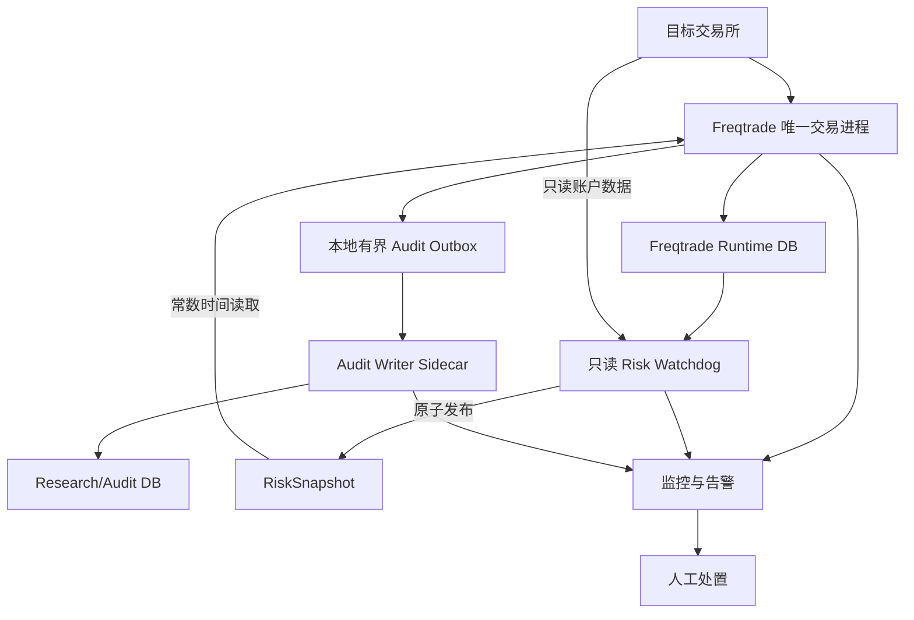

# alphaMind 完整开发计划

| 元数据 | 内容 |
|---|---|
| 状态 | Normative / 后续开发执行基准 |
| 设计基线 | `main@889132b` |
| 制定日期 | 2026-07-15 |
| 最近进度更新 | 2026-07-16 / P2-01 至 P2-04 DONE，下一任务 P2-05 |
| 适用范围 | 现货 long/flat、BTC/USDT 与 ETH/USDT、4h 趋势基线、Freqtrade MVP、Paper 与 Live Canary |
> 当前阶段：Phase 0 gate、P1-01 至 P1-06、P2-01 至 P2-04 均为 DONE；`main@53ebabd` 的 GitHub Actions `deterministic-quality #17` 已成功，项目所有人于 2026-07-16 指示完成后推送远程 main 并批准 P2-04。下一任务为 P2-05 Walk-Forward 与 trial registry。原 Final Holdout 已降级，P1-07/P2-07 在新未见区间预注册前保持阻塞。认证交易所接入、Paper 和 Live 仍须分别满足后续任务与阶段门禁

## 1. 计划目的与使用规则

本文把现有架构、运行合同、策略规范和路线图转化为可排期、可验收、可追溯的开发工作包。后续开发必须引用本文中的任务 ID，并按依赖顺序推进。

文档职责和冲突处理顺序如下：

1. MVP 运行所有权、风险会计和数据库边界，以 [Freqtrade MVP Runtime Contract](freqtrade-mvp-runtime-contract.md) 为最高依据；
2. 研究证据、反作弊检查和晋升门槛，以 [策略研究与验证规范](strategy-research-and-validation.md) 为最高依据；
3. 具体开发顺序、文件布局、任务依赖和验收方式，以本文为准；
4. [系统架构](architecture.md) 描述长期目标；与 MVP 合同冲突时，不得提前实现长期自研接口；
5. [开发路线图](roadmap.md) 提供阶段摘要；与本文粒度不同时，以本文的工作包和门禁为准。

执行规则：

- P0-01 与 P0-02 完成后，允许实现无密钥、无网络、无交易写权限的工程骨架、策略纯函数和风险纯函数；
- P0-08 未通过前，不允许实现认证交易所调用、启用真实 API Key、启动 Paper/Live 或创建第二条交易写路径；
- 每个变更必须对应一个任务 ID，例如 `P1-03`；
- 每个任务只有在产物、测试、审查和证据全部满足后才能标记完成；
- 阶段门禁必须由开发者之外的评审者复核，不能由实现者自行宣布通过；
- 任何影响信号、仓位、退出、成本、风险阈值或运行所有权的变更，都必须先更新决策记录和本文；
- 不允许为了赶进度跨越 Backtest、Paper 或 Live Canary 门禁；
- 不允许用“无报错运行”替代统计证据、故障证据或资金对账证据。

进度账本规则：

- 本文同时是规范性计划和唯一任务进度账本；不得维护一份与本文状态不同的临时进度清单；
- 每次完成、暂停、拆分或迁移任务时，必须在同一批改动中更新顶部“当前阶段”、第一轮执行清单、实际产物、验证结果和延期项；
- 状态只使用 `NOT_STARTED`、`IN_PROGRESS`、`READY_TO_VERIFY`、`BLOCKED`、`DONE`，并且 `DONE` 必须能从仓库产物和验证证据复核；
- 未完成验证若迁移到后续任务，必须同时写明新的任务 ID 和它所阻止的门禁，禁止仅删除原验收项；
- 提交前必须核对代码、配置、ADR、测试结果与本文状态一致；发现不一致时先修正账本再提交；
- 提交信息应能关联本轮主要任务 ID；开发交接和状态报告以本文当前内容为准。

## 2. 设计分析结论

### 2.1 已经明确且应保持的决策

现有设计形成了以下一致结论，后续不应重复争论或绕开：

| 主题 | 已冻结方向 | 开发含义 |
|---|---|---|
| MVP 框架 | Freqtrade | 不实现第二套 Order Manager |
| 交易所接入 | Freqtrade 内部 CCXT 能力 | 策略和 watchdog 不直接创建订单 |
| 市场范围 | 单一交易所现货 | 不引入合约、杠杆、多账户和多腿 |
| 标的与方向 | BTC/USDT、ETH/USDT，long/flat | 不实现 short 和保证金逻辑 |
| 主周期 | 4h；1d 仅稳健性复测 | 15m、1h 不进入首个 MVP |
| 第一策略 | 简单趋势基线 | 默认 Donchian；若改为 Dual EMA，必须在 Phase 0 留下理由 |
| 运行状态 | Freqtrade Runtime DB | Audit DB 不恢复或覆盖 Trade/Order |
| 风险审批 | 外部 watchdog + Freqtrade callback | callback 只读缓存快照，禁止阻塞式远程调用 |
| 验证层 | Backtest、Dry-run、Replay、可选 Contract Harness、Live Canary | 各层证据分开保存，不互相冒充 |
| AI 边界 | 不进入实时资金决策链 | AI Agent 不是 MVP 前置条件 |

### 2.2 当前仓库事实

- 仓库目前只有设计文档和基础 `.gitignore`，没有 Python package、Freqtrade user directory、测试、配置、容器或 CI；
- 因此不存在可复用的现有实现，也不存在需要兼容的历史数据库 schema；
- 所有实现工作都必须从 Phase 0 的决策产物和 Phase 1 的工程骨架开始；
- 当前文档描述了目标和阶段，但没有任务级依赖、统一产物路径、测试命令和变更控制；本文补齐这些缺口。

### 2.3 必须在编码前解决的设计缺口

| 编号 | 缺口 | 默认建议 | 未解决时的影响 |
|---|---|---|---|
| G-01 | 目标交易所未定 | **已解决**：开发目标固定为 Bybit 国际版现货；常驻地区仅作为 Live Canary 外部准入检查 | P0-03 已锁定运行版本；端点实测由 P1-02/P3-06 负责 |
| G-02 | Donchian 与 Dual EMA 尚未最终二选一 | **已解决**：第一策略和参数已由 ADR-0004 固定为 4h Donchian 20/10、ATR(20) × 2 stop；1d 仅做稳健性复测 | P2-01/P2-02 必须与 Strategy Card 同源 |
| G-03 | Freqtrade、CCXT、Python 和镜像未锁定 | **已解决**：版本和 digest 已写入 `configs/common/runtime-versions.toml`；固定镜像内实测迁移至 P1-02 | 不阻塞 P0-04、P0-05 和离线开发；实测前不得完成 P1-02 或进入 Paper/Live |
| G-04 | 数据原始层定义存在张力 | **已解决**：ADR-0005 固定 Freqtrade Feather 首次落盘文件为不可变 source snapshot，不保留原始 REST payload；actual hash 由 P1-03 下载后登记 | P1-03/P1-04 必须遵守 source/clean/features/holdout 隔离和禁止静默补缺合同 |
| G-05 | Runtime DB 选型与 watchdog 只读路径未定 | **已解决**：ADR-0007 固定本地/dry-run 隔离 SQLite 只读路径，Paper/Live 候选使用 PostgreSQL SELECT-only 角色；Freqtrade 保持唯一写入和 migration 所有者 | P3-04 必须实测只读权限、版本 allowlist、RPO/RTO 和恢复顺序 |
| G-06 | callback 到 Audit DB 的异步通道未定 | **已解决**：ADR-0007 固定独立 SQLite WAL outbox、50 ms callback 上限、10,000/256 MiB 容量、分级背压与幂等 sidecar writer | P3-03 必须验证 crash/retry/dead-letter，达到阈值时新入场 fail-closed |
| G-07 | Replay 的验证对象容易越界 | **已解决**：Replay 只验证 alphaMind 风险、审计、适配与运维处置；partial fill/submit unknown 使用 fixture 与锁定版本 Freqtrade 集成测试，不建立第二订单权威 | P3-05 必须证明 Replay 无生产凭据、无交易写权限且证据不越层 |
| G-08 | Paper 的最小信号、成交和独立事件数未预注册 | **已解决**：ADR-0004 已固定至少 90 天、12 个有效信号、8 个模拟成交和 4 个独立事件 | 证据不足时继续 Paper，不得降低门槛 |
| G-09 | 部署平台与密钥方案未定 | **已解决**：P0-08 gate 整合 P0-01/P0-02/P0-03，固定 Windows 无 key 研究、Linux amd64 pinned Docker 生产候选、分离 trade/read-only key、禁 Withdrawal、IP 绑定与仓库外 `0400` 只读 secret 文件 | P3-07/P3-08 必须实测 host 加固、secret mount、撤销与轮换；失败时不得进入 Paper/Live |
| G-10 | Kill Switch 的实际动作未定 | **已解决**：ADR-0006 与 runbook 固定 entry fail-closed、撤销未成交入场、保留安全退出、Kill 人工处置和恢复证据 | P3-05 必须完成故障与恢复演练 |

`G-04` 和 `G-07` 是最容易造成过度设计的两点。前者不能为了“保存一切”提前建设通用行情平台；后者不能为了测试 partial fill 而在 Freqtrade 外维护一套生产订单真相。

### 2.4 关键逻辑链

```mermaid
flowchart LR
    A["Phase 0 决策冻结"] --> B["固定环境与仓库骨架"]
    B --> C["不可变数据快照与质量报告"]
    C --> D["基准与实验登记"]
    D --> E["单一趋势策略"]
    E --> F["Walk-Forward 与反作弊"]
    F --> G["一次性 Final Holdout"]
    G --> H["RiskSnapshot 与 Freqtrade callbacks"]
    H --> I["Dry-run、Replay、可选 Contract Harness"]
    I --> J["冻结版本 Paper 至少 90 天"]
    J --> K["Live Canary 60–90 天"]
    K --> L["Scale 或证伪归档"]
```



运行时的数据流必须保持单一写路径：



约束：

- 只有 Freqtrade 拥有交易写权限；
- watchdog 不能创建、取消或修改订单；
- Audit DB 不能成为订单或持仓恢复源；
- RiskSnapshot 缺失、陈旧、损坏或版本不支持时，新入场必须 fail-closed；
- 风险停止不能阻断止损、安全退出或撤销未成交入场单。

### 2.5 反方观点与失败路径

#### 观点一：直接自研执行引擎更灵活

自研可以更完整地表达幂等键、partial fill 和状态机，但当前只有单所现货、两个标的和简单趋势策略。此时自研会同时引入交易所适配、订单生命周期、数据库恢复和生产运维风险，无法证明收益超过复用 Freqtrade 的成本。结论：MVP 不采纳；只有 Runtime Contract 的六项替换门槛全部满足后重新立项。

#### 观点二：同时实现 Donchian 和 Dual EMA 可以加快选优

同时实现会把“建立验证链路”变成隐性策略搜索，扩大多重测试偏差。第一策略的目标不是找到收益最高的规则，而是证明研究、风险和运行链可复现。结论：默认 Donchian，只允许在 Phase 0 看策略结果之前改选一次。

#### 观点三：90 天 Paper 足以证明可实盘

时间长度不能替代有效信号数、独立市场事件和压力状态覆盖。4h 低频策略可能在 90 天内证据不足。结论：Paper 晋升使用“至少 90 天 + 预注册事件门槛 + 压力状态覆盖”的联合条件。

#### 观点四：Testnet 或 dry-run 通过即可证明执行安全

Freqtrade 官方文档明确区分 dry-run 与真实交易；其 FAQ 也不把 sandbox 市场视为真实策略验证环境。Testnet 的订单簿、流动性和参与者与生产不同。结论：无论是否有 Contract Harness，Live Canary 仍是生产写路径和真实成交的独立证据层。

## 3. MVP 范围

### 3.1 In Scope

- 单一交易所现货；
- BTC/USDT、ETH/USDT；
- 4h Donchian 趋势基线，1d 稳健性复测；
- 现金、单标的 Buy-and-Hold、可选初始 50/50 不再平衡组合和简单均线基准；
- Freqtrade 数据下载、回测、lookahead analysis、recursive analysis、dry-run 与 Live Canary；
- point-in-time 数据质量、实验登记、成本与成交模型；
- 风险定仓、RiskSnapshot、日/周亏损、回撤、close-only 和 Kill Switch；
- Runtime DB 与 Research/Audit DB 隔离；
- 监控、告警、备份恢复、人工操作和证据归档；
- alphaMind 自有逻辑的单元、合同、集成、回放和故障注入测试。

### 3.2 Out of Scope

- short、杠杆、保证金、永续、期权和 Funding/Basis Carry；
- 多账户、多交易所、多腿和跨所套利；
- 自研 Order Manager、ExchangePort 和生产订单状态机；
- 15m/1h 均值回归和复杂 Regime 模型；
- FreqAI、LLM 实时信号或任何 AI 资金决策；
- Redis、Kafka、Kubernetes 和微服务拆分；
- 复杂前端与公开 Internet 管理面；
- 自动 Hyperopt 或以收益目标为停止条件的参数搜索。

## 4. 目标仓库布局

以下目录在对应任务开始时创建，不提前批量生成空目录：

```text
alphaMind/
├─ docs/
│  ├─ decisions/                 # Phase 0 决策记录
│  ├─ runbooks/                  # 运维、恢复、Kill Switch
│  ├─ README.md
│  ├─ architecture.md
│  ├─ development-plan.md
│  ├─ freqtrade-mvp-runtime-contract.md
│  ├─ roadmap.md
│  ├─ strategy-research-and-validation.md
│  └─ strategy.md
├─ configs/
│  ├─ common/
│  ├─ backtest/
│  ├─ dry_run/
│  ├─ replay/
│  ├─ testnet_contract/          # 仅在目标交易所支持时创建
│  └─ live/
├─ data/
│  ├─ manifests/                 # 可提交的元数据和 hash
│  ├─ quality/                   # 可提交的质量报告
│  └─ schemas/
├─ research/
│  ├─ hypotheses/
│  ├─ strategy_cards/
│  ├─ experiments/
│  └─ reports/
├─ src/alphamind/
│  ├─ data_quality/
│  ├─ research/
│  ├─ risk/
│  ├─ audit/
│  ├─ replay/
│  └─ monitoring/
├─ user_data/
│  ├─ strategies/                # Freqtrade strategy 的唯一源路径
│  ├─ data/                      # 不提交大体量行情文件
│  ├─ backtest_results/          # 不提交生成物
│  └─ logs/                      # 不提交运行日志
├─ tests/
│  ├─ unit/
│  ├─ contract/
│  ├─ integration/
│  ├─ replay/
│  └─ fixtures/
├─ scripts/
├─ docker/
├─ pyproject.toml
├─ dependency lock file
└─ docker-compose.yml
```

目录约束：

- Freqtrade strategy 只存在于 `user_data/strategies/`，禁止再维护一份顶层副本；
- 可复用的纯计算逻辑放在 `src/alphamind/`，strategy 文件只做 Freqtrade 映射；
- 真实密钥、live 配置、Runtime DB、行情、日志和实验大文件不得提交；
- 示例配置使用 `.example` 或无密钥模板，并通过环境变量或 Secret Manager 注入；
- `execution/` 目录不得在 MVP 中创建；创建它本身需要新的架构决策。

## 5. 阶段和依赖总览

| 阶段 | 入口条件 | 核心产物 | 退出门禁 | 参考周期 |
|---|---|---|---|---:|
| Phase 0 决策冻结 | 本文已评审 | 决策、合同、阈值、数据与交换所清单 | Scope Frozen | 约 1 周 |
| Phase 1 研究底座 | Scope Frozen | 固定环境、数据、基准、实验链 | Research Ready | 2–4 周 |
| Phase 2 趋势策略 | Research Ready | 单一候选策略和完整研究证据 | Backtest Qualified | 3–6 周 |
| Phase 3 Paper-ready 工程 | Backtest Qualified | 风险、审计、dry-run、恢复和告警 | Paper Ready | 3–6 周 |
| Phase 4 冻结版本 Paper | Paper Ready | 至少 90 天运行证据 | Paper Qualified | 至少 90 天 |
| Phase 5 Live Canary | Paper Qualified + 上线审批 | 小额生产证据 | Scale Qualified 或停止 | 60–90 天 |
| Phase 6 第二策略与组合 | 首策略 Scale Qualified | 独立均值回归与组合证据 | 单独晋升 | 不预设 |
| Phase 7 高级扩展 | Phase 6 单独通过 | 衍生品/多腿研究 | 单独立项 | 不预设 |

关键路径：

```text
P0 决策
  -> P1 环境与数据
  -> P2 信号与研究证据
  -> P3 风险运行链
  -> P4 冻结 Paper
  -> P5 Live Canary
```

可以并行但不能跨门禁的工作：

- P1 中，环境骨架、数据 schema 和实验 schema 可并行；
- P2 中，策略单元测试、成本模型和报告生成可并行；
- P3 中，RiskSnapshot、Audit Outbox、监控和 runbook 可并行；
- Paper 观察期间只能修复不影响候选语义的外围缺陷；任何实质变更都重新进入 P2/P3 并重启计时。

## 6. Phase 0：决策冻结

### P0-01 项目约束与责任矩阵

产物：

- `docs/decisions/0001-project-scope.md`
- `docs/decisions/ownership-matrix.md`

必须记录：

- 市场、标的、方向、周期和非目标；
- 项目负责人、策略负责人、风险审批人、运维责任人和独立评审者；
- 告警接收、升级时限、人工操作权限和最终停机权；
- 计划资金、最大可接受资金损失和退出条件。

验收：

- 每个责任有具体责任人和替补；
- 不使用“团队负责”作为责任主体；
- 任何人不能同时独占开发、风险批准和 Live Canary 上线批准。

### P0-02 交易所 Capability Matrix

产物：

- `docs/decisions/0002-exchange-selection.md`
- `configs/common/exchange-capabilities.yaml`

已选开发目标：Bybit 国际版现货，CCXT/Freqtrade exchange id 为 `bybit`。

调查项：

- Bybit 国际版 V5 API 与 Freqtrade 适配能力；
- 常驻地区不得进入策略、风险或交易对选择代码；账户资格仅在 Live Canary 前重新核对；
- Freqtrade stable 支持状态；
- BTC/USDT、ETH/USDT 现货符号；
- 最小名义金额、价格/数量精度和手续费币种；
- market/limit/stop 订单能力；
- `client_order_id`、订单查询、成交查询和历史保留；
- API 限频、IP allowlist、无提现交易 key；
- Testnet、test-order 或最小额 contract test 能力；
- 人工交易、奖励、返佣和外部现金流识别方式。

验收：

- 只批准 Bybit 国际版作为当前开发目标；
- 每一项都给出官方来源、核对日期和“不支持/未知”状态；
- 未知项有验证任务和保守处置；
- 无法唯一判断写请求结果的情况有停机而非盲重试规则。
- 明确 Freqtrade Bybit spot 不支持 `stoploss_on_exchange`，不得通过第二交易写路径绕过；
- Bybit Testnet 只用于独立 Contract Harness，不能冒充 Freqtrade dry-run 或生产成交证据。

### P0-03 运行环境和版本锁定

产物：

- `docs/decisions/0003-runtime-version-lock.md`
- `configs/common/runtime-versions.toml`
- `.python-version`、`pyproject.toml` 和 `uv.lock`
- `scripts/verify_runtime_lock.py`

决策：

- Python 版本；
- Freqtrade release/tag、镜像 digest；
- Freqtrade 所带 CCXT 版本；
- 本地研究与生产宿主平台；
- alphaMind 在本地研究 Python 与容器 Python 之间的兼容范围。

范围迁移：Runtime DB/Audit DB 技术边界由 P0-07 冻结；Docker Compose 和固定镜像实测由 P1-02 完成；备份恢复由 P3-04 完成。这些任务不再作为 P0-03 的完成前置，但继续约束对应后续门禁。

验收：

- 禁止在可复现证据中使用浮动 `latest` 或未记录 digest 的 `stable`；
- 开发、CI、dry-run 和 live 的版本关系明确；
- 版本升级要求重新运行兼容性、回测和 dry-run 验证；
- 生产候选不直接依赖 Windows Docker；如确需使用，必须单独接受可靠性风险；
- 本地研究版本检查和 Python 3.12/3.14 兼容测试通过；
- 固定 digest 容器实测已登记为 P1-02 强制验收，不允许被 Paper/Live 跳过。

### P0-04 第一策略与 Strategy Card

产物：

- `docs/decisions/0004-first-strategy.md`
- `research/strategy_cards/donchian_trend_v0.1.0.yaml`

默认规则：

- 策略：4h Donchian Breakout；
- 方向：long/flat；
- 信号：只使用已完成 candle；
- rolling high/low：滞后一根；
- 成交：不得使用信号 candle 的 close 无滑点成交；
- 1d：只做稳健性复测。

Strategy Card 必须固定：

- 假设、参数搜索边界和不得修改项；
- entry、exit、stop、最大持仓时间；
- 预算风险与仓位约束；
- 最小信号、成交和独立事件门槛；
- 失效 regime 和证伪标准；
- trial registry 初始值。

验收：

- 未查看目标数据上的候选收益前完成；
- 若选择 Dual EMA，必须解释为何不是根据表现择优；
- 不允许同时实现两种策略后再决定。

### P0-05 数据与验证合同

产物：

- `docs/decisions/0005-data-and-holdout.md`
- `data/schemas/ohlcv.schema.yaml`
- `data/schemas/data-manifest.schema.yaml`
- `data/manifests/regime-manifest.yaml`

必须冻结：

- 数据来源、交易所、符号、时区、4h/1d 起止日期；
- source snapshot 的定义和是否保留原始 exchange payload；
- train/validation rolling 方式；
- 一次性 final holdout 的连续区间；
- stress slices 的预注册日期与分类规则；
- 缺失、重复、异常价格和异常成交量的处置；
- 数据 hash 和不可变策略。

验收：

- final holdout 在查看结果前冻结；
- 不允许静默补齐缺失行情；
- source、clean 和 feature 数据物理或路径隔离；
- final holdout 一旦用于调参即永久降级并留下记录。

实际进度（2026-07-15）：

- 状态：`DONE`；四项计划产物和本地验证已完成，项目所有人于 2026-07-16 在 P0-08 总门禁批准中接受 `main@7a9d124` 的合同基线；
- 数据合同：Bybit spot、BTC/USDT 与 ETH/USDT、4h/1d、`[2022-01-01, 2026-07-01)` UTC；
- 开发验证：expanding train + 6 个月 validation，共 3 个 fold；
- Final Holdout：P0-05 完成时 `[2025-07-01, 2026-07-01)` 状态为 `SEALED_UNREAD`；该历史结论已被 P1-03 访问事件 supersede，当前状态见 P1-03；
- 结构化验证：两个 Draft 2020-12 schema 合法，有效示例通过，`fill_missing=true` 和负成交量示例被拒绝，fold/holdout/regime 交叉约束通过；
- 项目验证：`uv run pytest` 为 33 passed；`ruff check`、`ruff format --check`、`uv lock --check` 和 `git diff --check` 通过；
- 延期边界：本任务没有下载或读取目标数据；actual file/snapshot SHA-256、数据质量报告和 holdout 访问证据由 P1-03、P1-04、P2-07 分别落地，缺失时阻止对应任务和门禁。

### P0-06 风险会计与 Kill Switch

产物：

- `docs/decisions/0006-risk-accounting.md`
- `data/schemas/risk-snapshot.schema.yaml`
- `docs/runbooks/kill-switch.md`

必须冻结：

- NAV、mark price、手续费、负债和外部现金流口径；
- UTC 日/周边界和现金流调整高水位；
- 单笔计划风险、单日亏、单周亏和回撤阈值；
- `entry_allowed`、`close_only`、`kill_switch` 的动作；
- snapshot TTL、发布频率、版本兼容和 fail-closed 条件；
- 入场挂单暴露、最小名义金额、精度和余额约束；
- 未知资金差异的人工复核流程。

默认阈值仅作为待批准起点：

- 单笔计划风险：NAV 的 0.25%；
- 单日亏损：1%，禁止新入场；
- 单周亏损：3%，禁止新入场并人工复核；
- 回撤：5%，触发 Kill Switch；
- 项目绝对损失：从 `configs/common/risk-limits.toml` 读取比例和固定金额，当前为现金流调整资本基线的 10% 与 45 USDT，达到任一边界即触发 Kill Switch；上调任一边界都必须重新审批并更新 P0-01 决策。

验收：

- 明确这些是计划风险而非最大实际亏损保证；
- Kill Switch 不阻塞安全退出；
- 每个风险状态都有可测试的输入、输出和操作动作。

实际进度（2026-07-16）：

- 状态：`DONE`；三项计划产物和本地验证已完成，项目所有人于 2026-07-16 在 P0-08 总门禁批准中接受 `main@52f1ae8` 的风险合同基线；
- 会计合同：USDT 会计币种、保守退出 mark、手续费/负债、外部现金流、UTC 日/周、现金流调整高水位与项目绝对损失公式已冻结；
- 状态合同：`ENTRY_ALLOWED`、`CLOSE_ONLY`、`KILLED_MANUAL_REVIEW` 的确定输入、输出、优先级、撤销入场和安全退出动作已冻结；
- 快照合同：15 秒目标发布、60 秒 TTL、30 秒源新鲜度、5 秒未来时钟容差、schema v1、原子替换和 missing/stale/corrupt/unsupported fail-closed 已冻结；
- 结构化验证：RiskSnapshot Draft 2020-12 schema 可解析，有效三状态示例通过，非法状态布尔组合、未知字段、浮点金额和 `safe_exit_allowed=false` 示例被拒绝；
- 项目验证：`uv run pytest` 为 41 passed；`ruff check .`、新增测试文件的 `ruff format --check`、`uv lock --check` 与 `git diff --check` 通过；全仓 format check 仍报告 13 个未触碰历史文件，未在本任务中批量改写；
- 延期边界：本任务不实现 watchdog、Freqtrade callback 或交易写路径；运行会计/原子发布由 P3-01 验证，消费者 fail-closed 与安全退出由 P3-02 验证，故障和恢复演练由 P3-05 验证。

### P0-07 Audit、Replay 与数据库边界

产物：

- `docs/decisions/0007-audit-and-replay.md`
- `data/schemas/audit-event.schema.yaml`
- `data/schemas/experiment.schema.yaml`

必须冻结：

- Runtime DB 的唯一写入者和备份恢复责任；
- watchdog 的只读数据路径；
- callback 到本地 outbox 的写入方式、容量、持久性和背压阈值；
- Audit Writer 的重试、去重和失败状态；
- Audit DB 对 Runtime DB 的只读关联；
- Replay 只测试 alphaMind 所有逻辑，不模拟成为生产订单权威；
- partial fill、submit unknown 等场景通过何种 Freqtrade 集成或 contract fixture 验证。

验收：

- callback 不执行远程 DB/API 请求；
- outbox 积压超阈值时新入场 fail-closed；
- Audit DB 不参与 Freqtrade 状态恢复；
- Replay 代码没有交易写权限和生产 API Key。

实际进度（2026-07-16）：

- 状态：`DONE`；ADR、AuditEvent schema 和 Experiment schema 三项产物及本地验证已完成，项目所有人于 2026-07-16 在 P0-08 总门禁批准中接受 `main@f36e6ba` 的合同基线；
- 数据库合同：Freqtrade 是 Runtime DB 唯一写入/migration 所有者；本地/dry-run 使用隔离 SQLite 只读路径，Paper/Live 候选使用 PostgreSQL SELECT-only 角色；恢复顺序与 `RPO <= 5 分钟`、`RTO <= 60 分钟` 目标已冻结；
- Outbox 合同：独立 SQLite WAL、50 ms callback 上限、16 KiB 单事件、10,000 pending/256 MiB 硬容量、5,000/2 分钟/128 MiB 预警和 8,000/5 分钟/192 MiB 入场停止阈值已冻结；
- Writer 合同：at-least-once、event ID + content hash 幂等、100 条 batch、60 秒 lease、1–60 秒退避、20 次后 dead-letter 和 7 天已交付保留已冻结；
- Replay 合同：无生产凭据/交易写权限，partial fill 与 submit unknown 使用 contract fixture 和锁定版本 Freqtrade integration，不建立第二订单状态机；
- 结构化验证：两个 Draft 2020-12 schema 可解析；合法 replay audit、预注册/已完成 experiment 通过；Runtime authority、secret、Replay 写权限、伪造生产证据、holdout 访问和负成本等非法示例被拒绝；
- 项目验证：`uv run pytest` 为 52 passed；`ruff check .`、新增 P0-07 测试文件的 `ruff format --check`、`uv lock --check` 与 `git diff --check` 通过；全仓 format check 仍受 14 个未触碰历史文件的换行/格式基线影响，未在本任务中批量改写；
- 延期边界：P3-03 实现并验证 outbox/writer，P3-04 验证数据库隔离与恢复，P3-05 验证 Replay/fault injection；本任务没有数据库、网络、凭据或交易写入。

### P0-08 Scope Frozen 评审

输入：`P0-01` 至 `P0-07` 全部产物。

通过条件：

- 所有 `G-01` 至 `G-10` 均为“已决策”或“明确拒绝并有替代”；
- 决策文件、schema 和 Strategy Card 已独立评审；
- capability matrix 没有影响下单或对账的未知关键项；
- final holdout 和 trial registry 已冻结；
- 评审结果写入 `docs/decisions/phase-0-gate.md`。

不通过：继续 Phase 0，不得创建策略实现。

实际进度（2026-07-16）：

- 状态：`DONE`；`docs/decisions/phase-0-gate.md` 已完成逐项证据审查，项目所有人于 2026-07-16 明确批准 P0-08；
- 设计缺口：G-01 至 G-10 均已有明确决策，G-09 由既有部署方向、运行时锁和 key 安全基线整合关闭；
- capability：下单、查询、partial fill、幂等、权限与 stoploss 关键项均已分类；动态市场规则和真实写路径仍由 P1-02/P3-06/Live preflight 验证；
- 冻结证据：P0-08 批准时 Final Holdout 为 `SEALED_UNREAD`、`access_count=0`；该历史结论已被 P1-03 访问事件 supersede；trial 初始预算为 14、禁止 Cartesian product、当前结果数为 0；
- 项目验证：`uv run pytest` 为 55 passed；`ruff check .`、新增 gate 测试的 `ruff format --check`、`uv lock --check` 与 `git diff --check` 通过；全仓 format check 仍受 14 个未触碰历史文件的换行/格式基线影响，未在本任务中批量改写；
- 复核结论：项目所有人的 P0-08 明确批准同时覆盖 ADR-0005 `7a9d124`、ADR-0006 `52f1ae8`、ADR-0007 `f36e6ba` 和 gate 审查 `5fe2555`，原 B-01 至 B-04 阻塞全部解除；
- 变更边界：后续若实质修改数据/holdout、风险阈值、Runtime/Audit 所有权或 MVP 范围，相关任务必须重新进入评审，当前批准不能自动覆盖新版本。

## 7. Phase 1：研究底座

### P1-01 工程骨架与质量门禁

实现：

- 创建 `pyproject.toml`、依赖锁和最小 package；Docker Compose 与固定 Freqtrade 镜像统一由 P1-02 创建和验证；
- 配置 formatter、linter、type check 和 pytest；
- 配置 Markdown 链接检查、secret scan 和 `git diff --check`；
- 建立 unit、contract、integration、replay 测试分层；
- CI 只运行确定性、无密钥、无生产网络依赖的验证。

验收：

- 空骨架在 Windows 本地开发与 Linux CI 中一致通过；
- 任一依赖版本可由锁文件追溯；
- 测试不需要真实交易 key；
- 敏感配置不会进入 Git。

实际进度（2026-07-16）：

- 状态：`DONE`；Windows 本地工程骨架和确定性质量门禁已完成，提交 `e56d21a` 触发的 GitHub Linux workflow 已成功；
- 工具链：`pyproject.toml`、`uv.lock`、Python 3.12 package、pytest、Ruff 和 strict mypy 已配置；
- 仓库门禁：`scripts/check_repository.py` 检查已跟踪及未忽略新文件的 Markdown 本地链接、敏感文件名、高置信度 secret 和可疑凭据赋值，且不回显疑似 secret；
- CI：`.github/workflows/ci.yml` 使用只读 `contents: read`、`actions/checkout@v7`、固定 SHA 的 `setup-uv v8.1.0`、锁定 uv/Python，并执行 repository scan、mypy、Ruff、pytest、lock 与 whitespace 检查；工作流不引用 GitHub secrets；
- 测试分层：`tests/unit` 已运行，`tests/contract`、`tests/integration`、`tests/replay` 已建立边界说明；后两类认证/Freqtrade 集成仍受 P0/P1-02/P3 门禁约束；
- 换行基线：新增 `.gitattributes` 固定 Python/TOML/YAML 为 LF，并以全仓 Ruff format/check 验证 18 个 Python 文件；Windows checkout 显示的 14 个换行假阳性不纳入提交内容；
- 本地验证：repository scan 检查 55 个文件无发现；mypy 检查 10 个 source/script 文件通过；`uv run pytest` 为 60 passed；`ruff check .`、`ruff format --check .`、`uv lock --check` 与 `git diff --check` 通过；
- CI 证据：项目所有人于 2026-07-16 提供 GitHub Actions 截图，显示 `deterministic-quality #1` 在 `main` 的 commit `e56d21a` 上成功完成，耗时 14 秒；
- 延期边界：Docker Compose、固定镜像拉取和 Freqtrade CLI 属于 P1-02；认证交易所、Paper/Live 仍受 P1-02、P3、P4、P5 对应门禁约束。

### P1-02 Freqtrade 固定环境

实现：

- 基于 P0-03 固定镜像构建项目环境；
- 在 Docker daemon 下拉取固定 linux/amd64 digest，并运行 `scripts/verify_runtime_lock.py --target freqtrade`；
- 创建独立的 backtest、dry-run、replay 和 live 配置模板；
- 初始化 `user_data/`；
- 验证目标交易所、市场、周期与 callback API；
- 记录 `freqtrade --version`、Python、CCXT 和镜像 digest。

验收：

- 相同 digest 可重复执行 Freqtrade CLI；
- 配置层不能通过单一布尔开关把 dry-run 变为 live；
- live 配置模板没有 key，且默认不可启动；
- dry-run 与 live 使用不同 Runtime DB。

实际进度（2026-07-16）：

- 状态：`DONE`；实现、本机 Docker 验收和远端 Linux CI 均已完成，项目所有人于 2026-07-16 明确批准；
- 固定运行时：在 Docker Desktop 4.67.0、Engine 29.3.1、Compose 5.1.1 的 Linux amd64 daemon 上拉取并复用 `freqtradeorg/freqtrade@sha256:1e9298ae0895531fd47c4f13d10e5708b3b8b6e5241292f364fc23f201b5acaa`；镜像检查结果为 `linux/amd64`；
- 版本证据：容器内 `scripts/verify_runtime_lock.py --target freqtrade` 返回 Python 3.14.6、Freqtrade 2026.6、CCXT 4.5.61，均与 `runtime-versions.toml` 一致；
- Compose：`compose.yaml` 的全部服务使用固定 platform digest、只读根文件系统、drop all capabilities、`no-new-privileges` 和显式 profile；默认不启动任何服务；
- 环境隔离：backtest、dry-run、replay 使用独立配置和 SQLite Runtime DB；replay 与 tools 验证禁用网络；live 只有无 key 的 `live.template.json`，没有 Compose service，P5 批准前不可通过本项目 Compose 启动；
- 目标合同：公共配置固定 Bybit spot、BTC/USDT、ETH/USDT 与 4h；锁定容器的 `list-exchanges --all` 返回 `Bybit (Supported)`，四套配置均由 Freqtrade `show-config` 成功解析；
- callback 合同：`verify_freqtrade_contract.py` 已核对 `populate_indicators`、entry/exit trend、`custom_stake_amount`、`custom_stoploss` 与 `confirm_trade_entry` 的参数名和顺序；
- 项目验证：repository scan 检查 69 个文件无发现；mypy 检查 11 个 source/script 文件通过；`uv run pytest` 为 63 passed；Ruff 20 个文件、`uv lock --check`、`git diff --check` 与 `docker compose config --quiet` 均通过；
- CI 证据：项目所有人提供 GitHub Actions 截图，显示 `deterministic-quality #3` 在 `main` 的 commit `2860b48` 上成功完成，耗时 15 秒；
- 延期边界：本任务没有连接认证 API、创建 key、下载市场数据、实现 strategy adapter 或启动 backtest/dry-run/live；真实市场 metadata 由 P1-03/P3-06 验证，Paper/Live PostgreSQL 与恢复由 P3-04/P4/P5 验证。

### P1-03 数据下载与不可变清单

当前状态（2026-07-16）：`DONE`；真实 Bybit source snapshot、不可变 manifest、公开 metadata、哈希复核和严格 holdout 降级处置均已完成，项目所有人已在 `main@7301894` 基线上批准本任务。

实现：

- 按 P0-05 下载 BTC/USDT、ETH/USDT 的 4h 数据和 1d 复测数据；
- 记录请求参数、下载时间、交易所 metadata、文件大小和 SHA-256；
- source snapshot 只追加，清洗输出写入新版本；
- 所有时间转换为 UTC。

验收：

- manifest 可以定位每个输入文件；
- 重新计算 hash 与 manifest 一致；
- 下载脚本不覆盖已有版本；
- 数据目录的提交策略符合 `.gitignore` 和备份规则。

实际进度（2026-07-16）：

- 固定运行时：使用 P1-02 锁定的 Freqtrade `2026.6`、CCXT `4.5.61` 和镜像 digest；下载仅访问 Bybit 公开接口，不使用 API Key，不运行策略或回测；
- source snapshot：`bybit-spot-ohlcv-20260716T070451Z-ef232b839406`，包含 BTC/USDT、ETH/USDT 的 4h/1d Feather 共 4 个文件，实际文件位于 Git 忽略的 `data/source/bybit_spot/`；
- 不可变证据：snapshot SHA-256 为 `ef232b839406bddd68b4a03febb98d34b116e6543ff01620b11686e025e4b6bb`，manifest content SHA-256 为 `f8fd29f72c149d9338adce006e028c9ea114ed35753e8801e5952b436744b44d`，exchange metadata SHA-256 为 `b0f1e3d34db24b8fa225c30a5af93bf1699913a2db68bec7df1f305585529137`；
- 独立复核：`--verify-manifest` 重新读取 4 个源文件并复算大小、逐文件 hash、snapshot hash、manifest hash 和 metadata hash，结果为 `status=verified`；下载/发布/证据写入均 fail-closed，已有目标和证据文件拒绝覆盖；
- schema 修正：P1-03 实测发现 `dataset_id` 的通用小写规则与 ADR-0005 的大写 UTC `T/Z` snapshot 格式冲突；schema 仅增加对该精确 snapshot 格式的允许，不放宽其他 dataset ID；
- source 结构事实：Freqtrade 对空目录下载附带右边界后的 candle，两个 4h 分区各 91 根、两个 1d 分区各 15 根，共 212 根，原始 source 按合同保留不改写；P1-04 必须在新 clean 数据版本中严格裁剪 `[2022-01-01, 2026-07-01)` 并让任何越界数据阻止实验输入；
- holdout 事件：首次 P1-03 扫描读取了完整分区的 OHLC/volume 列；虽然未运行策略、收益或回测，但违反 P1/P2 数据质量只能读取开发池的严格合同。项目所有人选择严格降级，原 Final Holdout 当前为 `DEGRADED_TO_DEVELOPMENT`、`access_count=1`，访问事件以 JSON 追加记录，不改写不可变 source/manifest；
- 修正边界：P1-03 工具已收窄为只读取完整文件的字节哈希与时间戳元数据；OHLC/volume、异常价格和成交量检查全部由 P1-04 在开发池内完成。P1-07/P2-07 由新的未见 Final Holdout 预注册解除阻塞；
- 提交与备份：Git 只提交 manifest/metadata/报告，Feather 继续由 `.gitignore` 排除；仓库外备份必须按完整 snapshot 目录保存并在恢复后运行同一验证命令，P3 负责配置备份介质和生命周期。
- 验证状态：项目所有人运行 repository scan（76 files）、mypy（12 source files）、全量 pytest、Ruff check、Ruff format check（21 files）、`uv lock --check`、Compose config、`git diff --check` 均通过；容器内独立复核返回 `status=verified`、`partition_count=4` 和 `holdout_state=DEGRADED_TO_DEVELOPMENT`。`git diff --check` 仅报告 Git 换行转换 warning，无 whitespace error。

### P1-04 数据质量流水线

当前状态（2026-07-16）：`DONE`；仅限开发数据、无静默修复、ERROR 阻断下游的确定性质量流水线已完成实现和真实数据验证。GitHub Actions `deterministic-quality #7` 已在 `main@5c05086` 成功，项目所有人于同日的继续开发指令中批准该任务。

实现：

- 严格递增时间戳；
- 重复 candle、缺失区间和乱序检测；
- OHLC 关系、非正价格、负成交量和异常跳变检测；
- 预期 4h/1d 网格检查；
- 缺失和异常只报告，不静默修复；
- 输出机器可读 JSON 与人可读 Markdown 报告。
- 异常 close 跳变固定为诊断 WARN：4h 绝对相邻收益达到 20%，1d 达到 30%；不删除 candle，也不作为 ERROR 阻止 clean 发布。

验收：

- 每种异常至少有一个固定 fixture；
- 相同输入生成相同报告和 hash；
- ERROR 级数据问题阻止下游实验；
- WARN 的接受理由进入 manifest。

开发进度（2026-07-16）：

- 已实现纯函数质量规则，覆盖 UTC、严格递增、重复、缺口、乱序、网格、非有限值、非正价格、OHLC 关系、负/零成交量和固定阈值 close 跳变；
- Arrow Dataset scanner 在读取 OHLC/volume 时先应用当前开发数据边界；`SEALED_UNREAD` 只读取原开发池，`DEGRADED_TO_DEVELOPMENT` 按已批准的严格降级读取 `[2022-01-01, 2026-07-01)`，完整 source 只做 P1-03 字节与时间戳复核；
- clean 输出使用新 dataset ID 和 staging 目录，ERROR 时不发布，WARN 时保留原观测值；source 不填补、不去重、不插值、不重排；
- JSON 报告、Markdown 报告、逐文件 SHA-256、clean snapshot hash 和独立 `--verify-report` 复核入口均为确定性证据；
- 固定异常 fixtures 位于既有测试目录，断言追加到现有测试文件，没有新增独立测试脚本；
- 本地门禁已通过：repository scan 检查 82 个文件，mypy 检查 15 个 source/script 文件，聚焦测试 11 个、全量 pytest 66 个，Ruff check/format 检查 24 个 Python 文件，`uv lock --check`、Compose config 与 `git diff --check` 均通过；
- 真实数据报告 `bybit-spot-development-ef232b839406-p1-04-v1` 为 `ACCEPTED`，四个分区均为 0 ERROR、0 WARN；4h 各 9,852 根、1d 各 1,642 根，仅排除请求右边界后的 91/15 根附带 candle；
- clean snapshot SHA-256 为 `75ba42c33919b1acc6a6f032d67326960ab4b2dda3d84b28dde0d4410bb8f07a`，report content SHA-256 为 `06cb68e83a5cdccc5bafdffead91cfe22531d586d06848eb5d68fc7e9c7ae33c`；独立 `--verify-report` 返回 source/report/clean 均 verified，并允许下游实验使用该 clean 数据。

### P1-05 基准与统一绩效指标

当前状态（2026-07-16）：`DONE`；统一指标纯函数、四类确定性基准、真实 clean 数据报告和独立重算复核已完成，GitHub Actions `deterministic-quality #8` 已在 `main@1098a48` 成功，项目所有人已批准。

实现：

- 现金基准；
- BTC Buy-and-Hold；
- ETH Buy-and-Hold；
- 可选初始 50/50、不再平衡组合；
- 简单均线工程基准；
- 统一计算净收益、MDD、Sharpe、Sortino、Calmar、Profit Factor、CVaR、Turnover、Time Under Water 和暴露比例。

验收：

- 手工小样本可核对收益和回撤；
- 基准使用与策略一致的数据、费用和时间边界；
- BTC 与 ETH Buy-and-Hold 分开报告；
- 不允许只报告累计收益或胜率。

开发进度（2026-07-16）：

- `src/alphamind/research/performance.py` 从同一权益路径统一计算净收益、年化收益、MDD、Sharpe、Sortino、Calmar、Profit Factor、CVaR 95%、Turnover、Time Under Water 和暴露比例；无定义比率使用 `null`，禁止写入 Infinity 或用零值掩盖；
- `src/alphamind/research/benchmarks.py` 实现现金、BTC/ETH 分资产 Buy-and-Hold、初始 50/50 期间不再平衡组合，以及 SMA(200) long/flat 工程基准；SMA 信号只读取已完成 candle close，最早在下一根 candle open 执行，末根 close 只做统一结算；
- `configs/research/benchmark-v1.toml` 冻结同一初始权益和成本输入：Bybit Non-VIP spot 每侧 0.1% fee 来自公开费率页，半点差 0.025% 与每侧滑点 0.05% 明确标记为 candle 数据下的固定工程假设，后两项不冒充真实历史成交；
- `scripts/build_benchmark_report.py` 只接受 P1-04 `ACCEPTED` 且 `downstream_experiment_allowed=true` 的 clean report，重新复核 source/clean hash 后生成 JSON/Markdown，并提供 `--verify-report` 独立重算入口；
- 真实开发池报告 `bybit-spot-development-ef232b839406-p1-04-v1-p1-05-v1` 覆盖 `[2022-01-01, 2026-07-01)`，分别生成 4h/1d 的现金、两资产 Buy-and-Hold、50/50 与两资产 SMA 共 12 组记录；report content SHA-256 为 `774242be85f94abf02285c0deebfacee53a9614be6f20d4b9e56c904196775e9`；
- 手工小样本已核对净收益、20% MDD、Profit Factor、CVaR、Turnover、Time Under Water 和暴露比例；固定测试证明成本增加不能改善 Buy-and-Hold 净收益、50/50 不再平衡、SMA 不在 signal candle 成交、缺口与双资产时间戳错位 fail-closed；
- 本地门禁已通过：repository scan 检查 89 个文件，strict mypy 检查 18 个 source/script 文件，全量 pytest 为 73 passed，Ruff check 与 format check 覆盖 28 个 Python 文件；`uv lock --check`、Compose config、`git diff --check`、P1-04 容器复核与 P1-05 容器独立重算均通过；
- Windows checkout 的既有 JSON/Markdown 证据可能被转换为 CRLF，导致内容相同但字节 hash 失败；`.gitattributes` 已固定 JSON/Markdown 为 LF，既有 worktree 复核仅规范化 CRLF 为 LF，bare carriage return 仍拒绝。P1-03 metadata 与 P1-04 Markdown 的记录 hash 均保持不变并重新验证通过。

### P1-06 实验登记与可复现报告

当前状态（2026-07-16）：`DONE`；实现、本地全量门禁和 `main@61fd1e9` 的 GitHub Actions `deterministic-quality #9` 均已通过，项目所有人已批准。

实现：

- hypothesis、experiment、Strategy Card 和 trial registry schema；
- 保存 commit、config hash、data hash、environment hash、seed 和成本模型版本；
- 输出固定格式报告和 artifact manifest；
- 明确失败实验也必须登记。

验收：

- 给定 experiment ID 可定位全部输入与输出；
- 同环境重复运行得到一致交易列表和允许误差内的指标；
- 未登记实验不能进入策略选择；
- 报告明确区分 train、validation、holdout 和 stress slice。

开发进度（2026-07-16）：

- 新增 Hypothesis、Strategy Card、Trial Registry 和 Artifact Manifest Draft 2020-12 schema；扩展既有 Experiment schema，冻结 hypothesis/config/data/environment hash、feature 与成本模型版本、random seed、review result 和四类 slice；严格降级数据使用 `[2022-01-01, 2026-07-01)`，不再伪装为未读 Final Holdout；
- `research/hypotheses/donchian_trend_v1.yaml` 与既有 Strategy Card SHA-256 同源；`research/experiments/trial-registry.json` 冻结 14 次上限和失败 trial 保留规则，entries 保持为空，P1-06 没有提前消耗 P2-05 trial 或写入虚构回测结果；
- `src/alphamind/research/experiment_registry.py` 和 `scripts/manage_experiment.py` 实现 register、verify、finalize、review 四阶段追加链路；registration 不可覆盖，结果、报告、交易列表、指标和评审使用新 artifact，registry 禁止重复 experiment ID/trial index；
- 固定报告始终分列 train、validation、holdout、stress；artifact manifest 复核 registration semantic hash、manifest content hash 和全部输入输出逐字节 SHA-256；策略选择只接受 `COMPLETED + PASS + APPROVED`，未登记、失败或待评审结果 fail-closed；
- 聚焦测试 17 个通过，覆盖 schema、真实 Strategy Card hash、holdout 状态约束、按 ID 定位、重复登记拒绝、失败结果保留、独立评审、交易列表确定性和指标误差边界；全量门禁为 79 passed，repository scan 检查 99 个文件，strict mypy 检查 20 个 source/script 文件，Ruff check/format 覆盖 31 个 Python 文件，`uv lock --check`、Compose config 和 `git diff --check` 均通过。

### P1-07 Research Ready 门禁

通过条件：

- P1-01 至 P1-06 完成；
- 数据质量无未处置 ERROR；
- 基准结果可重复；
- final holdout 未被读取；
- `research/reports/research-ready-review.md` 记录独立复核结果。

## 8. Phase 2：趋势策略与研究审计

### P2-01 纯 Donchian 信号逻辑

当前状态（2026-07-16）：`DONE`；point-in-time 纯函数、本地全量门禁和 `main@3e3c141` 的 GitHub Actions `deterministic-quality #11` 均已通过，项目所有人已批准。

实现：

- 在 `src/alphamind/research/` 实现纯函数指标和信号；
- rolling high/low 使用上一根及更早的已完成 candle；
- 输出 entry/exit signal、reason code、reference price 和 signal timestamp；
- 不包含交易所 API、stake 或订单调用。

测试：

- rolling window 恰好滞后一根；
- 未完成 candle 不产生信号；
- signal candle 不成交；
- warm-up 不足时不产生信号；
- NaN、缺口和异常数据 fail-closed；
- BTC/ETH 和 4h/1d 不产生时区偏移。

开发进度（2026-07-16）：

- `src/alphamind/research/donchian.py` 保持 market-agnostic、Decimal 和 UTC 纯函数边界，entry/exit threshold 严格排除 signal candle，严格大于/小于才触发，输出稳定 signal、reason、reference price 和 signal timestamp，不包含 fill 或订单语义；
- active window 中的未闭 candle、缺失 candle、NaN/Infinity、非法 OHLC 和乱序时间戳全部 fail-closed 或直接拒绝；历史不足优先稳定返回 `WARMUP`，非布尔持仓状态不允许隐式转换；
- 聚焦测试 11 个通过，覆盖 entry/exit 严格边界、signal candle 排除、无成交输出、warm-up、gap、未闭 candle、异常输入、BTC/ETH 无状态差异以及 4h/1d UTC 时间戳；
- 全量门禁为 83 passed，repository scan 检查 99 个文件，strict mypy 检查 20 个 source/script 文件，Ruff check/format 覆盖 31 个 Python 文件，`uv lock --check`、Compose config 和 `git diff --check` 均通过。

### P2-02 Freqtrade Strategy Adapter

当前状态（2026-07-16）：`DONE`；`main@03e6884` 的唯一 strategy adapter、锁定容器合同、本地质量门禁和 GitHub Actions 均已通过，项目所有人已批准。

实现：

- 在 `user_data/strategies/` 创建唯一 strategy；
- 映射 `populate_indicators`、`populate_entry_trend`、`populate_exit_trend`；
- 写入稳定的 `enter_tag`、`exit_tag` 和 strategy version；
- callback 签名严格匹配 P0-03 锁定版本；
- 不启用 position adjustment、DCA、short 或 leverage。

验收：

- 纯逻辑和 Freqtrade 输出在相同 candle 上一致；
- backtest 和 dry-run 使用同一 strategy 源文件；
- strategy 不持有或读取生产 key；
- 不使用 `iloc[-1]` 等未来信息模式生成历史信号。

实际进度（2026-07-16）：

- `DonchianTrendStrategy` 是 `user_data/strategies/` 中唯一 strategy，固定 interface v3、4h、long/flat、20/10 channel、稳定 entry/exit tag 和 `0.1.0` version；rolling threshold 均先计算再 `shift(1)`，signal candle 不进入自身阈值；
- adapter 对 OHLCV、UTC 时间、连续 4h active window 和可选 `is_closed` 标志执行 fail-closed 检查，并在锁定镜像内与 P2-01 纯函数逐行对账；构造 fixture 仅在第 20 行 entry、第 24 行 exit，缺失 candle 场景的结果同样一致；
- Freqtrade 2026.6 的 callback 参数合同、strategy settings 和 resolver 加载均通过；`list-strategies` 只返回一个 `DonchianTrendStrategy` 且状态为 `OK`，合并后的 backtest 配置通过 schema/runtime 校验；
- 公共配置移除了禁用但仍触发必填凭据校验的 Telegram/API 空壳，补齐锁定版运行时必需的 entry/exit pricing；backtest 与 dry-run 均通过默认 strategy 目录加载同一文件，不再重复声明相同 `strategy-path`；
- P3-02 风险快照、风险定仓和硬止损 callback 落地前，`confirm_trade_entry` 固定返回 `False`；离线 backtest 成功覆盖 2022-01-21 至 2026-07-16，0 trades 是该执行门禁的预期证据，不代表策略有效性结论；
- 本地门禁：repository scan 检查 100 个文件，strict mypy 检查 20 个 source/script 文件，Ruff check/format 覆盖 32 个 Python 文件，全量 pytest 为 85 passed；`uv lock --check`、Compose config 和 `git diff --check` 均通过；
- CI 与批准：GitHub Actions `deterministic-quality #13` 在 `main@03e6884` 成功完成 repository scan、strict mypy、Ruff、全量 pytest、lock 与 whitespace 门禁；项目所有人于 2026-07-16 指示按既定验收链继续推进并批准 P2-02；
- 残余边界：P3-02 完成前禁止放开 entry execution，真实 dry-run/Paper/Live 仍受对应阶段门禁约束。

### P2-03 风险定仓纯函数

当前状态（2026-07-16）：`DONE`；`main@f9ae212` 的确定性定仓公式、版本化 risk context、精度/上界校验、本地门禁和 GitHub Actions 均已通过，项目所有人已批准。

实现：

- `risk_cash = NAV * risk_fraction`；
- unit loss 包含 stop distance、fee、slippage 和 gap buffer；
- 依次应用波动率、单标的、同方向、余额和未成交暴露上限；
- 按交易所 step 向下取整；
- 检查最小 stake、最小 notional 和精度。
- 定义版本化 risk context 接口：Backtest 从 Freqtrade 模拟钱包和已知挂单构造确定性上下文，Dry/Live 从 RiskSnapshot 构造上下文；
- 两种上下文必须调用同一个风险定仓纯函数，禁止为回测和运行分别维护仓位公式。

测试：

- 任一上限收紧都不能扩大仓位；
- stop 距离为零、负数、NaN 或过小时拒绝；
- 余额不足和 min notional 冲突时拒绝；
- 舍入只能降低风险；
- 极端 gap 和 fee buffer 有明确上界或拒绝规则。
- 相同 risk context 在 Backtest 与 Dry/Live adapter 中得到相同批准数量；
- Backtest 不依赖外部 watchdog 文件，Dry/Live 不允许回退到模拟钱包上下文。

实际进度（2026-07-16）：

- 复核 `main@82d50c8` 的并行离线基线后保留单一 `calculate_position_size` 公式，继续使用 Decimal 计算 risk cash、stop/cost/gap unit loss、风险/波动率/symbol/方向/余额最小上限和 exchange step 向下取整；
- 新增 schema v1 `PositionSizeContext` 与稳定 `RiskContextSource`：Backtest context 禁止携带 RiskSnapshot id，Dry/Live 候选的 `RISK_SNAPSHOT` context 必须携带非空 snapshot id，二者使用相同 request 时输出完全一致；
- request 新增显式 `price_tick` 与 `maximum_unit_loss`；entry/stop 未对齐 price tick、stop 非法或过小、非 Decimal/非有限输入、负 buffer、估算 unit loss 超上界时均直接拒绝，不生成伪安全仓位；
- 聚焦测试 23 个通过，覆盖风险预算、五类上限单调性、pending exposure、数量 step、minimum quantity/notional、余额冲突、Backtest/Runtime 同源 context、未知 context 版本、stop 零值/负值/NaN、price tick 和极端 fee/gap；
- 全量门禁为 96 passed，repository scan 检查 100 个文件，strict mypy 检查 20 个 source/script 文件，Ruff check/format 覆盖 32 个 Python 文件；`uv lock --check`、Compose config 和 `git diff --check` 均通过；
- CI 与批准：GitHub Actions `deterministic-quality #15` 在 `main@f9ae212` 成功完成 repository scan、strict mypy、Ruff、全量 pytest、lock 与 whitespace 门禁；项目所有人于 2026-07-16 指示按既定思路继续下一任务并批准 P2-03；
- 残余边界：P2-03 只定义纯函数与 context 合同，不读取钱包、文件或 RiskSnapshot，不实现 Freqtrade callback；实际 context 构造与 callback 映射仍由 P3-02 负责。

### P2-04 成本、成交与压力模型

当前状态（2026-07-16）：`DONE`；确定性 fill/cost 纯函数、版本化配置、压力矩阵、可复现报告、锁定容器合同、本地门禁和远端 CI 均已通过，项目所有人已批准。

实现：

- maker/taker fee、spread、slippage；
- 最小下单、精度和 next-candle 成交；
- 费用 2 倍、滑点 3 倍；
- 参数 ±10% 和 ±20%；
- 单日 -10%/-20%、缺失 candle 和延迟场景。

验收：

- 基础成本为零时与独立手算基准一致；
- 成本增加不能改善净收益；
- 限价未成交不能被自动视为成交；
- 所有压力假设在报告中单独披露。

实际进度（2026-07-16）：

- 新增 `ExecutionOrder`、`ExecutionBar`、`ExecutionCostModel` 与 `simulate_execution` 纯函数，使用 Decimal 分离 maker/taker fee、half-spread 和每侧 slippage；market 最早使用下一根 candle open，buy price tick 向上、sell 向下执行保守精度对齐；
- limit order 即使价格落入 candle high/low 也必须由 `limit_fill_confirmed` 显式确认；未确认、未触价、低于 minimum quantity/notional、缺失 candle 或延迟与 scenario 不匹配均返回稳定 `UNFILLED` reason，不冒充真实成交或 partial fill；
- `execution-model-v1.toml` 冻结 spot/4h、next-candle open、显式 limit fill、maker/taker 0.1%、half-spread 0.025% 和每侧 slippage 0.05%；fee 来源与检查时间单独记录，spread/slippage 明确标为工程假设；
- 固定 11 个逐项披露的 scenario：baseline、fee 2x、slippage 3x、参数 -20%/-10%/+10%/+20%、单日 -10%/-20%、missing candle 和延迟一根 candle；参数 stress 不能被执行函数静默忽略，外部极端成本不得把有效费率推至 100% 以上；
- `build_execution_model_report.py` 生成带 config SHA-256 的 JSON/Markdown 报告，测试证明同输入重跑字节语义一致且所有 scenario 均进入报告；
- 锁定 Freqtrade 2026.6 容器实测 `_get_order_filled`：请求价格位于 candle low/high 内返回 true，区间外返回 false；alphaMind 在该事实之上保留更严格的显式确认边界，避免把 backtest fill 假设冒充 dry/live 事实；
- P2-04 单元测试 14 个、含 Freqtrade 合同测试的聚焦测试 19 个、全量 pytest 110 个通过；repository scan 检查 107 个文件，strict mypy 检查 22 个 source/script 文件，Ruff check/format 覆盖 36 个 Python 文件；`uv lock --check`、Compose config、锁定容器 contract-check 和 `git diff --check` 均通过；
- 功能提交 `main@53ebabd` 的 GitHub Actions `deterministic-quality #17` 全部通过；项目所有人于 2026-07-16 明确要求完成后推送远程 main，P2-04 据此批准为 DONE；
- 残余边界：P2-04 不模拟 partial fill、API timeout、撤单竞争或真实 order book；这些行为继续由 P3-05 Replay、P3-06 Contract Harness、P4 Paper 和 P5 Live Canary 分层验证。

### P2-05 Walk-Forward 与 trial registry

实现：

- 按 P0-05 的 rolling/expanding 方案运行；
- 每次候选、参数和人工筛选写入 registry；
- 输出每窗收益、回撤、交易数、独立事件和置信区间；
- 使用 bootstrap、Probabilistic/Deflated Sharpe 或经批准的等价校正。

验收：

- 禁止随机拆分；
- 未登记选择不得进入下一轮；
- 参数必须形成稳定区间，而不是单点最优；
- 报告盈利集中度、Top 5 交易和单标的贡献。

### P2-06 自动反作弊检查

至少运行：

- Freqtrade `lookahead-analysis`；
- Freqtrade `recursive-analysis`；
- signal candle 与成交 candle 分离测试；
- 逐列未来信息扫描；
- 全样本归一化检查；
- train/validation/holdout 路径访问保护；
- 不同交易所同标的数据复测。

验收：

- 任一 lookahead 结果阻止晋升；
- recursive variance 超出预注册容差时增加 warm-up 或修复指标；
- 检查命令、版本和原始输出进入 experiment artifact；
- 不通过删除交易或放宽配置来消除检查失败。

### P2-07 一次性 Final Holdout

入口：

- 候选 strategy、参数、仓位、stop 和成本模型全部冻结；
- P2-01 至 P2-06 通过；
- 独立评审者批准执行。

执行：

- 只运行一次预注册 final holdout；
- 保存命令、输入 hash、环境 digest、交易明细和完整指标；
- 结果不能回流调参。

结果：

- 通过：进入 P2-08；
- 未通过：当前候选被证伪；holdout 降级为已见数据，重新进入 P0-05/P2，不能重复使用该区间作为最终测试。

### P2-08 Backtest Qualified 门禁

必须同时满足策略规范中的 Backtest -> Paper 条件，并生成：

- `research/reports/backtest-qualified-review.md`
- 完整 experiment artifact manifest；
- 独立复核结论和残余风险。

未达到压力成本正期望、稳健参数区间或证据数量时，允许结论为“策略被证伪”；不得通过增加指标或扩大搜索空间自动继续。

## 9. Phase 3：Paper-ready 工程

### P3-01 Risk Watchdog 与 RiskSnapshot

实现：

- 读取经批准的账户、Runtime DB/Freqtrade 状态和 mark price；
- 按 P0-06 计算 NAV、外部现金流调整 PnL 和高水位；
- 生成 schema-versioned RiskSnapshot；
- 使用临时文件 + fsync/close + atomic replace，或等价原子发布方式；
- 缺失、陈旧、解析失败和版本不支持时 fail-closed。

测试：

- UTC 日/周边界；
- 充值、提币、返佣和奖励调整；
- 未实现 PnL 与费用；
- stale snapshot、clock skew、损坏文件和部分写入；
- 日亏、周亏、回撤和人工 Kill Switch；
- entry block 不影响安全退出。

### P3-02 Freqtrade 风险 callback 映射

实现：

- `bot_loop_start` 或锁定版本的等价非关键位置加载缓存；
- `custom_stake_amount` 使用 P2-03 的同一风险定仓纯函数和运行时 RiskSnapshot context；
- `confirm_trade_entry` 只做常数时间 allow/reject；
- `stoploss`/`custom_stoploss`、最大持仓时间和 protections 按合同映射；
- 配置 wallet、max open trades、symbol exposure 和禁止 DCA。

验收：

- callback 内无网络请求、远程 DB 查询或复杂计算；
- `confirm_trade_entry` 不能扩大 stake；
- stale/missing snapshot 拒绝入场；
- close-only 状态仍可退出；
- 使用相同固定输入时，Backtest risk context 与 Dry/Live RiskSnapshot context 的批准数量一致；
- callback 单元与集成测试覆盖锁定版本签名。

### P3-03 Audit Outbox 与 Writer

实现：

- 定义 event id、schema version、timestamp、strategy/config hash、snapshot id、reason code；
- callback 只写有界本地 outbox；
- sidecar 异步写 Research/Audit DB；
- event id 幂等、批量重试、dead-letter 和 backlog 指标；
- outbox 不可写或积压超阈值时触发 entry fail-closed。

验收：

- 重复投递不会生成重复审计事实；
- sidecar 重启后可以继续消费；
- Runtime DB/Audit DB 不可用场景的恢复顺序符合合同；
- Audit DB 永远不能反向修改 Trade/Order。

### P3-04 Runtime DB 隔离与恢复

实现：

- backtest、dry-run、replay、contract 和 live 使用独立 DB/用户/schema；
- 备份、恢复、升级和 rollback runbook；
- 明确 Freqtrade migration 所有权；
- 启动时先恢复 Freqtrade 与交易所事实，再补 Audit。

测试：

- 非正常退出与重启；
- open trade、open order 和已成交事件恢复；
- Audit DB 离线时 Freqtrade 的安全行为；
- Runtime DB 不一致时禁止新入场并告警。

### P3-05 Replay 与故障注入

场景矩阵：

| 场景 | 预期安全结果 |
|---|---|
| snapshot 缺失/陈旧/损坏 | 拒绝新入场 |
| outbox 满或 Audit Writer 停止 | 达到阈值后拒绝新入场 |
| 重复 signal/event | 审计幂等，不扩大风险 |
| API timeout / submit unknown fixture | 不盲目重试，进入人工或 Freqtrade 恢复流程 |
| partial fill fixture | 暴露按累计成交计算，不把取消视为零成交 |
| cancel reject | 保持风险暴露并告警 |
| 进程重启 | 先恢复 Runtime DB/交易所，再恢复审计 |
| 外部人工交易/现金流 | 停止新入场，分类或人工复核 |
| clock skew | 快照失效并告警 |
| 数据缺口 | 不产生新信号或入场 |

边界：

- Replay 使用 fixture、fake adapter 或 Freqtrade 公开测试接口；
- 不创建可用于生产的第二套订单数据库；
- 不给 Replay 生产 key；
- 无法覆盖的 Freqtrade 内部行为必须记录为外部依赖风险，而不是伪造通过证据。

### P3-06 可选 Testnet Contract Harness

仅当 P0-02 证明目标交易所提供可信能力时创建。

验证：

- key 权限、IP allowlist；
- symbol、精度、min notional；
- create/query/cancel 的参数契约；
- `client_order_id`；
- order/fill 查询与历史保留；
- 费用币种和错误映射。

限制：

- 不将 Testnet PnL 纳入策略证据；
- 不声称 Testnet 代表生产流动性；
- Freqtrade 本身不运行 sandbox account；
- 没有可信 Testnet 时生成残余风险接受记录，不伪造替代层。

### P3-07 监控、告警与 Runbook

指标：

- candle 与 snapshot 新鲜度；
- API latency、timeout、rate limit；
- signal、allow/reject 与 reason code；
- open trade/order、exposure、realized/unrealized PnL；
- 日/周 PnL、drawdown、HWM；
- Runtime/Audit 差异、outbox backlog；
- 进程心跳、重启、人工操作。

Runbook：

- stale data；
- risk snapshot failure；
- exchange/API outage；
- Runtime DB recovery；
- unknown order/partial fill；
- Audit DB outage；
- Kill Switch；
- key revoke 与子账户隔离；
- 备份恢复演练。

验收：

- 每个严重事件有负责人、时限和升级路径；
- 告警经过人工确认测试；
- 管理面不暴露公网；
- runbook 演练结果可复核。

### P3-08 Paper Candidate Freeze

冻结：

- strategy commit/hash；
- config hash；
- image digest 和依赖；
- data/cost model；
- RiskSnapshot schema 与阈值；
- Runtime/Audit DB schema；
- 监控与 runbook 版本。

输出：

- `research/reports/paper-ready-review.md`
- `research/strategy_cards/donchian_trend_v0.1.0.yaml` 的冻结状态
- Paper 开始时间和到期最早日期

通过条件：

- P3-01 至 P3-07 全部通过；
- 无重复风险暴露和未解释状态差异；
- Dry-run、Replay 和可选 Contract Harness 证据明确分层；
- 独立评审者批准开始计时。

## 10. Phase 4：冻结版本 Paper

### P4-01 启动与基线

- 使用独立 dry-run 配置和 Runtime DB；
- 记录启动时间、版本、hash、初始虚拟 NAV 和时钟状态；
- 验证首个 4h candle 信号与离线计算一致；
- 启用全量监控、审计和备份。

### P4-02 连续运行

至少 90 天，并同时满足：

- Strategy Card 预注册的最小有效信号数；
- 最小模拟成交数；
- 最小独立市场事件数；
- 至少一个预注册压力状态；
- 无重复下单、丢仓或不可解释差异。

每日/每周证据：

- 心跳、数据和 snapshot 新鲜度；
- signal 对账；
- PnL、费用、滑点和暴露；
- 风险拒绝和告警；
- 人工操作和重启；
- 备份可恢复状态。

### P4-03 变更控制

以下变更立即使观察窗口失效并重新计时：

- entry/exit、指标、参数；
- stake、stop、最大持仓时间；
- 费用、slippage 或成交模型；
- 风险阈值和 snapshot 语义；
- 影响 callback 行为的 Freqtrade/CCXT 升级。

不影响候选语义的监控展示或文档修订，可经评审后保留计时，但必须记录理由。

### P4-04 Paper Qualified 门禁

输出 `research/reports/paper-qualified-review.md`。

通过条件：

- 时间、事件、成交和压力状态四项同时满足；
- 所有资金与状态变化可解释；
- 没有失效人工干预；
- Live Canary 残余风险、资金和责任人已批准。

## 11. Phase 5：Live Canary

### P5-01 上线前检查

- 独立子账户；
- key 只读+交易、无提现、IP allowlist；
- 初始资金只占计划资金 5%–10%；
- 无杠杆；
- live 配置、Runtime DB、Audit DB 和 secret 与 dry-run 隔离；
- Kill Switch、告警、key revoke、备份恢复完成演练；
- 无可信 Testnet 时，书面接受“首次验证生产写路径”的风险。

任何检查未通过都禁止启动。

### P5-02 受限上线

- 固定 strategy/config/image hash；
- 单笔计划风险不高于已批准阈值；
- 日亏、周亏和回撤动作自动执行；
- 全量订单、成交、费用、slippage、latency 和人工操作审计；
- 每日交易所余额/订单/成交与 Runtime DB 对账；
- 未解释差异立即停止新入场。

### P5-03 观察与比较

连续 60–90 天：

- 比较 Paper 与 Live 的 signal、fill rate、fee、slippage、latency 和 PnL；
- 报告 execution loss 与计划风险的偏差；
- 区分策略损益、执行损益和外部现金流；
- 任何策略实质修改都退回 Phase 2/3 并重新 Paper。

### P5-04 Scale Qualified 或停止

通过条件：

- 观察期满足；
- 所有资金变化可解释；
- 风险和告警按预定动作执行；
- 无未处置的对账差异；
- 相对 Paper 的执行偏差在预注册范围。

结果只能是：

- `SCALE_QUALIFIED`：按独立审批逐级增加资金；
- `EXTEND_CANARY`：证据不足但没有违反风险边界；
- `STOPPED`：策略、执行或运维被证伪。

禁止把“尚未亏损”视为 Scale Qualified。

## 12. Phase 6 与 Phase 7

### Phase 6：Regime-filtered Mean Reversion 与组合

顺序：

1. 建立独立 hypothesis、data contract 和 Strategy Card；
2. 引入 15m/1h 或衍生数据前重新做数据审查；
3. 独立通过 Phase 1–5 的适用门禁；
4. 趋势和均值回归均有独立证据后，才研究确定性组合分配；
5. 组合重新验证共同暴露、压力相关性和总风险预算。

禁止：

- 继承趋势策略的 holdout、Paper 或 Live 结论；
- 使用 Martingale、无限补仓或取消 stop；
- 用复杂模型掩盖简单模型不稳定；
- 先组合两条弱策略再宣称组合有效。

### Phase 7：高级扩展

依次立项：

1. Order Book、Open Interest 和逐笔数据；
2. Funding/Basis Carry；
3. BTC-ETH 统计套利和多腿状态机；
4. 多交易所、期权和跨所策略。

每次立项都需要新的 capability matrix、风险模型、故障注入和完整晋升流程。现货 MVP 的执行、保证金、数据和风险结论不得直接继承。

## 13. 验证矩阵

| 变更类型 | 最小验证 | 通过标准 |
|---|---|---|
| 文档/schema | Markdown 链接检查、schema fixture、`git diff --check` | 无断链、schema 可解析、无空白错误 |
| 纯计算逻辑 | pytest unit + property/boundary tests | 边界、NaN、时区、舍入全部覆盖 |
| 数据流水线 | fixture + manifest/hash + 重跑 | 异常可检测、同输入同输出 |
| Freqtrade strategy | unit + Freqtrade backtest | 信号映射一致、无同 candle 成交 |
| Lookahead | `lookahead-analysis` | 无 bias |
| Recursive indicator | `recursive-analysis` | variance 在预注册容差内 |
| 成本/压力 | scenario matrix | 成本上升不改善净收益，失败路径披露 |
| RiskSnapshot | contract + stale/corrupt/clock tests | 所有异常 fail-closed |
| callbacks | 锁定版本集成测试 | 无网络/远程 DB、常数时间判断 |
| Audit Outbox | crash/retry/idempotency tests | 不重复、可恢复、积压触发保护 |
| Runtime DB | restart/recovery integration | 无丢仓、无第二写入者 |
| Replay | deterministic fixtures | 相同事件得到相同状态和动作 |
| Contract Harness | 目标交易所最小订单契约 | 参数、精度、查询与取消符合 matrix |
| Dry-run | 连续运行 + signal 对账 | 实时与离线已完成 candle 一致 |
| Live Canary | 每日对账 + 风险演练 | 所有资金变化可解释 |

计划中的命令模板在 P0-03 锁定版本后固化到 `scripts/`，至少覆盖：

```text
freqtrade --version
freqtrade list-exchanges
freqtrade list-markets
freqtrade download-data
freqtrade backtesting --cache none
freqtrade lookahead-analysis
freqtrade recursive-analysis
freqtrade trade --config <dry-run-config>
pytest
git diff --check
```

不得把示例命令直接用于 live；live 启动命令必须写入受控 runbook，并要求双人复核配置和账户。

## 14. 全局 Definition of Done

一个任务只有同时满足以下条件才算完成：

1. 产物位于计划指定路径；
2. 实现与 Runtime Contract、Strategy Card 和 schema 一致；
3. 必要中文注释解释意图、边界和 fail-closed 分支；
4. 单元/合同/集成测试按变更风险通过；
5. 命令、版本和输出摘要已记录；
6. 不包含真实密钥、运行数据库或未授权数据；
7. 独立评审者确认没有扩大 MVP 范围；
8. 本文的任务状态和证据链接已更新；
9. 残余风险明确记录，没有用“后续优化”掩盖门禁失败。

阶段完成不等于策略有效。允许并鼓励以“证伪、停止”作为合格结论；禁止为了让项目继续而修改门槛。

## 15. 风险登记

| 风险 | 早期信号 | 影响 | 预防/处置 |
|---|---|---|---|
| 数据偏差或缺口 | hash 变化、missing candle | 虚假收益 | 不可变 manifest、质量门禁、跨源复测 |
| Lookahead | signal 与删减数据不一致 | 回测失真 | shift、lookahead/recursive analysis |
| 多重测试 | 候选和参数持续增加 | 过拟合 | trial registry、DSR、一次性 holdout |
| 成本低估 | Live/Paper 偏差扩大 | alpha 被吞噬 | 2x fee、3x slippage、execution loss |
| Runtime 双写 | 两个组件能创建订单 | 重复风险 | Freqtrade 唯一写权限、权限审计 |
| callback 阻塞 | loop latency 升高 | 漏信号或运行异常 | 只读缓存、本地有界 outbox |
| snapshot 陈旧 | generated_at 超 TTL | 使用过时 NAV | fail-closed、clock 监控 |
| Audit backlog | queue 深度持续增长 | 行为不可审计 | 阈值告警、停止新入场 |
| 对账差异 | 交易所与 Runtime DB 不一致 | 未知暴露 | close-only、人工复核 |
| Testnet 假信心 | 测试网 fill 过好 | 低估生产风险 | 证据分层、受限 Live Canary |
| Paper 事件不足 | 90 天信号太少 | 统计结论不足 | 延长而非降低门槛 |
| 版本漂移 | stable tag 内容变化 | 结果不可复现 | digest/lock、升级重验 |
| 密钥泄漏 | secret scan 或日志命中 | 资金风险 | 无提现、allowlist、轮换、立即 revoke |
| 范围膨胀 | 提前出现 execution/AI/衍生品 | 延误与新风险 | Out of Scope 门禁和架构评审 |

## 16. 计划状态与变更流程

任务状态只允许：

- `NOT_STARTED`
- `IN_PROGRESS`
- `READY_TO_VERIFY`
- `BLOCKED`
- `DONE`

状态更新要求：

- `IN_PROGRESS`：入口依赖全部满足；
- `BLOCKED`：写明阻塞事实、证据和解除条件；
- `DONE`：附验证命令、结果摘要和评审链接；
- `REJECTED`：策略或方案被证伪，保留失败证据；
- 不允许用 `DONE_WITH_ISSUES` 绕开门禁。

计划变更流程：

1. 提出变更原因和影响的任务 ID；
2. 判断是否影响 Runtime Contract、Strategy Card、holdout、风险阈值或观察计时；
3. 新建或更新 `docs/decisions/` 记录；
4. 同步修改本文和受影响设计文档；
5. 由非实现者评审；
6. 再开始代码修改。

以下变更必须升级为正式决策：

- 更换交易所、市场类型、标的、周期或方向；
- 更换第一策略；
- 引入新数据源或新参数空间；
- 修改风险阈值、NAV 或 Kill Switch；
- 修改 Runtime/Audit 所有权；
- 引入 Redis、消息队列、自研执行或 AI Agent；
- 变更 final holdout；
- Paper/Live 期间升级 Freqtrade 或 CCXT。

## 17. 第一轮执行清单

后续开发从以下顺序开始：

| 顺序 | 任务 | 当前状态 | 说明 |
|---:|---|---|---|
| 1 | P0-01 项目约束与责任矩阵 | DONE | 已确认个人项目、日本、450–500 USDT、10% 与 45 USDT 双损失边界、默认风险/策略/部署 |
| 2 | P0-02 交易所 Capability Matrix | DONE | 已固定 Bybit 国际版、BTC/USDT 与 ETH/USDT，并记录 Freqtrade/API/Testnet/stoploss 边界 |
| 3 | P0-03 运行环境和版本锁定 | DONE | 已锁定 Python、Freqtrade 2026.6、CCXT 4.5.61 和镜像 digest；容器实测迁移至 P1-02 强制验收 |
| 4 | P0-04 第一策略与 Strategy Card | DONE | 已冻结 4h Donchian 20/10、ATR(20) × 2 stop、试验预算和证伪条件 |
| 5 | P0-05 数据与验证合同 | DONE | 合同、schema、regime manifest 和本地验证已完成，并由项目所有人在 P0-08 批准中接受 |
| 6 | P0-06 风险会计与 Kill Switch | DONE | ADR、RiskSnapshot schema 与 Kill Switch runbook 已完成，并由项目所有人在 P0-08 批准中接受 |
| 7 | P0-07 Audit、Replay 与数据库边界 | DONE | ADR、AuditEvent/Experiment schema 与本地验证已完成，并由项目所有人在 P0-08 批准中接受 |
| 8 | P0-08 Scope Frozen 评审 | DONE | 项目所有人于 2026-07-16 批准 Scope Frozen，原 B-01 至 B-04 阻塞已解除 |
| 9 | P1-01 工程骨架与质量门禁 | DONE | Windows 本地门禁通过；GitHub `deterministic-quality #1` 在 `e56d21a` 上成功 |
| 10 | P1-02 Freqtrade 固定环境 | DONE | 固定镜像、Compose、隔离配置和容器验证完成；`2860b48` 的 GitHub Actions 通过并由项目所有人批准 |
| 11 | P1-03 数据下载与不可变清单 | DONE | snapshot、hash 与严格 holdout 降级处置均已验证，项目所有人批准 `main@7301894` |
| 12 | P1-04 数据质量流水线 | DONE | `main@5c05086` 的实现、真实 clean 构建、独立复核和 GitHub Actions 均通过，项目所有人已批准 |
| 13 | P1-05 基准与统一绩效指标 | DONE | `main@1098a48` 的统一指标、12 组真实数据基准、独立重算和 GitHub Actions 均通过，项目所有人已批准 |
| 14 | P1-06 实验登记与可复现报告 | DONE | `main@61fd1e9` 的 schema、append-only 生命周期、固定报告、artifact manifest、失败保留、选择门禁和 GitHub Actions 均通过，项目所有人已批准 |
| 15 | P2-01 纯 Donchian 信号逻辑 | DONE | `main@3e3c141` 的 point-in-time 信号、fail-closed 边界、4h/1d UTC、无成交输出和 GitHub Actions 均通过，项目所有人已批准 |
| 16 | P2-02 Freqtrade Strategy Adapter | DONE | `main@03e6884` 的唯一 strategy、纯函数逐行对账、锁定容器 resolver/backtest、本地门禁和 GitHub Actions 均通过，项目所有人已批准 |
| 17 | P2-03 风险定仓纯函数 | DONE | `main@f9ae212` 的单一公式、版本化 context、精度/极端损失拒绝、本地门禁和 GitHub Actions 均通过，项目所有人已批准 |
| 18 | P2-04 成本、成交与压力模型 | DONE | `main@53ebabd` 的 fill/cost 纯函数、11 项压力矩阵、可复现报告、锁定容器合同、本地门禁和 GitHub Actions 均通过，项目所有人已批准 |

代码启动边界于 2026-07-15 经项目所有人明确调整，允许在 Phase 0 复核期间并行实现离线确定性核心；项目所有人已于 2026-07-16 批准 P0-05 至 P0-08。该批准不等于 Backtest、Paper 或 Live Canary 门禁通过，Freqtrade callback、认证 API、真实账户数据与交易写入仍必须等待对应前置任务完成。

## 18. 官方文档核对基线

开发时必须优先核对锁定版本的官方文档，而不是依赖本文中的示例名称：

- [Freqtrade Installation](https://www.freqtrade.io/en/stable/installation/)
- [Freqtrade Docker Quickstart](https://www.freqtrade.io/en/latest/docker_quickstart/)
- [Freqtrade Bot Basics](https://www.freqtrade.io/en/stable/bot-basics/)
- [Freqtrade Strategy Callbacks](https://www.freqtrade.io/en/stable/strategy-callbacks/)
- [Freqtrade Strategy Customization](https://www.freqtrade.io/en/stable/strategy-customization/)
- [Freqtrade Lookahead Analysis](https://www.freqtrade.io/en/stable/lookahead-analysis/)
- [Freqtrade Recursive Analysis](https://www.freqtrade.io/en/stable/recursive-analysis/)
- [Freqtrade FAQ：Sandbox Accounts](https://www.freqtrade.io/en/stable/faq/)
- [Freqtrade Advanced Setup / Database](https://www.freqtrade.io/en/stable/advanced-setup/)
- [Freqtrade Protections](https://docs.freqtrade.io/en/stable/plugins/)

官方文档当前确认的关键行为：

- live loop 会在入场前依次确定 stake 并调用 entry confirmation callback；
- backtest 与 live 的 callback 频率和成交假设不同，必须做同源性测试；
- Freqtrade 提供 `lookahead-analysis` 和 `recursive-analysis`；
- dry-run 使用实时行情但不在交易所创建真实订单；
- Freqtrade 官方 FAQ 不支持把 sandbox account 当作其运行模式；
- Runtime DB 用于交易、订单和重启恢复，多个实例必须隔离数据库；
- Windows Docker 适合研究和回测，但生产部署应单独评估可靠性。

在 P0-03 锁定版本后，应保存对应版本文档链接或离线快照；如果 stable 文档与锁定版本不一致，以版本化文档和实际集成测试为准。
