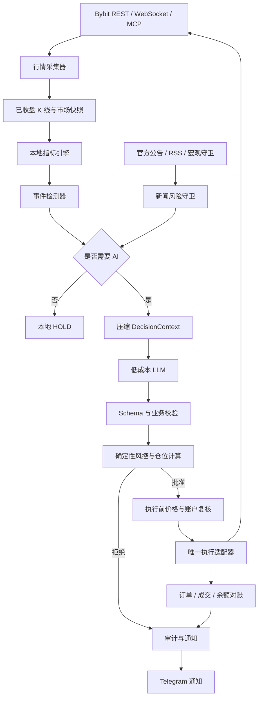

# 轻量级 AI 自动交易 MVP 开发计划

> 状态：Proposal / 新项目开发基线  
> 制定日期：2026-07-23  
> 存放位置：`alphaMind/docs/`，仅作为新项目的规划文档  
> 目标项目：独立新仓库，暂定名 `alphaMind Lite`  
> 与 alphaMind 的关系：alphaMind 保留并暂停继续开发；本计划不修改 alphaMind 现有产品范围、架构和进度账本

---

## 1. 决策结论

当前 alphaMind 已经按生产级个人交易系统设计，覆盖研究、风险、审计、账户观察、新闻、模型、Telegram 审批、Freqtrade 执行和故障恢复。该路线适合未来管理更大资金，但对于 100–500 USDT 的小资金验证阶段，开发复杂度、运行成本和验证周期过高。

因此做出以下决定：

1. **冻结并保留 alphaMind。** 不删除代码，不重写原开发计划，不在原仓库继续堆叠轻量功能。
2. **新建独立项目。** 使用新仓库实现事件驱动、低 Token、现货优先的 AI 自动交易 MVP。
3. **先验证系统是否能安全、低成本地自动完成交易。** 第一阶段不追求多市场、多策略、机构级审计和复杂故障恢复。
4. **代码负责观察和纪律，AI 只处理少量模糊决策。** 不允许 LLM 每隔固定时间无条件分析行情。
5. **确定性风控拥有最终否决权。** LLM 不直接计算最终仓位，不得绕过止损、回撤熔断和交易权限边界。
6. **先证明正期望，再扩大资金和复杂度。** 若小额实盘不能覆盖手续费、滑点和固定运行成本，则停止扩展。

一句话定位：

> `alphaMind Lite` 是“事件驱动规则系统 + 本地指标引擎 + 低成本新闻守卫 + LLM 决策审核 + 确定性风控 + Bybit 自动执行”的小资金验证系统。

---

## 2. MVP 目标

### 2.1 核心目标

在不依赖人工盯盘的情况下，使用 100–500 USDT 隔离资金，验证以下问题：

- 系统能否持续获取可靠行情并正确计算技术指标；
- 系统能否只在重要事件出现时调用 LLM；
- AI 是否能输出稳定、结构化、可验证的交易候选；
- 确定性风控能否阻止全仓追涨、亏损加仓、重复下单和无止损交易；
- Bybit 执行链路能否完成下单、撤单、成交确认和保护单设置；
- 系统能否在真实手续费和滑点后保持正收益或至少接近盈亏平衡；
- 每月基础运行成本能否控制在 **3–6 USDT** 左右。

### 2.2 第一阶段成功标准

只有同时满足以下条件，才允许继续扩大资金或恢复 alphaMind Full 路线：

- Dry-run 连续稳定运行至少 14 天；
- 小额 Live Canary 连续运行至少 30 天；
- 无重复下单、无越权交易、无漏设保护单；
- 交易记录、模型决策和风控拒绝均可复盘；
- 最大实盘回撤不超过配置上限；
- LLM 月成本不超过预算；
- 扣除手续费、滑点和服务器成本后，结果不显著劣于简单 Buy-and-Hold 基准；
- 至少完成 10–20 笔独立、可复核的实盘交易或完整持仓周期。

---

## 3. 非目标

第一版明确不做以下内容：

- 不支持合约、杠杆、做空和期权；
- 不支持多交易所；
- 不实现高频交易、做市和逐 Tick 策略；
- 不让 LLM 直接消费所有原始 K 线、盘口或新闻全文；
- 不让 LLM 直接持有或读取 API Secret；
- 不让 LLM 直接决定最终下单数量；
- 不每 30 分钟固定调用高级模型；
- 不实现复杂多智能体辩论；
- 不实现完整机构级订单状态机和跨区域容灾；
- 不追求一次覆盖所有市场状态；
- 不承诺稳定盈利、固定月收益或自动赚回订阅费。

---

## 4. 设计原则

### 4.1 事件驱动，而不是定时烧 Token

本地程序可每 1–5 分钟更新行情和指标，但只有出现实质变化时才调用 LLM。

普通情况由代码直接返回：

```json
{
  "action": "HOLD",
  "reason": "NO_MATERIAL_CHANGE"
}
```

### 4.2 已收盘 K 线优先

正式交易信号只能基于已收盘 K 线。当前未收盘 K 线可用于风险预警，但不能单独构成开仓依据。

### 4.3 LLM 负责判断，代码负责边界

LLM 可以提出：

- `HOLD`
- `OPEN`
- `REDUCE`
- `CLOSE`
- `CANCEL_ORDER`

LLM 不可以：

- 直接生成最终下单数量；
- 修改最大仓位；
- 取消强制止损；
- 放宽回撤限制；
- 在数据过期时开仓；
- 在成本预算耗尽后继续调用模型；
- 直接调用未注册交易工具。

### 4.4 Fail Closed

任何关键输入缺失或异常时，默认结果必须是：

```text
禁止开新仓
允许撤单
允许减仓或平仓
发送告警
```

### 4.5 隔离资金

正式实盘优先使用 Bybit AI Subaccount 或独立交易子账户：

- 与主账户资金隔离；
- 禁止提币；
- 只放入预先接受最大损失的资金；
- 只授予必要交易权限；
- 配置固定 IP 白名单；
- 用户永久保留暂停、只减仓和撤销授权权限。

---

## 5. MVP 范围

### 5.1 交易所与市场

| 项目 | MVP 选择 |
|---|---|
| 交易所 | Bybit |
| 市场 | Spot |
| 结算资产 | USDT |
| 账户 | AI Subaccount / 独立子账户 |
| 提币权限 | 禁止 |
| 杠杆 | 禁止 |
| 执行接口 | Bybit Trading MCP 或 Bybit V5 API 适配器 |

M0 阶段必须对 MCP 与直接 V5 API 做一次 POC。最终只能选一个作为订单写入主路径，禁止同时维护两个交易权威。

### 5.2 初始币种

默认只启用：

- BTC/USDT
- ETH/USDT
- SOL/USDT

允许配置一个额外高波动币种，但必须满足：

- Bybit 现货可交易；
- 流动性和成交额达到配置阈值；
- 价差低于配置上限；
- 不处于新上市保护期；
- 没有已知重大解锁、下架或安全事件。

### 5.3 初始动作

```text
HOLD
OPEN
REDUCE
CLOSE
CANCEL_ORDER
```

MVP 不支持 `ADD`。禁止亏损加仓和马丁格尔，避免系统在第一版中引入难以控制的仓位路径。

---

## 6. 总体架构



### 6.1 运行频率

| 模块 | 建议频率 |
|---|---:|
| Ticker / 当前价格 | 1–5 分钟 |
| 已收盘 15m K 线 | 每根收盘后 |
| 已收盘 1h K 线 | 每根收盘后 |
| 账户与挂单 | 1–5 分钟；下单前后强制刷新 |
| 新闻守卫 | 5–15 分钟 |
| LLM | 仅事件触发 |
| 日终报告 | 每日一次 |

WebSocket 用于低成本监听实时价格、订单和成交事件；指标计算仍以已收盘 K 线为准。

---

## 7. 模块设计

### 7.1 Market Data Collector

职责：

- 获取 ticker、bid/ask、OHLCV、成交量；
- 获取账户余额、现货持仓、未成交订单和近期成交；
- 可选监听 WebSocket ticker、order 和 execution；
- 所有时间统一为 UTC；
- 检查重复、缺口、乱序和数据过期；
- 把原始响应与规范化快照分开保存。

最低输出：

```json
{
  "symbol": "SOLUSDT",
  "timestamp": "2026-07-23T10:30:00Z",
  "last_price": "82.15",
  "bid": "82.14",
  "ask": "82.16",
  "spread_bps": "2.43",
  "candle_interval": "15m",
  "candle_closed": true,
  "ohlcv": {
    "open": "81.90",
    "high": "82.40",
    "low": "81.70",
    "close": "82.15",
    "volume": "123456.7"
  }
}
```

### 7.2 Local Indicator Engine

全部指标由本地确定性代码计算，不让 LLM 自行心算。

MVP 指标：

- EMA 20 / EMA 50 / EMA 200；
- RSI 14；
- ATR 14 及 ATR 百分比；
- ADX 14；
- Donchian 20；
- 成交量相对均值；
- 近期高低点；
- K 线位置和简单形态；
- 15m、1h、4h 多周期方向摘要。

示例输出：

```json
{
  "ema_alignment": "bullish",
  "rsi14": 63.4,
  "adx14": 27.8,
  "atr_pct": 2.1,
  "volume_ratio": 1.7,
  "donchian_position": "near_upper_breakout",
  "structure": "higher_high_higher_low",
  "multi_timeframe": {
    "15m": "bullish",
    "1h": "bullish",
    "4h": "neutral"
  }
}
```

### 7.3 Event Detector

事件检测器负责筛掉绝大多数无意义周期。

首批事件：

- `PRICE_BREAKOUT_UP`
- `PRICE_BREAKOUT_DOWN`
- `VOLUME_SPIKE`
- `EMA_ALIGNMENT_CHANGED`
- `RSI_REGIME_CHANGED`
- `ADX_TREND_CONFIRMED`
- `VOLATILITY_SPIKE`
- `POSITION_NEAR_STOP`
- `POSITION_NEAR_TAKE_PROFIT`
- `ORDER_STALE`
- `PRICE_DRIFT_EXCEEDED`
- `DATA_STALE`
- `ACCOUNT_MISMATCH`
- `CRITICAL_NEWS`

事件必须支持：

- 去抖动；
- 冷却期；
- 同类事件合并；
- 严重级别；
- 是否允许触发 LLM；
- 是否立即切换 `close-only`。

### 7.4 News Risk Guard

新闻守卫的目标不是预测所有消息，而是尽快识别可能导致系统停止开仓的事件。

MVP 来源：

- Bybit 官方公告；
- 交易币种项目方官方公告或 RSS；
- 少量可信宏观新闻源；
- 宏观经济日历；
- 可选接入安全事件源。

首批关键词分类：

```text
war / military strike / invasion
sanctions / tariff / export control
hack / exploit / drained / bridge attack
delisting / trading suspension / withdrawal suspended
investigation / lawsuit / regulator
bankruptcy / insolvency
emergency rate decision
exchange outage / API outage
```

处理原则：

- 高危事件先由规则切换 `close-only`，不等待 LLM；
- 新闻正文视为不可信输入；
- 只向 LLM 提供标题、来源、时间、摘要和资产关联；
- 新闻抓取失败不能阻塞已有保护单；
- 新闻不可用时禁止基于新闻扩大风险。

### 7.5 Decision Context Builder

只传递紧凑摘要，不传数百根 K 线和新闻全文。

目标单次输入：

- 常规决策：2,000–6,000 Token；
- 复杂决策：不超过 10,000 Token；
- 超出预算则先本地压缩，禁止无条件扩容。

Context 至少包含：

- 当前价格、bid/ask 和价差；
- 已收盘多周期摘要；
- 指标值和结构；
- 账户净值、现金、持仓成本和浮动盈亏；
- 未成交订单和保护单；
- 风险限额和当前剩余额度；
- 触发本次决策的事件；
- 最多 3–5 条相关高质量新闻；
- 数据新鲜度和缺失项。

### 7.6 LLM Decision Layer

推荐路由：

```text
普通事件 -> DeepSeek V4 Flash 非思考模式
准备 OPEN / CLOSE 或存在冲突 -> DeepSeek V4 Pro 复核
无事件 -> 不调用模型
```

第一版不调用 OpenAI 旗舰模型作为每周期默认模型。可保留 OpenAI Provider 接口，用于未来离线对比或极少量高风险复核。

LLM 输出必须是严格 JSON：

```json
{
  "schema_version": 1,
  "decision_id": "dec-20260723T103000Z-abc123",
  "symbol": "SOLUSDT",
  "action": "OPEN",
  "side": "long",
  "entry_range": {
    "min": "81.90",
    "max": "82.20"
  },
  "stop_loss": "79.80",
  "take_profit": ["85.00", "88.00"],
  "valid_for_seconds": 600,
  "confidence": "MEDIUM",
  "reason_codes": [
    "BREAKOUT_CONFIRMED",
    "VOLUME_SUPPORT",
    "MULTI_TIMEFRAME_PARTIAL_AGREEMENT"
  ],
  "risks": [
    "4H_TREND_NOT_FULLY_CONFIRMED"
  ],
  "summary": "15m and 1h breakout with volume expansion; 4h remains neutral."
}
```

LLM 输出中禁止出现：

- 最终数量；
- 账户百分比指令；
- API 参数；
- 撤销风控要求；
- 自然语言之外的可执行代码。

### 7.7 Deterministic Risk Engine

风险引擎拥有最终否决权。

建议默认值：

| 风控项 | MVP 默认值 |
|---|---:|
| 单笔最大账户风险 | 0.75% NAV |
| 单币最大持仓 | 25% NAV |
| 总持仓上限 | 60% NAV |
| 最低现金比例 | 40% NAV |
| 单日亏损熔断 | 2% NAV |
| 单周亏损熔断 | 4% NAV |
| 最大账户回撤 | 8% |
| 连续亏损暂停 | 3 笔后暂停 24 小时 |
| 止损后同币冷却 | 12 小时 |
| 最大允许追价 | 0.5%–1.0% |
| 最大允许价差 | 配置化，默认 20 bps |
| 数据最大陈旧时间 | Ticker 60 秒，K 线 2 个周期 |

仓位计算：

```text
risk_amount = NAV × risk_per_trade
stop_distance = abs(entry_price - stop_price) / entry_price
quantity_by_risk = risk_amount / abs(entry_price - stop_price)
quantity_by_exposure = max_symbol_notional / entry_price
approved_quantity = min(quantity_by_risk, quantity_by_exposure, available_cash_limit)
```

必须拒绝：

- 无止损开仓；
- 止损距离无效；
- 超过最大仓位；
- 价格漂移过大；
- 数据过期；
- 已有同方向未完成订单；
- 日亏或回撤已触发；
- 新闻高危状态；
- 订单或账户对账失败；
- LLM 输出不符合 Schema；
- API 成本预算已耗尽。

### 7.8 Execution Adapter

MVP 只允许一个订单写入者。

候选实现：

- Bybit 官方 Trading MCP；或
- Bybit V5 API + 官方 SDK。

无论选择哪种，都必须：

- 使用 client order id；
- 下单前重新读取余额、订单和价格；
- 验证价格漂移；
- 下单后查询订单状态；
- 成交后立即确认保护单；
- 无法确定请求是否成功时先对账，禁止盲目重试；
- 日志不得记录 API Secret；
- 提币权限必须关闭。

### 7.9 Audit and Notification

SQLite 保存：

- market snapshots；
- indicators；
- detected events；
- news alerts；
- LLM request metadata；
- token usage and cost；
- raw model JSON；
- validation result；
- risk decision；
- order request and response；
- fills；
- position snapshots；
- PnL；
- system health events。

Telegram 只做通知和紧急控制：

- 新交易候选；
- 风控拒绝；
- 下单、成交、撤单；
- 止损、止盈；
- 日亏或回撤熔断；
- 数据或 API 异常；
- `PAUSE`、`RESUME`、`CLOSE_ONLY`、`CANCEL_ALL`。

第一版可以选择“自动执行 + Telegram 通知”，但 Live Canary 前 7 天建议保留人工批准。

---

## 8. 项目目录建议

```text
alphamind-lite/
├── README.md
├── pyproject.toml
├── docker-compose.yml
├── .env.example
├── configs/
│   ├── instruments.yaml
│   ├── risk.yaml
│   ├── runtime.yaml
│   ├── events.yaml
│   ├── news.yaml
│   └── models.yaml
├── prompts/
│   └── trade-decision.md
├── schemas/
│   ├── decision.schema.json
│   └── event.schema.json
├── src/alphamind_lite/
│   ├── market/
│   │   ├── collector.py
│   │   ├── websocket.py
│   │   └── models.py
│   ├── indicators/
│   │   ├── engine.py
│   │   └── features.py
│   ├── events/
│   │   ├── detector.py
│   │   ├── debounce.py
│   │   └── models.py
│   ├── news/
│   │   ├── collector.py
│   │   ├── classifier.py
│   │   └── guard.py
│   ├── decision/
│   │   ├── context.py
│   │   ├── provider.py
│   │   ├── router.py
│   │   └── validator.py
│   ├── risk/
│   │   ├── engine.py
│   │   ├── sizing.py
│   │   └── kill_switch.py
│   ├── execution/
│   │   ├── port.py
│   │   ├── bybit_mcp.py
│   │   ├── bybit_v5.py
│   │   └── reconcile.py
│   ├── storage/
│   │   ├── db.py
│   │   └── migrations/
│   ├── notifications/
│   │   └── telegram.py
│   ├── runtime/
│   │   ├── scheduler.py
│   │   ├── health.py
│   │   └── service.py
│   └── cli.py
├── tests/
│   ├── unit/
│   ├── integration/
│   ├── fixtures/
│   └── replay/
└── data/
    ├── state/
    ├── logs/
    └── snapshots/
```

---

## 9. 配置示例

### 9.1 `risk.yaml`

```yaml
schema_version: 1
mode: spot_only

risk_per_trade_pct: 0.75
max_symbol_exposure_pct: 25
max_total_exposure_pct: 60
min_cash_pct: 40

daily_loss_limit_pct: 2
weekly_loss_limit_pct: 4
max_drawdown_pct: 8

max_price_drift_pct: 0.75
max_spread_bps: 20
stop_required: true
allow_add_to_loser: false
allow_leverage: false

consecutive_losses_before_pause: 3
pause_hours_after_loss_streak: 24
symbol_cooldown_hours_after_stop: 12
```

### 9.2 `runtime.yaml`

```yaml
schema_version: 1
market_scan_seconds: 60
account_refresh_seconds: 120
news_refresh_seconds: 600

llm_event_only: true
llm_daily_cost_limit_usd: 0.10
llm_monthly_cost_limit_usd: 2.00

fail_closed: true
live_enabled: false
close_only: false
```

### 9.3 `models.yaml`

```yaml
schema_version: 1

primary:
  provider: deepseek
  model: deepseek-v4-flash
  thinking: false
  max_input_tokens: 10000
  max_output_tokens: 1500

review:
  provider: deepseek
  model: deepseek-v4-pro
  thinking: false
  enabled_for_actions:
    - OPEN
    - CLOSE
  enabled_when_conflict: true

failure_policy: HOLD_ONLY
```

---

## 10. 月度成本预算

目标：小资金阶段固定成本不超过账户本金的 1%–1.5% / 月。

以 400 USDT 账户为例：

| 项目 | 目标月成本 |
|---|---:|
| VPS | 3.00 USD |
| DeepSeek Flash | 0.25–1.00 USD |
| DeepSeek Pro 复核 | 0.25–1.00 USD |
| 日志与备份 | 0–0.50 USD |
| 合计 | 3.50–5.50 USD |

成本控制规则：

- 无事件不调用模型；
- 固定 Prompt 和 Schema 使用缓存友好结构；
- 新闻只传相关摘要；
- 不传大量原始 K 线；
- 每日和每月设置硬预算；
- 超预算立即切换 `HOLD_ONLY`；
- Dry-run 可在本地电脑运行，Live 才使用 VPS；
- 服务器和模型费用必须计入策略净收益。

---

## 11. 开发阶段

### M0：仓库与边界冻结

产物：

- 新建独立仓库；
- README、许可证、Python 环境和基础 CI；
- 明确 Bybit MCP 与 V5 API 的 POC 选择；
- 配置文件和 Secret 管理；
- 禁止提币和 Testnet 账户准备。

验收：

- 无 Secret 进入 Git；
- 能读取公开行情；
- 能在 Testnet 查询账户；
- 唯一执行适配器决策形成 ADR。

### M1：行情与指标

产物：

- REST 行情采集；
- 可选 WebSocket；
- 已收盘 K 线识别；
- 指标计算；
- SQLite 快照。

验收：

- 与 TradingView 或独立计算结果对比；
- 数据缺口、重复和过期测试通过；
- 指标计算可重复。

### M2：事件检测

产物：

- 首批事件规则；
- 去抖动和冷却；
- 本地 HOLD；
- Telegram 事件通知。

验收：

- 震荡行情不会频繁触发；
- 历史回放中可解释每次触发；
- 同一事件不会重复调用 LLM。

### M3：新闻守卫

产物：

- Bybit 公告；
- 项目官方源；
- 宏观关键词分类；
- 高危事件 `close-only`。

验收：

- 使用历史黑天鹅标题回放；
- 高危事件不依赖 LLM 即可暂停开仓；
- Prompt Injection 测试通过。

### M4：LLM 决策层

产物：

- DecisionContext；
- DeepSeek Flash Provider；
- Pro 复核路由；
- 严格 JSON Schema；
- Token 成本记录和预算熔断。

验收：

- 非法 JSON 被拒绝；
- 缺失止损的 OPEN 被拒绝；
- 模型不可生成最终数量；
- Provider 失败时为 HOLD_ONLY。

### M5：确定性风控

产物：

- 仓位计算；
- 单币和总仓位限制；
- 日亏、周亏、回撤熔断；
- 冷却期；
- 价格漂移检查。

验收：

- 全仓请求必定被拒绝；
- 亏损加仓必定被拒绝；
- 无止损交易必定被拒绝；
- 极端价格和最小下单量测试通过。

### M6：执行与对账

产物：

- Testnet 下单；
- client order id；
- 撤单和成交查询；
- 保护单；
- 重启后对账；
- Telegram 结果通知。

验收：

- 不会重复提交同一 Action；
- 请求超时后不会盲目重试；
- 成交后保护单存在；
- 本地状态与交易所一致。

### M7：Dry-run

周期：至少 14 天。

验收：

- 服务可持续运行；
- 无重复和越权动作；
- LLM 成本符合预算；
- 事件触发频率合理；
- 交易候选具有可解释性；
- 与 Buy-and-Hold、空仓基准对比。

### M8：Live Canary

资金：建议 50–100 USDT，而不是一开始投入全部 400 USDT。

阶段：

1. 前 7 天：模型建议 + 人工批准；
2. 接下来 7–14 天：自动执行，但单币上限 10%；
3. 稳定后：逐步提高到配置上限；
4. 任一安全问题发生，立即退回 Dry-run。

---

## 12. 测试策略

### 单元测试

- 指标计算；
- 事件检测；
- 去抖动；
- Schema 校验；
- 仓位计算；
- 日亏和回撤熔断；
- 价格漂移；
- 成本预算。

### 集成测试

- Bybit Testnet；
- 模拟 API 超时；
- 重复回调；
- 部分成交；
- 保护单失败；
- WebSocket 断连；
- 数据陈旧；
- 模型非法输出。

### 历史回放

使用历史 K 线和事件时间线回放：

- 单边上涨；
- 单边下跌；
- 区间震荡；
- 假突破；
- 暴跌；
- 交易所故障；
- 黑客或监管新闻。

Replay 只验证决策与安全逻辑，不声称能精确复现真实成交。

---

## 13. 评价指标

### 安全指标

- 越权动作数；
- 重复订单数；
- 漏设止损数；
- 数据过期仍开仓次数；
- 对账失败次数；
- Kill Switch 触发和恢复记录。

### 策略指标

- 净收益；
- 最大回撤；
- Profit Factor；
- 胜率；
- 平均盈亏比；
- 手续费和滑点占毛利润比例；
- 与 Buy-and-Hold 对比；
- 持仓时间；
- 不同事件类型的收益贡献。

### AI 指标

- 每月调用次数；
- 平均输入和输出 Token；
- 每次可执行候选成本；
- HOLD 比例；
- Schema 失败率；
- Pro 复核推翻 Flash 的比例；
- 被风控拒绝的动作比例。

---

## 14. 停止条件

出现以下任一情况，暂停 Live 并回到 Dry-run：

- 发生重复真实订单；
- 发生无保护单持仓；
- API Secret 泄露或疑似泄露；
- 账户与本地状态无法对账；
- 月成本超过预算 50%；
- 最大回撤达到 8%；
- 连续三次出现模型明显违反交易合同；
- 实盘 30–60 天后，扣除成本显著落后于 Buy-and-Hold；
- 策略收益不足以覆盖手续费、滑点和运行成本。

停止项目不等于失败。若结果显示小资金不足以支撑自动交易成本，则得到的验证结论本身就是项目产出。

---

## 15. 与 alphaMind 的复用边界

允许复用的思想或小模块：

- 严格结构化输出；
- Provider 抽象；
- 成本预算与 HOLD_ONLY；
- 风控规则和仓位计算思路；
- Secret 扫描；
- 幂等和价格漂移检查；
- 审计字段设计。

第一阶段不直接搬运：

- Freqtrade 双实例；
- 完整 RiskSnapshot；
- 完整 Proposal/Approval Store；
- 多市场和合约模型；
- 重型研究流水线；
- 机构级订单状态机；
- 大量历史兼容代码。

复用必须按新项目需求逐个引入，禁止把 alphaMind 复制后再删减。

---

## 16. 后续升级条件

只有 MVP 通过 Live Canary 后，才按顺序考虑：

1. 增加币种；
2. 增加 `ADD`，但仍禁止亏损加仓；
3. 多策略组合；
4. 更完整的新闻源；
5. PostgreSQL；
6. 高可用和远程备份；
7. 合约和低杠杆；
8. 恢复 alphaMind Full 的审批、执行网关和完整审计路线。

任何升级都必须回答：

- 是否提升可验证收益；
- 是否降低风险；
- 是否增加固定成本；
- 小资金是否仍具有经济性；
- 是否需要回到 alphaMind 而不是继续扩张 Lite。

---

## 17. 首轮开发清单

按依赖顺序执行：

- [ ] 创建独立仓库；
- [ ] 确定项目正式名称；
- [ ] 完成 Bybit MCP 与 V5 API POC；
- [ ] 冻结 Spot-only、无杠杆范围；
- [ ] 建立配置和 Secret 管理；
- [ ] 实现行情采集；
- [ ] 实现指标引擎；
- [ ] 实现事件检测和去抖动；
- [ ] 实现本地 HOLD；
- [ ] 实现新闻风险守卫；
- [ ] 实现 DecisionContext；
- [ ] 接入 DeepSeek Flash；
- [ ] 接入 Pro 复核；
- [ ] 实现严格 Schema；
- [ ] 实现确定性仓位和风控；
- [ ] 实现 Testnet 下单和对账；
- [ ] 实现 Telegram 控制；
- [ ] 完成 14 天 Dry-run；
- [ ] 完成小额 Live Canary；
- [ ] 输出继续、暂停或升级的验证报告。

---

## 18. 当前外部能力参考

- Bybit 官方 Trading MCP：`https://github.com/bybit-exchange/trading-mcp`
- Bybit AI Subaccount：`https://www.bybit.com/en/help-center/article/Introduction-to-the-AI-Subaccount`
- Bybit AI Hub：`https://www.bybit.com/ai`
- DeepSeek API 价格：`https://api-docs.deepseek.com/zh-cn/quick_start/pricing/`

外部 API、模型名称和价格均可能变化。实现时必须通过配置管理，不得写死到业务代码；正式上线前重新核对最新文档。

---

## 19. 最终原则

> 先让小额资金安全地完成十几笔可复盘交易，再讨论让 AI 管理更大资金。

> 无事件不调用模型，无止损不允许开仓，无对账不允许继续交易，无预算不允许继续推理。

> Lite 的目标不是看起来像机构系统，而是用最低必要复杂度证明：这套自动交易方法是否值得继续投入。
